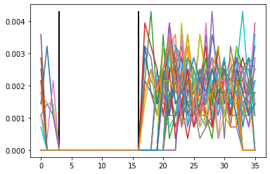
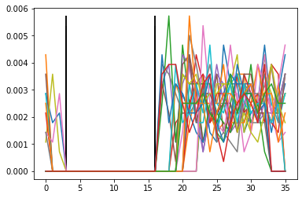
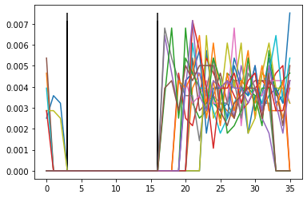
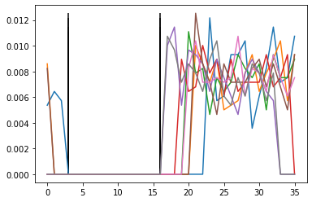
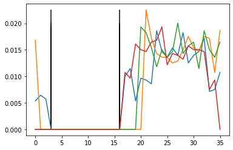
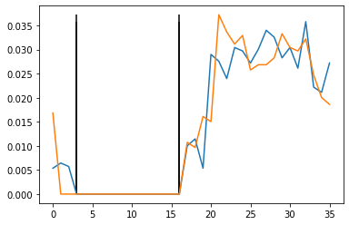
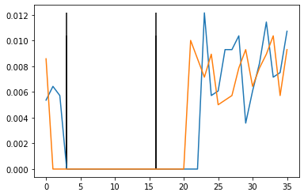
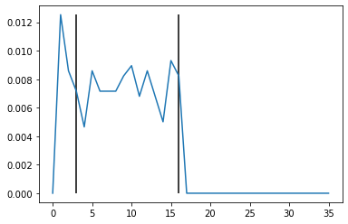
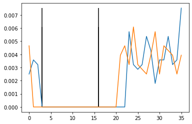

```python
import pandas as pd
pd.set_option('display.max_rows', 500)
pd.set_option('display.max_columns', 500)
pd.set_option('display.width', 1000)
```


```python
ct = '54ztv9yyx8u3s5u1xvutrvu414y1vzztxvutrv84xvutrvvux3uvrvurxv9w22v48wutrvuw07y2vzys2z014984267uw0wu0wu5v7xwyzyvs09v1vu6t42sx941zvu1axutr0zrxvuy6v660ax0uv104y1w0x7x76665954261v632u6285455t07v3345ty7u7sa1ub80t5895c9171572a674468s9a9zyww4b89y60vw9612y51185z1vxvu9y38y1xs6wz308356a38xa0539x3u1yr9a744672z68wuwvz578y27568a48yz2xz12z060za602y66x47w20w515612y31z3373vvxzc93w3vy07935v94yx86yrx7r1861426y4v16v38u2701638r7a8tz86yby9uw6uv65yyvz7169605v7r009u03y090wzrxxyb2xur0ux712zxz4x4714y21y8218s9w6zx7vw09sc3082z6y926060y09077y363y79xz26ycavuzavsbv5usw061354u89rc3z42zv6y90841z529z72vvr67x2192x929t3404xau8668t0w5vvv4wcaz5u75x6927r87r98u8336y7azzv926z41x63yr1y23r13x6z7ys1337611xx0wy560y4xs871wuxyr9y1t406z2123z06t5360wy4wxvu3t702y51xrvxw2x60uw6vyy36329s0780t80u83xxy1zr5xw1y423b0uxs9uyx497s1346wzz54w20zw84225zw2vszu41yv54003xx9x52xs911y56vux476u3333v4v460yb9w05x8uyw52r6y2byw425x160y4s96225z327426x16v6v20z40vv1ua66t012vxy44u81400203a2sy62xsaxx7a9y19vsx6vtrxu68z6t6v332y8xy4ws2a04sz2x9v36ra2s0vv2s4zt62u7w7z11xx8s9zu5w6txy8zzvvz256w102w173z96u5u5yr1y47330y4wvw1vwy29u2v165a3w0sxxr5wy3rw7t9a58u7263yuvrau00775u3020y281wys24v5wvvvx44y165r49y7ww71za51svvv7y6t4494289zr91yy130z44w8zyts8yt644uwv7vx78xy11r53y5zvz105943ywx27v6s98y619wr51tzvw5w11x4z15w37xx8ztrzuw1zy3za6115vvt32448u1w236137xuy0y1538u8405508saww8332325t15w0188sz7y7tax127u16vv3660yx1vyya7xy54y4355wzw328185vw4xxu04y3s3207u753901tx20y844034uya760051rz82632zv8xz5ta8u707wzv5s0yx1rax113w42wx6b20z0z8xxy40v75r53y1xz16x3ux523v831xz0837v72r1v3y3v51v3u69yw234389213234668ur61z2723t0u2cy836z611w2w446r1x5vv5yucvxzuv03978ws79z328uw561byxvua1x0avuvz9r20u5wz0vy0084vysc96ztw4w76zwxw16008tyw3613yvs9160w546666977y50vv5a2yy9wx9wvxza30935wz74wx70222x3b13t14zuzv8wt08ux83wua6629yx2x3r8ww55x1sx247r61z07zy1auz9wvy174tcxu7swxvcz6xx4w15913y1w2axy8040rz43u3xus650009760737485t721107uy617w36743046089uy39zs9v3xwx6200r6wwx3z0049874z7415v7u28s852t322ub142z07xb91u453u55wzzavw9300y473zzvvyw9x6xuyry610448034w93zxw97s4www64zr017yu91097ww5v1z05w7sa2v213632zs9x71v74rz128661r788x2w92544zxv2s1a4ww7544vzts993c98uzx537x582wx24z58v63u89yyx146ax6703046v2858zuay30z47v6912v77431y4367vaa30tvu1511v5awty9905wz19y0wxx8t873xt1vrb663yyvx77w137x546676y40x2x559vu54xy26vta0yww4ww2w02uyyy651u2w4x9a8w4x4z068uuw5vx5vy2z155828ux62ay68s5v5620wyyx4zw9w231356u6z2115174t99t7a45s43y1v3yr53r2wwuy3u64355z3yz1w45xx969wu8t3z52xu2swywz665v0ys07zx439x76v6u86384953yzy6643w62y654y41v0155z2zyv247v316u966xv5725968yv454vvyv2vx612yz9vt1y863990x91vs1w55866swzs7a6vyz3v7a34241t2zztw9104a92xy408vw0534yb52u0z5167w4169w18wvt4z0a2vwx1x2b294u715c2z4wv56623zw63v820ys3wz2vxtuwwxx396y0yy7344wzw35461x504avww6avyxv4u6w522v9045633y70wax46223s0zz9w8236ux8064z6913746t4u3cy9y2xz602u55vvt9y9542uvc3v5x91y62970z35x22wuxwuy505wv8s29v3r53vb4y3z49xzxwvvw9tc47z3y45b632x493xx860a1vav933a6z25utrvurxvy2v0y51z47vx0r5x'
ct1 = '5zvyxusuxuru1yvzxur8xurvxurux92v8uru0yvy204827ww0uvxyys91ut2x4zuaurzxu660xu141077655216268450v35yus1b059c117a74899ywb96v91y18zvv93yx6z0363x03xuy9747z8uv582584y2z200a0y64w0551y137vxc33y73v4x6r7164641v8206878z6b9wu6yv76657090y9wrxbxru72x441y181swz7w9c026966y97y6y9z6cvzvb5s015u9cz2vy04z2z2v6x129930xu6805v4czu562r79u367zv2z16y12r367s371x0y6yx81uy914622z656w4xut0y1rx26u6y33908t08xyz5wy2busux9s36z5w0w42z2su1v40x95x915vx7u33440bw58y5rybw2x6ys62z2461vv04v1a602x4u10232y2sx791vxvru866328yw20s293r20vsz6uwz1xsz56x8zv2612139uuy14304v1w2uv6awsx5yr795u23uru07u0021y2vwvx4154yw7z5sv764929r1y3z48ysy64w7x8y15yzz093w2vs869r1zww141w7xzru1yz61vt24uw317u013u450sw83351w18zytx2u6v60xvy7y445ww215wxu4330u591x0843ua601z23z8zt877z50xrx1w2xb008x4v55yx1xu5381z877rvyv136y24823368r122tuc866124615vycxu098s938w6bxu10vv92uw0y04yc6t47zx108y31ys10566975v52yw9vz395z4x02xb31zz8t8x3u62y238w51x4r10z1u9v14cusxc6xw51yway00z33u60070345710u67373409y9svxx206w3048471vu88232b4z7b1435wzv90y7zvy96ur604049zw74w6z07u19w510ws2233z97v4z261782954x214w54zs9c8z5752x45v38yx4a600625za3z761v73y37a3tu515wy95z90x883tvb6yv7w3x4664xx5v5x2vayww20uy6124984408u5xv2152u6a6sv60yxz9215uz157t974s313r32wyu45zy14x99utz2usyz6vy0z497vu6893z64w2644v152y273696v756y44vvv62zv1839x1sw56sz76y373212zw149x48w54b2056w191wtzavxxb9u1czw563w380sw2xuwx9yy74ww56x0aw6vx465294637wx62sz983u86z934tuc92z0u5v994ucvx16903x2uwy0w82vr3byz9zwv9c734b3x9x801a9362uruxyvy14v05'
ct2 = '4t9y8351vtv441ztvtv4vtvu3vvrvw24wtvw72zsz1946u0uw57wzv0vv64s91v1xt0rvyv6a0v0ywxx66946v3u255t734t77au8t859752646sazw48y0w625151xuy81sw385a8a5931ra4626wwz7y76a8zx1z6z626x72w1623z33vz9wv0959y8yxr812yv63u713rat8yyu6v5yz190vr0u300zxy2u0x1zzx742y2896xv0s38zy200007337x2yauasvuw6348r34z6981597vr729x2t44a86twvvwa57x978r883yaz964x3ry31xzy1361xw504s7wxryt0z130t30ywv3725xvwx0wvy62s708u3x1rx1430x9y4714wz42z825wvz4y503xx2s1y6u4633vv6y90xuw262y45104925372x662z0vu6t1vy48400as6xaxay9s6tx6ztv3yx4sa4zxv6asv24t2771x89uwtyzvz5w0w7z655ry73ywwvy921530xrw3wta876yva07532y8ws45vv4y6r97w1a1vvyt448z9y104wzt8t4uvv7x1r35v154yx769y1w5tv51xz53x8tzwz3a15v3481263xyy588058aw322t508s77a171v36y1yax5y35z388v4x0ys27730t2y404y705r862vx5au0wvsy1a134w62zzxy07r31z63x2v3x03v21335vu9w3391246u6z7302y3z1ww4rxv5uvzv37w7z2u51yvaxauzr05zv08vs9zww6ww60tw63v96w4667y0vay9xwxa03w7w72231t4uvw0u8wa69xxrw5xs276z7yazwy7tx7wvzx419312x84r4uxs5096778t217y1w64068u3z93w60rwxz097z4572s5t2u120x9u5u5zaw3043zvwxxyy1483w3x9sww4r1y907wvz57av162sx17r186r8xw24zvsaw74vt939ux3x8w2z86u9y16x734v88uy04v9274146va0v11vat90w1ywxt7x1r63yx717567y0259u4y6t0w4ww2yy5uwxawxz6uwv5yz588x2y8552wy4ww336621149ta54yvy5rwu36353zw5x6w835x2ww650s7x3x668345yy636y5y105zzv4v1u6x5298v5vy2x1y9ty6909v1586wsavzva44tzt90a2y0v03y5uz1746w8v402w12247524v62z6v2y3zvtwx360y34z34154vwayvuw2v053y0a4230zw26x04617643yyx625vty52v359y27z52wxu55vs935v434xxvwt4zy56243x6avv3az5tvrv205z7xrx'

alpha = ['a', 'b', 'c', 'd', 'e', 'f', 'g', 'h', 'i', 'j', 'k', 'l', 'm', 'n', 'o', 'p', 'q', 'r', 's', 't', 'u', 'v', 'w', 'x', 'y', 'z', '0', '1', '2', '3', '4', '5', '6', '7', '8', '9']
alpha2 = ['a', 'b', 'c', 'r', 's', 't', 'u', 'v', 'w', 'x', 'y', 'z', '0', '1', '2', '3', '4', '5', '6', '7', '8', '9']
alpha3 = ['a', 'b', 'c', 'd', 'e', 'f', 'g', 'h', 'i', 'k', 'l', 'm', 'n', '1', '2', '3', '4', '5', '6', '7', '8', '9']
```


```python
def cshift(c, n, rev=False, alphabet=alpha):
    nval = alphabet.index(n)
    if rev:
        nval = -nval
    return alphabet[(alphabet.index(c) + nval) % len(alphabet)]

def ashift(n, alphabet=alpha):
    return [cshift(x, n) for x in alphabet]

def vig(ct, key, rev, alphabet):
    r = []
    for i in range(len(ct)):
        r.append(cshift(ct[i], key[i % len(key)], rev, alphabet))
    return ''.join(r)

def vig_ac(ct, key, rev, alphabet):
    r = []
    for i in range(min(len(ct), len(key))):
        r.append(cshift(ct[i], key[i], rev, alphabet))
    j = i + 1
    if rev:
        for i in range(j, len(ct)):
            r.append(cshift(ct[i], r[i - j], rev, alphabet))
    else:
        for i in range(j, len(ct)):
            r.append(cshift(ct[i], ct[i - j], rev, alphabet))
    return ''.join(r)

def envig(ct, key, ac=False, alphabet=alpha):
    if ac:
        return vig_ac(ct, key, False, alphabet)
    return vig(ct, key, False, alphabet)

def devig(ct, key, ac=False, alphabet=alpha):
    if ac:
        return vig_ac(ct, key, True, alphabet)
    return vig(ct, key, True, alphabet)
```


```python
def vsquare(alphabet=alpha):
    s = {}
    for i in alphabet:
        s[i] = ashift(i, alphabet)
    return s
```


```python
def bisquare(alphabet=alpha):
    s = {}
    for i in alphabet:
        s[i] = [j+i for j in alphabet]
    return s
```


```python
pd.DataFrame(vsquare(), index=alpha)
```


<div>
<style scoped>
    .dataframe tbody tr th:only-of-type {
        vertical-align: middle;
    }

    .dataframe tbody tr th {
        vertical-align: top;
    }

    .dataframe thead th {
        text-align: right;
    }
</style>
<table border="1" class="dataframe">
  <thead>
    <tr style="text-align: right;">
      <th></th>
      <th>a</th>
      <th>b</th>
      <th>c</th>
      <th>d</th>
      <th>e</th>
      <th>f</th>
      <th>g</th>
      <th>h</th>
      <th>i</th>
      <th>j</th>
      <th>k</th>
      <th>l</th>
      <th>m</th>
      <th>n</th>
      <th>o</th>
      <th>p</th>
      <th>q</th>
      <th>r</th>
      <th>s</th>
      <th>t</th>
      <th>u</th>
      <th>v</th>
      <th>w</th>
      <th>x</th>
      <th>y</th>
      <th>z</th>
      <th>0</th>
      <th>1</th>
      <th>2</th>
      <th>3</th>
      <th>4</th>
      <th>5</th>
      <th>6</th>
      <th>7</th>
      <th>8</th>
      <th>9</th>
    </tr>
  </thead>
  <tbody>
    <tr>
      <th>a</th>
      <td>a</td>
      <td>b</td>
      <td>c</td>
      <td>d</td>
      <td>e</td>
      <td>f</td>
      <td>g</td>
      <td>h</td>
      <td>i</td>
      <td>j</td>
      <td>k</td>
      <td>l</td>
      <td>m</td>
      <td>n</td>
      <td>o</td>
      <td>p</td>
      <td>q</td>
      <td>r</td>
      <td>s</td>
      <td>t</td>
      <td>u</td>
      <td>v</td>
      <td>w</td>
      <td>x</td>
      <td>y</td>
      <td>z</td>
      <td>0</td>
      <td>1</td>
      <td>2</td>
      <td>3</td>
      <td>4</td>
      <td>5</td>
      <td>6</td>
      <td>7</td>
      <td>8</td>
      <td>9</td>
    </tr>
    <tr>
      <th>b</th>
      <td>b</td>
      <td>c</td>
      <td>d</td>
      <td>e</td>
      <td>f</td>
      <td>g</td>
      <td>h</td>
      <td>i</td>
      <td>j</td>
      <td>k</td>
      <td>l</td>
      <td>m</td>
      <td>n</td>
      <td>o</td>
      <td>p</td>
      <td>q</td>
      <td>r</td>
      <td>s</td>
      <td>t</td>
      <td>u</td>
      <td>v</td>
      <td>w</td>
      <td>x</td>
      <td>y</td>
      <td>z</td>
      <td>0</td>
      <td>1</td>
      <td>2</td>
      <td>3</td>
      <td>4</td>
      <td>5</td>
      <td>6</td>
      <td>7</td>
      <td>8</td>
      <td>9</td>
      <td>a</td>
    </tr>
    <tr>
      <th>c</th>
      <td>c</td>
      <td>d</td>
      <td>e</td>
      <td>f</td>
      <td>g</td>
      <td>h</td>
      <td>i</td>
      <td>j</td>
      <td>k</td>
      <td>l</td>
      <td>m</td>
      <td>n</td>
      <td>o</td>
      <td>p</td>
      <td>q</td>
      <td>r</td>
      <td>s</td>
      <td>t</td>
      <td>u</td>
      <td>v</td>
      <td>w</td>
      <td>x</td>
      <td>y</td>
      <td>z</td>
      <td>0</td>
      <td>1</td>
      <td>2</td>
      <td>3</td>
      <td>4</td>
      <td>5</td>
      <td>6</td>
      <td>7</td>
      <td>8</td>
      <td>9</td>
      <td>a</td>
      <td>b</td>
    </tr>
    <tr>
      <th>d</th>
      <td>d</td>
      <td>e</td>
      <td>f</td>
      <td>g</td>
      <td>h</td>
      <td>i</td>
      <td>j</td>
      <td>k</td>
      <td>l</td>
      <td>m</td>
      <td>n</td>
      <td>o</td>
      <td>p</td>
      <td>q</td>
      <td>r</td>
      <td>s</td>
      <td>t</td>
      <td>u</td>
      <td>v</td>
      <td>w</td>
      <td>x</td>
      <td>y</td>
      <td>z</td>
      <td>0</td>
      <td>1</td>
      <td>2</td>
      <td>3</td>
      <td>4</td>
      <td>5</td>
      <td>6</td>
      <td>7</td>
      <td>8</td>
      <td>9</td>
      <td>a</td>
      <td>b</td>
      <td>c</td>
    </tr>
    <tr>
      <th>e</th>
      <td>e</td>
      <td>f</td>
      <td>g</td>
      <td>h</td>
      <td>i</td>
      <td>j</td>
      <td>k</td>
      <td>l</td>
      <td>m</td>
      <td>n</td>
      <td>o</td>
      <td>p</td>
      <td>q</td>
      <td>r</td>
      <td>s</td>
      <td>t</td>
      <td>u</td>
      <td>v</td>
      <td>w</td>
      <td>x</td>
      <td>y</td>
      <td>z</td>
      <td>0</td>
      <td>1</td>
      <td>2</td>
      <td>3</td>
      <td>4</td>
      <td>5</td>
      <td>6</td>
      <td>7</td>
      <td>8</td>
      <td>9</td>
      <td>a</td>
      <td>b</td>
      <td>c</td>
      <td>d</td>
    </tr>
    <tr>
      <th>f</th>
      <td>f</td>
      <td>g</td>
      <td>h</td>
      <td>i</td>
      <td>j</td>
      <td>k</td>
      <td>l</td>
      <td>m</td>
      <td>n</td>
      <td>o</td>
      <td>p</td>
      <td>q</td>
      <td>r</td>
      <td>s</td>
      <td>t</td>
      <td>u</td>
      <td>v</td>
      <td>w</td>
      <td>x</td>
      <td>y</td>
      <td>z</td>
      <td>0</td>
      <td>1</td>
      <td>2</td>
      <td>3</td>
      <td>4</td>
      <td>5</td>
      <td>6</td>
      <td>7</td>
      <td>8</td>
      <td>9</td>
      <td>a</td>
      <td>b</td>
      <td>c</td>
      <td>d</td>
      <td>e</td>
    </tr>
    <tr>
      <th>g</th>
      <td>g</td>
      <td>h</td>
      <td>i</td>
      <td>j</td>
      <td>k</td>
      <td>l</td>
      <td>m</td>
      <td>n</td>
      <td>o</td>
      <td>p</td>
      <td>q</td>
      <td>r</td>
      <td>s</td>
      <td>t</td>
      <td>u</td>
      <td>v</td>
      <td>w</td>
      <td>x</td>
      <td>y</td>
      <td>z</td>
      <td>0</td>
      <td>1</td>
      <td>2</td>
      <td>3</td>
      <td>4</td>
      <td>5</td>
      <td>6</td>
      <td>7</td>
      <td>8</td>
      <td>9</td>
      <td>a</td>
      <td>b</td>
      <td>c</td>
      <td>d</td>
      <td>e</td>
      <td>f</td>
    </tr>
    <tr>
      <th>h</th>
      <td>h</td>
      <td>i</td>
      <td>j</td>
      <td>k</td>
      <td>l</td>
      <td>m</td>
      <td>n</td>
      <td>o</td>
      <td>p</td>
      <td>q</td>
      <td>r</td>
      <td>s</td>
      <td>t</td>
      <td>u</td>
      <td>v</td>
      <td>w</td>
      <td>x</td>
      <td>y</td>
      <td>z</td>
      <td>0</td>
      <td>1</td>
      <td>2</td>
      <td>3</td>
      <td>4</td>
      <td>5</td>
      <td>6</td>
      <td>7</td>
      <td>8</td>
      <td>9</td>
      <td>a</td>
      <td>b</td>
      <td>c</td>
      <td>d</td>
      <td>e</td>
      <td>f</td>
      <td>g</td>
    </tr>
    <tr>
      <th>i</th>
      <td>i</td>
      <td>j</td>
      <td>k</td>
      <td>l</td>
      <td>m</td>
      <td>n</td>
      <td>o</td>
      <td>p</td>
      <td>q</td>
      <td>r</td>
      <td>s</td>
      <td>t</td>
      <td>u</td>
      <td>v</td>
      <td>w</td>
      <td>x</td>
      <td>y</td>
      <td>z</td>
      <td>0</td>
      <td>1</td>
      <td>2</td>
      <td>3</td>
      <td>4</td>
      <td>5</td>
      <td>6</td>
      <td>7</td>
      <td>8</td>
      <td>9</td>
      <td>a</td>
      <td>b</td>
      <td>c</td>
      <td>d</td>
      <td>e</td>
      <td>f</td>
      <td>g</td>
      <td>h</td>
    </tr>
    <tr>
      <th>j</th>
      <td>j</td>
      <td>k</td>
      <td>l</td>
      <td>m</td>
      <td>n</td>
      <td>o</td>
      <td>p</td>
      <td>q</td>
      <td>r</td>
      <td>s</td>
      <td>t</td>
      <td>u</td>
      <td>v</td>
      <td>w</td>
      <td>x</td>
      <td>y</td>
      <td>z</td>
      <td>0</td>
      <td>1</td>
      <td>2</td>
      <td>3</td>
      <td>4</td>
      <td>5</td>
      <td>6</td>
      <td>7</td>
      <td>8</td>
      <td>9</td>
      <td>a</td>
      <td>b</td>
      <td>c</td>
      <td>d</td>
      <td>e</td>
      <td>f</td>
      <td>g</td>
      <td>h</td>
      <td>i</td>
    </tr>
    <tr>
      <th>k</th>
      <td>k</td>
      <td>l</td>
      <td>m</td>
      <td>n</td>
      <td>o</td>
      <td>p</td>
      <td>q</td>
      <td>r</td>
      <td>s</td>
      <td>t</td>
      <td>u</td>
      <td>v</td>
      <td>w</td>
      <td>x</td>
      <td>y</td>
      <td>z</td>
      <td>0</td>
      <td>1</td>
      <td>2</td>
      <td>3</td>
      <td>4</td>
      <td>5</td>
      <td>6</td>
      <td>7</td>
      <td>8</td>
      <td>9</td>
      <td>a</td>
      <td>b</td>
      <td>c</td>
      <td>d</td>
      <td>e</td>
      <td>f</td>
      <td>g</td>
      <td>h</td>
      <td>i</td>
      <td>j</td>
    </tr>
    <tr>
      <th>l</th>
      <td>l</td>
      <td>m</td>
      <td>n</td>
      <td>o</td>
      <td>p</td>
      <td>q</td>
      <td>r</td>
      <td>s</td>
      <td>t</td>
      <td>u</td>
      <td>v</td>
      <td>w</td>
      <td>x</td>
      <td>y</td>
      <td>z</td>
      <td>0</td>
      <td>1</td>
      <td>2</td>
      <td>3</td>
      <td>4</td>
      <td>5</td>
      <td>6</td>
      <td>7</td>
      <td>8</td>
      <td>9</td>
      <td>a</td>
      <td>b</td>
      <td>c</td>
      <td>d</td>
      <td>e</td>
      <td>f</td>
      <td>g</td>
      <td>h</td>
      <td>i</td>
      <td>j</td>
      <td>k</td>
    </tr>
    <tr>
      <th>m</th>
      <td>m</td>
      <td>n</td>
      <td>o</td>
      <td>p</td>
      <td>q</td>
      <td>r</td>
      <td>s</td>
      <td>t</td>
      <td>u</td>
      <td>v</td>
      <td>w</td>
      <td>x</td>
      <td>y</td>
      <td>z</td>
      <td>0</td>
      <td>1</td>
      <td>2</td>
      <td>3</td>
      <td>4</td>
      <td>5</td>
      <td>6</td>
      <td>7</td>
      <td>8</td>
      <td>9</td>
      <td>a</td>
      <td>b</td>
      <td>c</td>
      <td>d</td>
      <td>e</td>
      <td>f</td>
      <td>g</td>
      <td>h</td>
      <td>i</td>
      <td>j</td>
      <td>k</td>
      <td>l</td>
    </tr>
    <tr>
      <th>n</th>
      <td>n</td>
      <td>o</td>
      <td>p</td>
      <td>q</td>
      <td>r</td>
      <td>s</td>
      <td>t</td>
      <td>u</td>
      <td>v</td>
      <td>w</td>
      <td>x</td>
      <td>y</td>
      <td>z</td>
      <td>0</td>
      <td>1</td>
      <td>2</td>
      <td>3</td>
      <td>4</td>
      <td>5</td>
      <td>6</td>
      <td>7</td>
      <td>8</td>
      <td>9</td>
      <td>a</td>
      <td>b</td>
      <td>c</td>
      <td>d</td>
      <td>e</td>
      <td>f</td>
      <td>g</td>
      <td>h</td>
      <td>i</td>
      <td>j</td>
      <td>k</td>
      <td>l</td>
      <td>m</td>
    </tr>
    <tr>
      <th>o</th>
      <td>o</td>
      <td>p</td>
      <td>q</td>
      <td>r</td>
      <td>s</td>
      <td>t</td>
      <td>u</td>
      <td>v</td>
      <td>w</td>
      <td>x</td>
      <td>y</td>
      <td>z</td>
      <td>0</td>
      <td>1</td>
      <td>2</td>
      <td>3</td>
      <td>4</td>
      <td>5</td>
      <td>6</td>
      <td>7</td>
      <td>8</td>
      <td>9</td>
      <td>a</td>
      <td>b</td>
      <td>c</td>
      <td>d</td>
      <td>e</td>
      <td>f</td>
      <td>g</td>
      <td>h</td>
      <td>i</td>
      <td>j</td>
      <td>k</td>
      <td>l</td>
      <td>m</td>
      <td>n</td>
    </tr>
    <tr>
      <th>p</th>
      <td>p</td>
      <td>q</td>
      <td>r</td>
      <td>s</td>
      <td>t</td>
      <td>u</td>
      <td>v</td>
      <td>w</td>
      <td>x</td>
      <td>y</td>
      <td>z</td>
      <td>0</td>
      <td>1</td>
      <td>2</td>
      <td>3</td>
      <td>4</td>
      <td>5</td>
      <td>6</td>
      <td>7</td>
      <td>8</td>
      <td>9</td>
      <td>a</td>
      <td>b</td>
      <td>c</td>
      <td>d</td>
      <td>e</td>
      <td>f</td>
      <td>g</td>
      <td>h</td>
      <td>i</td>
      <td>j</td>
      <td>k</td>
      <td>l</td>
      <td>m</td>
      <td>n</td>
      <td>o</td>
    </tr>
    <tr>
      <th>q</th>
      <td>q</td>
      <td>r</td>
      <td>s</td>
      <td>t</td>
      <td>u</td>
      <td>v</td>
      <td>w</td>
      <td>x</td>
      <td>y</td>
      <td>z</td>
      <td>0</td>
      <td>1</td>
      <td>2</td>
      <td>3</td>
      <td>4</td>
      <td>5</td>
      <td>6</td>
      <td>7</td>
      <td>8</td>
      <td>9</td>
      <td>a</td>
      <td>b</td>
      <td>c</td>
      <td>d</td>
      <td>e</td>
      <td>f</td>
      <td>g</td>
      <td>h</td>
      <td>i</td>
      <td>j</td>
      <td>k</td>
      <td>l</td>
      <td>m</td>
      <td>n</td>
      <td>o</td>
      <td>p</td>
    </tr>
    <tr>
      <th>r</th>
      <td>r</td>
      <td>s</td>
      <td>t</td>
      <td>u</td>
      <td>v</td>
      <td>w</td>
      <td>x</td>
      <td>y</td>
      <td>z</td>
      <td>0</td>
      <td>1</td>
      <td>2</td>
      <td>3</td>
      <td>4</td>
      <td>5</td>
      <td>6</td>
      <td>7</td>
      <td>8</td>
      <td>9</td>
      <td>a</td>
      <td>b</td>
      <td>c</td>
      <td>d</td>
      <td>e</td>
      <td>f</td>
      <td>g</td>
      <td>h</td>
      <td>i</td>
      <td>j</td>
      <td>k</td>
      <td>l</td>
      <td>m</td>
      <td>n</td>
      <td>o</td>
      <td>p</td>
      <td>q</td>
    </tr>
    <tr>
      <th>s</th>
      <td>s</td>
      <td>t</td>
      <td>u</td>
      <td>v</td>
      <td>w</td>
      <td>x</td>
      <td>y</td>
      <td>z</td>
      <td>0</td>
      <td>1</td>
      <td>2</td>
      <td>3</td>
      <td>4</td>
      <td>5</td>
      <td>6</td>
      <td>7</td>
      <td>8</td>
      <td>9</td>
      <td>a</td>
      <td>b</td>
      <td>c</td>
      <td>d</td>
      <td>e</td>
      <td>f</td>
      <td>g</td>
      <td>h</td>
      <td>i</td>
      <td>j</td>
      <td>k</td>
      <td>l</td>
      <td>m</td>
      <td>n</td>
      <td>o</td>
      <td>p</td>
      <td>q</td>
      <td>r</td>
    </tr>
    <tr>
      <th>t</th>
      <td>t</td>
      <td>u</td>
      <td>v</td>
      <td>w</td>
      <td>x</td>
      <td>y</td>
      <td>z</td>
      <td>0</td>
      <td>1</td>
      <td>2</td>
      <td>3</td>
      <td>4</td>
      <td>5</td>
      <td>6</td>
      <td>7</td>
      <td>8</td>
      <td>9</td>
      <td>a</td>
      <td>b</td>
      <td>c</td>
      <td>d</td>
      <td>e</td>
      <td>f</td>
      <td>g</td>
      <td>h</td>
      <td>i</td>
      <td>j</td>
      <td>k</td>
      <td>l</td>
      <td>m</td>
      <td>n</td>
      <td>o</td>
      <td>p</td>
      <td>q</td>
      <td>r</td>
      <td>s</td>
    </tr>
    <tr>
      <th>u</th>
      <td>u</td>
      <td>v</td>
      <td>w</td>
      <td>x</td>
      <td>y</td>
      <td>z</td>
      <td>0</td>
      <td>1</td>
      <td>2</td>
      <td>3</td>
      <td>4</td>
      <td>5</td>
      <td>6</td>
      <td>7</td>
      <td>8</td>
      <td>9</td>
      <td>a</td>
      <td>b</td>
      <td>c</td>
      <td>d</td>
      <td>e</td>
      <td>f</td>
      <td>g</td>
      <td>h</td>
      <td>i</td>
      <td>j</td>
      <td>k</td>
      <td>l</td>
      <td>m</td>
      <td>n</td>
      <td>o</td>
      <td>p</td>
      <td>q</td>
      <td>r</td>
      <td>s</td>
      <td>t</td>
    </tr>
    <tr>
      <th>v</th>
      <td>v</td>
      <td>w</td>
      <td>x</td>
      <td>y</td>
      <td>z</td>
      <td>0</td>
      <td>1</td>
      <td>2</td>
      <td>3</td>
      <td>4</td>
      <td>5</td>
      <td>6</td>
      <td>7</td>
      <td>8</td>
      <td>9</td>
      <td>a</td>
      <td>b</td>
      <td>c</td>
      <td>d</td>
      <td>e</td>
      <td>f</td>
      <td>g</td>
      <td>h</td>
      <td>i</td>
      <td>j</td>
      <td>k</td>
      <td>l</td>
      <td>m</td>
      <td>n</td>
      <td>o</td>
      <td>p</td>
      <td>q</td>
      <td>r</td>
      <td>s</td>
      <td>t</td>
      <td>u</td>
    </tr>
    <tr>
      <th>w</th>
      <td>w</td>
      <td>x</td>
      <td>y</td>
      <td>z</td>
      <td>0</td>
      <td>1</td>
      <td>2</td>
      <td>3</td>
      <td>4</td>
      <td>5</td>
      <td>6</td>
      <td>7</td>
      <td>8</td>
      <td>9</td>
      <td>a</td>
      <td>b</td>
      <td>c</td>
      <td>d</td>
      <td>e</td>
      <td>f</td>
      <td>g</td>
      <td>h</td>
      <td>i</td>
      <td>j</td>
      <td>k</td>
      <td>l</td>
      <td>m</td>
      <td>n</td>
      <td>o</td>
      <td>p</td>
      <td>q</td>
      <td>r</td>
      <td>s</td>
      <td>t</td>
      <td>u</td>
      <td>v</td>
    </tr>
    <tr>
      <th>x</th>
      <td>x</td>
      <td>y</td>
      <td>z</td>
      <td>0</td>
      <td>1</td>
      <td>2</td>
      <td>3</td>
      <td>4</td>
      <td>5</td>
      <td>6</td>
      <td>7</td>
      <td>8</td>
      <td>9</td>
      <td>a</td>
      <td>b</td>
      <td>c</td>
      <td>d</td>
      <td>e</td>
      <td>f</td>
      <td>g</td>
      <td>h</td>
      <td>i</td>
      <td>j</td>
      <td>k</td>
      <td>l</td>
      <td>m</td>
      <td>n</td>
      <td>o</td>
      <td>p</td>
      <td>q</td>
      <td>r</td>
      <td>s</td>
      <td>t</td>
      <td>u</td>
      <td>v</td>
      <td>w</td>
    </tr>
    <tr>
      <th>y</th>
      <td>y</td>
      <td>z</td>
      <td>0</td>
      <td>1</td>
      <td>2</td>
      <td>3</td>
      <td>4</td>
      <td>5</td>
      <td>6</td>
      <td>7</td>
      <td>8</td>
      <td>9</td>
      <td>a</td>
      <td>b</td>
      <td>c</td>
      <td>d</td>
      <td>e</td>
      <td>f</td>
      <td>g</td>
      <td>h</td>
      <td>i</td>
      <td>j</td>
      <td>k</td>
      <td>l</td>
      <td>m</td>
      <td>n</td>
      <td>o</td>
      <td>p</td>
      <td>q</td>
      <td>r</td>
      <td>s</td>
      <td>t</td>
      <td>u</td>
      <td>v</td>
      <td>w</td>
      <td>x</td>
    </tr>
    <tr>
      <th>z</th>
      <td>z</td>
      <td>0</td>
      <td>1</td>
      <td>2</td>
      <td>3</td>
      <td>4</td>
      <td>5</td>
      <td>6</td>
      <td>7</td>
      <td>8</td>
      <td>9</td>
      <td>a</td>
      <td>b</td>
      <td>c</td>
      <td>d</td>
      <td>e</td>
      <td>f</td>
      <td>g</td>
      <td>h</td>
      <td>i</td>
      <td>j</td>
      <td>k</td>
      <td>l</td>
      <td>m</td>
      <td>n</td>
      <td>o</td>
      <td>p</td>
      <td>q</td>
      <td>r</td>
      <td>s</td>
      <td>t</td>
      <td>u</td>
      <td>v</td>
      <td>w</td>
      <td>x</td>
      <td>y</td>
    </tr>
    <tr>
      <th>0</th>
      <td>0</td>
      <td>1</td>
      <td>2</td>
      <td>3</td>
      <td>4</td>
      <td>5</td>
      <td>6</td>
      <td>7</td>
      <td>8</td>
      <td>9</td>
      <td>a</td>
      <td>b</td>
      <td>c</td>
      <td>d</td>
      <td>e</td>
      <td>f</td>
      <td>g</td>
      <td>h</td>
      <td>i</td>
      <td>j</td>
      <td>k</td>
      <td>l</td>
      <td>m</td>
      <td>n</td>
      <td>o</td>
      <td>p</td>
      <td>q</td>
      <td>r</td>
      <td>s</td>
      <td>t</td>
      <td>u</td>
      <td>v</td>
      <td>w</td>
      <td>x</td>
      <td>y</td>
      <td>z</td>
    </tr>
    <tr>
      <th>1</th>
      <td>1</td>
      <td>2</td>
      <td>3</td>
      <td>4</td>
      <td>5</td>
      <td>6</td>
      <td>7</td>
      <td>8</td>
      <td>9</td>
      <td>a</td>
      <td>b</td>
      <td>c</td>
      <td>d</td>
      <td>e</td>
      <td>f</td>
      <td>g</td>
      <td>h</td>
      <td>i</td>
      <td>j</td>
      <td>k</td>
      <td>l</td>
      <td>m</td>
      <td>n</td>
      <td>o</td>
      <td>p</td>
      <td>q</td>
      <td>r</td>
      <td>s</td>
      <td>t</td>
      <td>u</td>
      <td>v</td>
      <td>w</td>
      <td>x</td>
      <td>y</td>
      <td>z</td>
      <td>0</td>
    </tr>
    <tr>
      <th>2</th>
      <td>2</td>
      <td>3</td>
      <td>4</td>
      <td>5</td>
      <td>6</td>
      <td>7</td>
      <td>8</td>
      <td>9</td>
      <td>a</td>
      <td>b</td>
      <td>c</td>
      <td>d</td>
      <td>e</td>
      <td>f</td>
      <td>g</td>
      <td>h</td>
      <td>i</td>
      <td>j</td>
      <td>k</td>
      <td>l</td>
      <td>m</td>
      <td>n</td>
      <td>o</td>
      <td>p</td>
      <td>q</td>
      <td>r</td>
      <td>s</td>
      <td>t</td>
      <td>u</td>
      <td>v</td>
      <td>w</td>
      <td>x</td>
      <td>y</td>
      <td>z</td>
      <td>0</td>
      <td>1</td>
    </tr>
    <tr>
      <th>3</th>
      <td>3</td>
      <td>4</td>
      <td>5</td>
      <td>6</td>
      <td>7</td>
      <td>8</td>
      <td>9</td>
      <td>a</td>
      <td>b</td>
      <td>c</td>
      <td>d</td>
      <td>e</td>
      <td>f</td>
      <td>g</td>
      <td>h</td>
      <td>i</td>
      <td>j</td>
      <td>k</td>
      <td>l</td>
      <td>m</td>
      <td>n</td>
      <td>o</td>
      <td>p</td>
      <td>q</td>
      <td>r</td>
      <td>s</td>
      <td>t</td>
      <td>u</td>
      <td>v</td>
      <td>w</td>
      <td>x</td>
      <td>y</td>
      <td>z</td>
      <td>0</td>
      <td>1</td>
      <td>2</td>
    </tr>
    <tr>
      <th>4</th>
      <td>4</td>
      <td>5</td>
      <td>6</td>
      <td>7</td>
      <td>8</td>
      <td>9</td>
      <td>a</td>
      <td>b</td>
      <td>c</td>
      <td>d</td>
      <td>e</td>
      <td>f</td>
      <td>g</td>
      <td>h</td>
      <td>i</td>
      <td>j</td>
      <td>k</td>
      <td>l</td>
      <td>m</td>
      <td>n</td>
      <td>o</td>
      <td>p</td>
      <td>q</td>
      <td>r</td>
      <td>s</td>
      <td>t</td>
      <td>u</td>
      <td>v</td>
      <td>w</td>
      <td>x</td>
      <td>y</td>
      <td>z</td>
      <td>0</td>
      <td>1</td>
      <td>2</td>
      <td>3</td>
    </tr>
    <tr>
      <th>5</th>
      <td>5</td>
      <td>6</td>
      <td>7</td>
      <td>8</td>
      <td>9</td>
      <td>a</td>
      <td>b</td>
      <td>c</td>
      <td>d</td>
      <td>e</td>
      <td>f</td>
      <td>g</td>
      <td>h</td>
      <td>i</td>
      <td>j</td>
      <td>k</td>
      <td>l</td>
      <td>m</td>
      <td>n</td>
      <td>o</td>
      <td>p</td>
      <td>q</td>
      <td>r</td>
      <td>s</td>
      <td>t</td>
      <td>u</td>
      <td>v</td>
      <td>w</td>
      <td>x</td>
      <td>y</td>
      <td>z</td>
      <td>0</td>
      <td>1</td>
      <td>2</td>
      <td>3</td>
      <td>4</td>
    </tr>
    <tr>
      <th>6</th>
      <td>6</td>
      <td>7</td>
      <td>8</td>
      <td>9</td>
      <td>a</td>
      <td>b</td>
      <td>c</td>
      <td>d</td>
      <td>e</td>
      <td>f</td>
      <td>g</td>
      <td>h</td>
      <td>i</td>
      <td>j</td>
      <td>k</td>
      <td>l</td>
      <td>m</td>
      <td>n</td>
      <td>o</td>
      <td>p</td>
      <td>q</td>
      <td>r</td>
      <td>s</td>
      <td>t</td>
      <td>u</td>
      <td>v</td>
      <td>w</td>
      <td>x</td>
      <td>y</td>
      <td>z</td>
      <td>0</td>
      <td>1</td>
      <td>2</td>
      <td>3</td>
      <td>4</td>
      <td>5</td>
    </tr>
    <tr>
      <th>7</th>
      <td>7</td>
      <td>8</td>
      <td>9</td>
      <td>a</td>
      <td>b</td>
      <td>c</td>
      <td>d</td>
      <td>e</td>
      <td>f</td>
      <td>g</td>
      <td>h</td>
      <td>i</td>
      <td>j</td>
      <td>k</td>
      <td>l</td>
      <td>m</td>
      <td>n</td>
      <td>o</td>
      <td>p</td>
      <td>q</td>
      <td>r</td>
      <td>s</td>
      <td>t</td>
      <td>u</td>
      <td>v</td>
      <td>w</td>
      <td>x</td>
      <td>y</td>
      <td>z</td>
      <td>0</td>
      <td>1</td>
      <td>2</td>
      <td>3</td>
      <td>4</td>
      <td>5</td>
      <td>6</td>
    </tr>
    <tr>
      <th>8</th>
      <td>8</td>
      <td>9</td>
      <td>a</td>
      <td>b</td>
      <td>c</td>
      <td>d</td>
      <td>e</td>
      <td>f</td>
      <td>g</td>
      <td>h</td>
      <td>i</td>
      <td>j</td>
      <td>k</td>
      <td>l</td>
      <td>m</td>
      <td>n</td>
      <td>o</td>
      <td>p</td>
      <td>q</td>
      <td>r</td>
      <td>s</td>
      <td>t</td>
      <td>u</td>
      <td>v</td>
      <td>w</td>
      <td>x</td>
      <td>y</td>
      <td>z</td>
      <td>0</td>
      <td>1</td>
      <td>2</td>
      <td>3</td>
      <td>4</td>
      <td>5</td>
      <td>6</td>
      <td>7</td>
    </tr>
    <tr>
      <th>9</th>
      <td>9</td>
      <td>a</td>
      <td>b</td>
      <td>c</td>
      <td>d</td>
      <td>e</td>
      <td>f</td>
      <td>g</td>
      <td>h</td>
      <td>i</td>
      <td>j</td>
      <td>k</td>
      <td>l</td>
      <td>m</td>
      <td>n</td>
      <td>o</td>
      <td>p</td>
      <td>q</td>
      <td>r</td>
      <td>s</td>
      <td>t</td>
      <td>u</td>
      <td>v</td>
      <td>w</td>
      <td>x</td>
      <td>y</td>
      <td>z</td>
      <td>0</td>
      <td>1</td>
      <td>2</td>
      <td>3</td>
      <td>4</td>
      <td>5</td>
      <td>6</td>
      <td>7</td>
      <td>8</td>
    </tr>
  </tbody>
</table>
</div>


```python
pd.DataFrame(vsquare(alpha2), index=alpha2)
```


<div>
<style scoped>
    .dataframe tbody tr th:only-of-type {
        vertical-align: middle;
    }

    .dataframe tbody tr th {
        vertical-align: top;
    }

    .dataframe thead th {
        text-align: right;
    }
</style>
<table border="1" class="dataframe">
  <thead>
    <tr style="text-align: right;">
      <th></th>
      <th>a</th>
      <th>b</th>
      <th>c</th>
      <th>r</th>
      <th>s</th>
      <th>t</th>
      <th>u</th>
      <th>v</th>
      <th>w</th>
      <th>x</th>
      <th>y</th>
      <th>z</th>
      <th>0</th>
      <th>1</th>
      <th>2</th>
      <th>3</th>
      <th>4</th>
      <th>5</th>
      <th>6</th>
      <th>7</th>
      <th>8</th>
      <th>9</th>
    </tr>
  </thead>
  <tbody>
    <tr>
      <th>a</th>
      <td>a</td>
      <td>b</td>
      <td>c</td>
      <td>r</td>
      <td>s</td>
      <td>t</td>
      <td>u</td>
      <td>v</td>
      <td>w</td>
      <td>x</td>
      <td>y</td>
      <td>z</td>
      <td>0</td>
      <td>1</td>
      <td>2</td>
      <td>3</td>
      <td>4</td>
      <td>5</td>
      <td>6</td>
      <td>7</td>
      <td>8</td>
      <td>9</td>
    </tr>
    <tr>
      <th>b</th>
      <td>b</td>
      <td>c</td>
      <td>d</td>
      <td>s</td>
      <td>t</td>
      <td>u</td>
      <td>v</td>
      <td>w</td>
      <td>x</td>
      <td>y</td>
      <td>z</td>
      <td>0</td>
      <td>1</td>
      <td>2</td>
      <td>3</td>
      <td>4</td>
      <td>5</td>
      <td>6</td>
      <td>7</td>
      <td>8</td>
      <td>9</td>
      <td>a</td>
    </tr>
    <tr>
      <th>c</th>
      <td>c</td>
      <td>d</td>
      <td>e</td>
      <td>t</td>
      <td>u</td>
      <td>v</td>
      <td>w</td>
      <td>x</td>
      <td>y</td>
      <td>z</td>
      <td>0</td>
      <td>1</td>
      <td>2</td>
      <td>3</td>
      <td>4</td>
      <td>5</td>
      <td>6</td>
      <td>7</td>
      <td>8</td>
      <td>9</td>
      <td>a</td>
      <td>b</td>
    </tr>
    <tr>
      <th>r</th>
      <td>r</td>
      <td>s</td>
      <td>t</td>
      <td>8</td>
      <td>9</td>
      <td>a</td>
      <td>b</td>
      <td>c</td>
      <td>d</td>
      <td>e</td>
      <td>f</td>
      <td>g</td>
      <td>h</td>
      <td>i</td>
      <td>j</td>
      <td>k</td>
      <td>l</td>
      <td>m</td>
      <td>n</td>
      <td>o</td>
      <td>p</td>
      <td>q</td>
    </tr>
    <tr>
      <th>s</th>
      <td>s</td>
      <td>t</td>
      <td>u</td>
      <td>9</td>
      <td>a</td>
      <td>b</td>
      <td>c</td>
      <td>d</td>
      <td>e</td>
      <td>f</td>
      <td>g</td>
      <td>h</td>
      <td>i</td>
      <td>j</td>
      <td>k</td>
      <td>l</td>
      <td>m</td>
      <td>n</td>
      <td>o</td>
      <td>p</td>
      <td>q</td>
      <td>r</td>
    </tr>
    <tr>
      <th>t</th>
      <td>t</td>
      <td>u</td>
      <td>v</td>
      <td>a</td>
      <td>b</td>
      <td>c</td>
      <td>d</td>
      <td>e</td>
      <td>f</td>
      <td>g</td>
      <td>h</td>
      <td>i</td>
      <td>j</td>
      <td>k</td>
      <td>l</td>
      <td>m</td>
      <td>n</td>
      <td>o</td>
      <td>p</td>
      <td>q</td>
      <td>r</td>
      <td>s</td>
    </tr>
    <tr>
      <th>u</th>
      <td>u</td>
      <td>v</td>
      <td>w</td>
      <td>b</td>
      <td>c</td>
      <td>d</td>
      <td>e</td>
      <td>f</td>
      <td>g</td>
      <td>h</td>
      <td>i</td>
      <td>j</td>
      <td>k</td>
      <td>l</td>
      <td>m</td>
      <td>n</td>
      <td>o</td>
      <td>p</td>
      <td>q</td>
      <td>r</td>
      <td>s</td>
      <td>t</td>
    </tr>
    <tr>
      <th>v</th>
      <td>v</td>
      <td>w</td>
      <td>x</td>
      <td>c</td>
      <td>d</td>
      <td>e</td>
      <td>f</td>
      <td>g</td>
      <td>h</td>
      <td>i</td>
      <td>j</td>
      <td>k</td>
      <td>l</td>
      <td>m</td>
      <td>n</td>
      <td>o</td>
      <td>p</td>
      <td>q</td>
      <td>r</td>
      <td>s</td>
      <td>t</td>
      <td>u</td>
    </tr>
    <tr>
      <th>w</th>
      <td>w</td>
      <td>x</td>
      <td>y</td>
      <td>d</td>
      <td>e</td>
      <td>f</td>
      <td>g</td>
      <td>h</td>
      <td>i</td>
      <td>j</td>
      <td>k</td>
      <td>l</td>
      <td>m</td>
      <td>n</td>
      <td>o</td>
      <td>p</td>
      <td>q</td>
      <td>r</td>
      <td>s</td>
      <td>t</td>
      <td>u</td>
      <td>v</td>
    </tr>
    <tr>
      <th>x</th>
      <td>x</td>
      <td>y</td>
      <td>z</td>
      <td>e</td>
      <td>f</td>
      <td>g</td>
      <td>h</td>
      <td>i</td>
      <td>j</td>
      <td>k</td>
      <td>l</td>
      <td>m</td>
      <td>n</td>
      <td>o</td>
      <td>p</td>
      <td>q</td>
      <td>r</td>
      <td>s</td>
      <td>t</td>
      <td>u</td>
      <td>v</td>
      <td>w</td>
    </tr>
    <tr>
      <th>y</th>
      <td>y</td>
      <td>z</td>
      <td>0</td>
      <td>f</td>
      <td>g</td>
      <td>h</td>
      <td>i</td>
      <td>j</td>
      <td>k</td>
      <td>l</td>
      <td>m</td>
      <td>n</td>
      <td>o</td>
      <td>p</td>
      <td>q</td>
      <td>r</td>
      <td>s</td>
      <td>t</td>
      <td>u</td>
      <td>v</td>
      <td>w</td>
      <td>x</td>
    </tr>
    <tr>
      <th>z</th>
      <td>z</td>
      <td>0</td>
      <td>1</td>
      <td>g</td>
      <td>h</td>
      <td>i</td>
      <td>j</td>
      <td>k</td>
      <td>l</td>
      <td>m</td>
      <td>n</td>
      <td>o</td>
      <td>p</td>
      <td>q</td>
      <td>r</td>
      <td>s</td>
      <td>t</td>
      <td>u</td>
      <td>v</td>
      <td>w</td>
      <td>x</td>
      <td>y</td>
    </tr>
    <tr>
      <th>0</th>
      <td>0</td>
      <td>1</td>
      <td>2</td>
      <td>h</td>
      <td>i</td>
      <td>j</td>
      <td>k</td>
      <td>l</td>
      <td>m</td>
      <td>n</td>
      <td>o</td>
      <td>p</td>
      <td>q</td>
      <td>r</td>
      <td>s</td>
      <td>t</td>
      <td>u</td>
      <td>v</td>
      <td>w</td>
      <td>x</td>
      <td>y</td>
      <td>z</td>
    </tr>
    <tr>
      <th>1</th>
      <td>1</td>
      <td>2</td>
      <td>3</td>
      <td>i</td>
      <td>j</td>
      <td>k</td>
      <td>l</td>
      <td>m</td>
      <td>n</td>
      <td>o</td>
      <td>p</td>
      <td>q</td>
      <td>r</td>
      <td>s</td>
      <td>t</td>
      <td>u</td>
      <td>v</td>
      <td>w</td>
      <td>x</td>
      <td>y</td>
      <td>z</td>
      <td>0</td>
    </tr>
    <tr>
      <th>2</th>
      <td>2</td>
      <td>3</td>
      <td>4</td>
      <td>j</td>
      <td>k</td>
      <td>l</td>
      <td>m</td>
      <td>n</td>
      <td>o</td>
      <td>p</td>
      <td>q</td>
      <td>r</td>
      <td>s</td>
      <td>t</td>
      <td>u</td>
      <td>v</td>
      <td>w</td>
      <td>x</td>
      <td>y</td>
      <td>z</td>
      <td>0</td>
      <td>1</td>
    </tr>
    <tr>
      <th>3</th>
      <td>3</td>
      <td>4</td>
      <td>5</td>
      <td>k</td>
      <td>l</td>
      <td>m</td>
      <td>n</td>
      <td>o</td>
      <td>p</td>
      <td>q</td>
      <td>r</td>
      <td>s</td>
      <td>t</td>
      <td>u</td>
      <td>v</td>
      <td>w</td>
      <td>x</td>
      <td>y</td>
      <td>z</td>
      <td>0</td>
      <td>1</td>
      <td>2</td>
    </tr>
    <tr>
      <th>4</th>
      <td>4</td>
      <td>5</td>
      <td>6</td>
      <td>l</td>
      <td>m</td>
      <td>n</td>
      <td>o</td>
      <td>p</td>
      <td>q</td>
      <td>r</td>
      <td>s</td>
      <td>t</td>
      <td>u</td>
      <td>v</td>
      <td>w</td>
      <td>x</td>
      <td>y</td>
      <td>z</td>
      <td>0</td>
      <td>1</td>
      <td>2</td>
      <td>3</td>
    </tr>
    <tr>
      <th>5</th>
      <td>5</td>
      <td>6</td>
      <td>7</td>
      <td>m</td>
      <td>n</td>
      <td>o</td>
      <td>p</td>
      <td>q</td>
      <td>r</td>
      <td>s</td>
      <td>t</td>
      <td>u</td>
      <td>v</td>
      <td>w</td>
      <td>x</td>
      <td>y</td>
      <td>z</td>
      <td>0</td>
      <td>1</td>
      <td>2</td>
      <td>3</td>
      <td>4</td>
    </tr>
    <tr>
      <th>6</th>
      <td>6</td>
      <td>7</td>
      <td>8</td>
      <td>n</td>
      <td>o</td>
      <td>p</td>
      <td>q</td>
      <td>r</td>
      <td>s</td>
      <td>t</td>
      <td>u</td>
      <td>v</td>
      <td>w</td>
      <td>x</td>
      <td>y</td>
      <td>z</td>
      <td>0</td>
      <td>1</td>
      <td>2</td>
      <td>3</td>
      <td>4</td>
      <td>5</td>
    </tr>
    <tr>
      <th>7</th>
      <td>7</td>
      <td>8</td>
      <td>9</td>
      <td>o</td>
      <td>p</td>
      <td>q</td>
      <td>r</td>
      <td>s</td>
      <td>t</td>
      <td>u</td>
      <td>v</td>
      <td>w</td>
      <td>x</td>
      <td>y</td>
      <td>z</td>
      <td>0</td>
      <td>1</td>
      <td>2</td>
      <td>3</td>
      <td>4</td>
      <td>5</td>
      <td>6</td>
    </tr>
    <tr>
      <th>8</th>
      <td>8</td>
      <td>9</td>
      <td>a</td>
      <td>p</td>
      <td>q</td>
      <td>r</td>
      <td>s</td>
      <td>t</td>
      <td>u</td>
      <td>v</td>
      <td>w</td>
      <td>x</td>
      <td>y</td>
      <td>z</td>
      <td>0</td>
      <td>1</td>
      <td>2</td>
      <td>3</td>
      <td>4</td>
      <td>5</td>
      <td>6</td>
      <td>7</td>
    </tr>
    <tr>
      <th>9</th>
      <td>9</td>
      <td>a</td>
      <td>b</td>
      <td>q</td>
      <td>r</td>
      <td>s</td>
      <td>t</td>
      <td>u</td>
      <td>v</td>
      <td>w</td>
      <td>x</td>
      <td>y</td>
      <td>z</td>
      <td>0</td>
      <td>1</td>
      <td>2</td>
      <td>3</td>
      <td>4</td>
      <td>5</td>
      <td>6</td>
      <td>7</td>
      <td>8</td>
    </tr>
  </tbody>
</table>
</div>


```python
#pd.DataFrame(bisquare(), index=alpha)
```


```python
a='ziumvnnlidcovpkiidc2idcfqfcbivupudcgxqkgrr32yrmgmpsjnjiumqnkwvklxdhgiir20nfrsnnu324zymzmy3zoxoxovrsl9j34bywz610q9ykq9xwh5tts3qifx1pfssyy61xv2qlf910zvugk2wz182npqrwp6sut1omw1trqw0gmbpoo6yusvueozxwupxoszrzp7rxuztsf1mky5wqoqttozlel3hhhyrmr1vqp0zrsmsmr5yru1wwoz4rzvwrucfzdwpewuzsq5trrxyvu1wnc3p0p1sxuxs2rmqgqcurs5zpo7swu7ouytozfpviqvvjw3skmtwsf5nhfxkuvtvppywkqinqstocjpwgrmzvrxyrk1kpgsnsv1hrir6jxsozopuwxlnhopqutkwxf0p1fr3nwop0oamsskxnqzqxowsryxszwtxrnpugl6prnlysvqs3kupsk7x0dteeqxprwqvse2uhpuzrklnmiyrtqovrjrplxkkxsroys5ppfp1woqhmk1mm13mferrdq93ryrfrkx2nso0ngwqhgrsxm3viyzwdgvpy30yqppttqxhqh0ohsuvpiytkqv3rjzrrwxvmkkrnotwpuviggqrzxwgmw2lozuuiow1su0ysi1vvowmzqwvtozlro2oojyutsx0lp0zqqkkslvxryzkpo2uxi7wvixyvkvutsxtknoorouqot3ppvlusmypmxqhxo1op1sziorqmn5kvx7tvx2snqzvjm01vxnoynoqqixmft6upyvsrxziuo0fkqsplloypgbvfq3ljxqrkzujrxmz226vvg5qxjvizt2rwqusuq2mvjkujsvpu21lpkursjp1nqxn1jvjynzrei1trn4upoxwuhtnqc1qz3x02ozsxixtz1t0ytryrojtshsjsq35t1wsmq3lvm2wpualzn0lzh2qs0ogkwtifxu2tq2mvpqi0grvtr6iqqvtsntzvhwyslq02i5vo1ztik1qtzpir2bsmyu3opt3rn7mo0x3tur03jytts5ts1uszsatelwm5fxzrqxmkr5qkc7zmi4n0s03uups4fzlye0kqiosim1lor9urtwsgqsjrw30hyy4nqymmrlvvu1qrsw1ss7zmrmrmkogrqx0snnzk5vsmupmekv1lgxmxw3rsz24rn2xsq1svlwurjwsuq5tqz44jzpjnixqyep42zwmjr32eh7rno7xwkrivr41lutmys6mpw3qxvzhnp2hop33rw4th1ysso0ollnggjq5om0ylpzxsuvi6jiosxnzzzrxwryviov0zhy0v000nn0xpvspqex4wf5qwpy6pypohgtvhq1omo5rtwmhhs6wrz7vr2k40mv23vxdcbiqltq1ihs'
```


```python
def ripple(ct, key, n, fun):
    for i in range(n):
        ct = fun(ct, key)
    return ct
```


```python
ripple(ct, 'de', 64, devig)
```


    't0npj5mul4izg1ixlripfri0p0mxjvnplripfrw0lripfrjqlzirfrinlrxsqyj0wsipfriso3myjvmoqvoxs5w0q2vqkwkqosi1j3lsmvmrgwxrpri2h0qol5sxnrixytipfwnnlriuuru2o6lwirpwsupsotvtv2u2t5t0q2pruzqquyw1s1tpo3jzr0tpm3i3g6pqz4opt4x105p3p1vyy2v0s2wox6xvmsk0z4xuuwjsx2pym1pxw1nxjtjqxur4mxlousnzo4r1u6r4l6o1r5lzixmnx6v0s2vyn2wsisjvt3wuq3t2w6s4mvqtnxqvo2ovy2oym2uts3kyostxt2pymzpvrzvzjrlv05rsrrmwv5r1j5sul4uuftvnp4uxsyuusrp2jzwqq3oxuzwnv6wpn4uuzuxqk2iru1mujvvxu5uwtrvnowxqozmwxwkvftluzylqfwitvxqvlvsts3p0mypuwyp4g5k2ntvrkwxo0zo4qvuuxyuwuwmwxwv3mzuzm3xtnyuu06jqn6jozrtqgso2pzt0i4xn0zn0qvj2m5o4sxn1q5n3qrjnu3lyp5qtxyxpr0o0l6i4u2wpostrjrss06n1i3ttu5q3f4vnx4i4rzuuv6nvj5q2n0ptuzmnpuqzfxrtuvvugxrzv2pxltosm1uwm0low3psitmnxuppswuvqxqznwuptzuwkusslrizh3oym1ptfrlsqtuwisurmur2ryxoo3wwh4oqwzltmxnnttkxm0qzzwitg5iul0x3gxr0usnvt0kyovk4syq1nsqrgvi0puj1swozltxttyloxxput2jql0v2izrzrrsrs2ouz5kwttwqmstyf2myzuk0q1lxuwm0g5uyq1nzq3syutp2j2jyovswjrpqy2upoxqrlus0i4p0owqwr6qom2qtg6ltv6xup5jol2jpfti2wvupurrzquwtm0koq6o0gvqtxrr2f6qoorjyg0npuyi3k3nxptl4g5nqtsupluwvnrjvq1uspwqsp3rvx2i1i1mnpus3rzoussjsprkuq5iyjxu1yzkwgtlntsmzfsvpx6t4i3q2ruirf6iwo3v1izoyouq4psmoq0j1krjrl0sup2tns5m3ksvxn6txgrjrvuups0x0q4xvf5pumxrwn0sswvmpg4mpu0sqkrvrl3wtmxpntzm1nrnxo1x0ruktq3j2g5wuuxxsf1ppnrk1kxptsvp1kzvtl4npfvispvmzn6uxp1jrhzq0s4ixkyr2pzvtiuoup1r4i4swt1o4g6kswzryrytpp1kwp4won3m3h6lxq3ixurjzu2oulxjum6vtm1suszt1kvkzq4p4trk0ltiwsuroryo3i3tzxwpplyouw0swr0iuy3uwo1pnn4q2rynrwtn1h6wqvwvsnrtooulxf6lxpzk0qsl2zyovovwtluswj3tntzmxlvp2lzittyrrwzptnwwzvrvyfxjzmzj1prrqu5msqzszw5qxryr0u2wqf2pvq3qzhwiy0uwzuvuxpsqss0unpttrj1mq0rlvirozx3wsg3xvrywqk1uxzulri6pto6jqjvxnqwi1kvormwo4srmo05uvhsssv2nslsp2owwpmsr2pzmrg5p2ost0u2u2x3vutwjrt6qum5ktxsjtn6rwxztsn3ssl3oyqylzzxrpp0nqnrwshwwql4rsi6u2q5mtqtrnwsk1ttpolys3f2pvo3nup6ivxsjup3sp0ti3gslr0vutl0kxt5pzmxkyytm4o0onn0rqrtiou1owo5v2o3r3s4tpvypxo3iuuxvsr2v0rws2o4xqmzxvg5jzlsl2qwonusktrvows5w3svv0p1j3iywow1qpryqqzxsynwvtz5pqs1rqt1kvn6jsxzowm0vznvjrmsxtutiufuuxo0s4ozssxzntk5vossksu0nnoxvui5pwx3kstrpvo1k3g6qrqxr2rynoxtvxj3snnxq4u2pnv4wtqsxyt0svlrqop6ssk3t0srnpg5xz05wqnttzvtt4qslysvt4j2rqw5mulxs2ytu3ozo0urq4t4nqyurwn0vru5pyj3v0rxm0r2vry6rwhrixtxprt6kpm5xwtsnxxuosltwpw3rthxjnz2uzmujtv3kxr3l1s2u3uuswlyl1t5jqt0luq2jpywmsk0ksqsoyiumuu1pqqsstx6wsstsvo2wqistrl1juqvp1t4q4ituyyuu4g1j1uyosmul0nsxsqzpzt2i2nypxtxv0h5xpv6s1g0ruprruf1rnqskqmzi2szt1nzmvpss1ltx2xsi4hzn1qtiygsmsn2u1jwmoo3ntszxtv2j2i4uzw0x1runuu2szk2quu1susxjwp1tvqvmrq0vrrxuqx2utj1vyt5u4mrs1srjujyjtuxqun5jppuw2r5xwl5prgxk1t4u2gsnov6urmvrrv6r0q0ppqvnpk5pws6xyluswwrkwtzsuz1qqovtxu3k0p2xsp4krh0nwyyjslxlyzyx0i3p10yn0krt2uyrvk2rrwyougzkvqrlpisktlzx2mwmuvzs0kvkzt0uxl1o0yrksu6julrsqustyqrxws1uzruvwk6l0uyqzgwnvxswyr2itwwu0n2xxr3s2h0iz0uxuqtn2oyi1trjpxux1syir0zj1l5puuyx3ovr1lyqsitkqm1o1krwoq5jzf1rrz0mzn0xtntkrjsxp00vvrus1z2ryl0xzltw2o6pryrxzr6uvq1ipfrinlrmyjwm1pvs3jtontt'


```python
k = []
for c in ct:
    ks = ''
    for i in alpha:
        if cshift(c, i, True) not in ['0', '1', '2', '3', '4', '5', '6', '7', '8', '9']:
            ks += i
    k.append(ks)
```


```python
kd = {}
for i in range(1, 65):
    kas = []
    for j in range(i):
        ka = ''
        for a in alpha:
            bad=False
            for b in k[j::i]:
                if a not in b:
                    bad=True
                    break
            if not bad:
                ka += a
        kas.append(ka)
    kd[i] = kas
print(kd)
```

    {1: ['nopqr'], 2: ['nopqr', 'lmnopqr'], 3: ['nopqr', 'nopqr', 'nopqr'], 4: ['nopqr', 'lmnopqrstuv', 'klmnopqrstu', 'jklmnopqr'], 5: ['nopqr', 'nopqr', 'nopqr', 'nopqr', 'mnopqr'], 6: ['nopqr', 'lmnopqr', 'nopqr', 'lmnopqr', 'nopqr', 'lmnopqr'], 7: ['mnopqr', 'mnopqr', 'nopqr', 'nopqr', 'mnopqr', 'nopqr', 'nopqr'], 8: ['nopqrstuvwx', 'lmnopqrstuv', 'klmnopqrstu', 'jklmnopqrst', 'hijklmnopqr', 'lmnopqrstuv', 'klmnopqrstu', 'hijklmnopqr'], 9: ['nopqr', 'nopqr', 'mnopqr', 'nopqr', 'nopqr', 'nopqr', 'nopqr', 'nopqr', 'mnopqr'], 10: ['nopqr', 'lmnopqr', 'nopqr', 'lmnopqr', 'mnopqr', 'lmnopqr', 'nopqr', 'lmnopqr', 'nopqr', 'lmnopqr'], 11: ['nopqr', 'nopqr', 'nopqr', 'nopqr', 'lmnopqr', 'nopqr', 'nopqr', 'nopqr', 'nopqr', 'mnopqr', 'nopqr'], 12: ['nopqr', 'lmnopqrstuv', 'klmnopqrstu', 'jklmnopqr', 'nopqr', 'lmnopqrstuv', 'klmnopqrstu', 'jklmnopqr', 'nopqr', 'lmnopqrstuv', 'klmnopqrstu', 'jklmnopqr'], 13: ['nopqr', 'nopqr', 'nopqr', 'mnopqr', 'nopqr', 'nopqr', 'nopqr', 'nopqr', 'nopqr', 'nopqr', 'nopqr', 'mnopqr', 'mnopqr'], 14: ['mnopqr', 'lmnopqr', 'nopqr', 'lmnopqr', 'mnopqr', 'lmnopqr', 'nopqr', 'lmnopqr', 'mnopqr', 'lmnopqr', 'nopqr', 'lmnopqr', 'nopqr', 'lmnopqr'], 15: ['nopqr', 'nopqr', 'lmnopqr', 'nopqr', 'lmnopqr', 'nopqr', 'nopqr', 'nopqr', 'nopqr', 'mnopqr', 'nopqr', 'mnopqr', 'nopqr', 'nopqr', 'mnopqr'], 16: ['nopqrstuvwx', 'lmnopqrstuv', 'klmnopqrstu', 'jklmnopqrst', 'hijklmnopqr', 'lmnopqrstuv', 'klmnopqrstu', 'hijklmnopqr', 'nopqrstuvwx', 'lmnopqrstuv', 'klmnopqrstu', 'jklmnopqrst', 'hijklmnopqr', 'lmnopqrstuv', 'klmnopqrstu', 'hijklmnopqr'], 17: ['mnopqr', 'nopqr', 'mnopqr', 'nopqr', 'nopqr', 'nopqr', 'lmnopqr', 'mnopqr', 'nopqr', 'nopqr', 'nopqr', 'nopqr', 'mnopqrs', 'nopqr', 'mnopqr', 'nopqr', 'nopqr'], 18: ['nopqr', 'lmnopqr', 'mnopqr', 'lmnopqr', 'nopqr', 'lmnopqr', 'nopqr', 'lmnopqr', 'mnopqr', 'lmnopqr', 'nopqr', 'lmnopqr', 'nopqr', 'lmnopqr', 'nopqr', 'lmnopqr', 'nopqr', 'lmnopqr'], 19: ['nopqr', 'nopqr', 'nopqr', 'mnopqr', 'nopqr', 'lmnopqr', 'lmnopqr', 'mnopqr', 'nopqr', 'nopqr', 'mnopqrs', 'lmnopqr', 'nopqr', 'nopqr', 'lmnopqr', 'nopqr', 'mnopqr', 'mnopqr', 'nopqr'], 20: ['nopqr', 'lmnopqrstuv', 'klmnopqrstu', 'jklmnopqr', 'mnopqr', 'lmnopqrstuv', 'klmnopqrstu', 'jklmnopqr', 'nopqr', 'lmnopqrstuv', 'klmnopqrstu', 'jklmnopqr', 'nopqr', 'lmnopqrstuv', 'klmnopqrstu', 'jklmnopqr', 'nopqr', 'lmnopqrstuv', 'klmnopqrstu', 'jklmnopqr'], 21: ['lmnopqr', 'mnopqr', 'mnopqr', 'nopqr', 'lmnopqr', 'lmnopqr', 'nopqr', 'klmnopqr', 'mnopqr', 'nopqr', 'nopqr', 'mnopqr', 'nopqrs', 'nopqr', 'mnopqr', 'mnopqr', 'nopqr', 'nopqr', 'mnopqr', 'nopqr', 'nopqr'], 22: ['nopqr', 'lmnopqr', 'nopqr', 'lmnopqr', 'klmnopqr', 'lmnopqr', 'nopqr', 'lmnopqr', 'nopqr', 'lmnopqr', 'nopqr', 'klmnopqr', 'nopqr', 'lmnopqr', 'nopqr', 'lmnopqr', 'nopqr', 'lmnopqrs', 'nopqrs', 'lmnopqr', 'mnopqr', 'lmnopqr'], 23: ['nopqr', 'nopqr', 'mnopqr', 'lmnopqr', 'nopqr', 'mnopqr', 'nopqr', 'mnopqr', 'nopqr', 'mnopqr', 'nopqrs', 'nopqr', 'nopqr', 'nopqr', 'mnopqr', 'nopqr', 'mnopqr', 'mnopqr', 'lmnopqr', 'mnopqr', 'mnopqr', 'nopqr', 'nopqr'], 24: ['nopqrstuvwx', 'lmnopqrstuv', 'klmnopqrstu', 'jklmnopqrst', 'hijklmnopqr', 'lmnopqrstuv', 'klmnopqrstu', 'hijklmnopqr', 'nopqrstuvwx', 'lmnopqrstuv', 'klmnopqrstu', 'jklmnopqrst', 'hijklmnopqr', 'lmnopqrstuv', 'klmnopqrstu', 'hijklmnopqr', 'nopqrstuvwx', 'lmnopqrstuv', 'klmnopqrstu', 'jklmnopqrst', 'hijklmnopqr', 'lmnopqrstuv', 'klmnopqrstu', 'hijklmnopqr'], 25: ['mnopqr', 'mnopqr', 'nopqr', 'nopqr', 'lmnopqrs', 'nopqr', 'nopqr', 'nopqr', 'nopqr', 'lmnopqr', 'nopqr', 'nopqr', 'lmnopqr', 'mnopqrs', 'mnopqr', 'mnopqrs', 'mnopqr', 'lmnopqr', 'mnopqr', 'mnopqr', 'mnopqr', 'nopqr', 'lmnopqr', 'mnopqr', 'klmnopqr'], 26: ['nopqr', 'lmnopqr', 'nopqr', 'lmnopqr', 'nopqr', 'lmnopqr', 'nopqrstu', 'lmnopqr', 'nopqr', 'lmnopqr', 'nopqr', 'lmnopqr', 'mnopqr', 'lmnopqrs', 'nopqrs', 'lmnopqr', 'mnopqr', 'lmnopqr', 'nopqr', 'lmnopqr', 'nopqr', 'lmnopqr', 'nopqr', 'lmnopqr', 'mnopqr', 'lmnopqr'], 27: ['mnopqr', 'lmnopqr', 'lmnopqr', 'lmnopqr', 'lmnopqr', 'nopqr', 'lmnopqrs', 'nopqr', 'lmnopqr', 'nopqr', 'nopqr', 'mnopqr', 'nopqr', 'nopqr', 'nopqr', 'nopqrs', 'nopqr', 'mnopqr', 'klmnopqr', 'nopqrs', 'mnopqr', 'lmnopqr', 'lmnopqr', 'mnopqr', 'nopqr', 'nopqr', 'lmnopqr'], 28: ['mnopqr', 'lmnopqrstuv', 'klmnopqrstu', 'jklmnopqr', 'mnopqr', 'lmnopqrstuv', 'klmnopqrstu', 'jklmnopqr', 'mnopqr', 'lmnopqrstuv', 'klmnopqrstu', 'jklmnopqr', 'nopqr', 'lmnopqrstuv', 'klmnopqrstu', 'jklmnopqr', 'nopqr', 'lmnopqrstuv', 'klmnopqrstu', 'jklmnopqr', 'nopqr', 'lmnopqrstuv', 'klmnopqrstu', 'jklmnopqr', 'nopqr', 'lmnopqrstuv', 'klmnopqrstu', 'jklmnopqr'], 29: ['mnopqr', 'nopqr', 'nopqr', 'nopqr', 'lmnopqr', 'nopqr', 'nopqr', 'mnopqr', 'lmnopqr', 'lmnopqr', 'nopqr', 'lmnopqr', 'nopqrs', 'nopqrs', 'mnopqr', 'nopqr', 'lmnopqr', 'nopqr', 'mnopqrs', 'mnopqr', 'nopqr', 'mnopqr', 'lmnopqrs', 'mnopqr', 'mnopqr', 'klmnopqr', 'mnopqr', 'mnopqr', 'nopqr'], 30: ['nopqrs', 'lmnopqr', 'klmnopqr', 'lmnopqrs', 'lmnopqr', 'lmnopqr', 'nopqr', 'lmnopqrs', 'nopqr', 'lmnopqr', 'nopqr', 'lmnopqr', 'nopqr', 'lmnopqr', 'mnopqr', 'lmnopqr', 'nopqr', 'lmnopqr', 'nopqr', 'lmnopqr', 'nopqr', 'lmnopqr', 'nopqr', 'lmnopqr', 'mnopqrs', 'lmnopqr', 'mnopqr', 'lmnopqr', 'nopqrs', 'lmnopqrs'], 31: ['nopqr', 'nopqr', 'nopqr', 'lmnopqr', 'lmnopqr', 'mnopqr', 'lmnopqr', 'lmnopqr', 'nopqr', 'nopqr', 'lmnopqr', 'mnopqr', 'klmnopqrs', 'mnopqr', 'nopqr', 'mnopqr', 'nopqr', 'nopqr', 'lmnopqr', 'nopqr', 'mnopqr', 'nopqr', 'nopqr', 'mnopqr', 'nopqr', 'nopqrs', 'mnopqr', 'nopqr', 'mnopqr', 'lmnopqr', 'lmnopqrs'], 32: ['nopqrstuvwx', 'lmnopqrstuv', 'klmnopqrstu', 'jklmnopqrst', 'hijklmnopqr', 'lmnopqrstuv', 'klmnopqrstu', 'hijklmnopqr', 'nopqrstuvwx', 'lmnopqrstuv', 'klmnopqrstu', 'jklmnopqrst', 'hijklmnopqr', 'lmnopqrstuv', 'klmnopqrstu', 'hijklmnopqr', 'nopqrstuvwx', 'lmnopqrstuv', 'klmnopqrstu', 'jklmnopqrst', 'hijklmnopqr', 'lmnopqrstuv', 'klmnopqrstu', 'hijklmnopqr', 'nopqrstuvwx', 'lmnopqrstuv', 'klmnopqrstu', 'jklmnopqrst', 'hijklmnopqr', 'lmnopqrstuv', 'klmnopqrstu', 'hijklmnopqr'], 33: ['nopqr', 'nopqr', 'mnopqr', 'nopqr', 'lmnopqr', 'mnopqr', 'mnopqrst', 'nopqr', 'mnopqrs', 'mnopqr', 'nopqr', 'nopqr', 'lmnopqrs', 'lmnopqr', 'nopqr', 'lmnopqr', 'nopqr', 'lmnopqr', 'lmnopqr', 'nopqr', 'mnopqr', 'mnopqrs', 'klmnopqr', 'mnopqr', 'nopqr', 'mnopqr', 'lmnopqr', 'mnopqr', 'nopqrst', 'lmnopqr', 'nopqrstu', 'lmnopqr', 'mnopqr'], 34: ['mnopqr', 'lmnopqr', 'mnopqr', 'lmnopqr', 'nopqr', 'lmnopqr', 'lmnopqr', 'lmnopqr', 'nopqr', 'lmnopqr', 'nopqr', 'lmnopqr', 'mnopqrs', 'lmnopqr', 'mnopqr', 'lmnopqr', 'nopqrs', 'lmnopqr', 'nopqr', 'lmnopqr', 'nopqr', 'lmnopqr', 'nopqr', 'lmnopqrs', 'mnopqrs', 'lmnopqrs', 'nopqrs', 'lmnopqr', 'nopqr', 'lmnopqrs', 'nopqr', 'lmnopqr', 'nopqr', 'lmnopqr'], 35: ['lmnopqr', 'mnopqr', 'nopqrs', 'nopqr', 'lmnopqr', 'mnopqr', 'nopqrs', 'lmnopqr', 'mnopqr', 'mnopqr', 'nopqr', 'mnopqr', 'nopqrs', 'nopqrs', 'mnopqr', 'lmnopqr', 'nopqr', 'lmnopqr', 'klmnopqrs', 'klmnopqr', 'nopqr', 'klmnopqr', 'mnopqr', 'nopqrs', 'mnopqr', 'mnopqr', 'lmnopqr', 'nopqr', 'lmnopqr', 'lmnopqrs', 'lmnopqr', 'nopqr', 'lmnopqr', 'nopqr', 'lmnopqr'], 36: ['nopqr', 'lmnopqrstuv', 'klmnopqrstu', 'jklmnopqr', 'nopqr', 'lmnopqrstuv', 'klmnopqrstu', 'jklmnopqr', 'mnopqr', 'lmnopqrstuv', 'klmnopqrstu', 'jklmnopqr', 'nopqr', 'lmnopqrstuv', 'klmnopqrstu', 'jklmnopqr', 'nopqr', 'lmnopqrstuv', 'klmnopqrstu', 'jklmnopqr', 'mnopqr', 'lmnopqrstuv', 'klmnopqrstu', 'jklmnopqr', 'nopqr', 'lmnopqrstuv', 'klmnopqrstu', 'jklmnopqr', 'nopqr', 'lmnopqrstuv', 'klmnopqrstu', 'jklmnopqr', 'nopqr', 'lmnopqrstuv', 'klmnopqrstu', 'jklmnopqr'], 37: ['lmnopqr', 'mnopqr', 'lmnopqrs', 'lmnopqr', 'lmnopqr', 'lmnopqrs', 'mnopqrst', 'lmnopqr', 'lmnopqr', 'mnopqr', 'nopqr', 'nopqrs', 'mnopqr', 'nopqr', 'lmnopqrs', 'nopqr', 'nopqr', 'nopqr', 'mnopqr', 'mnopqr', 'nopqr', 'nopqr', 'mnopqr', 'nopqr', 'lmnopqr', 'klmnopqrs', 'lmnopqr', 'nopqr', 'mnopqr', 'nopqrst', 'mnopqr', 'lmnopqr', 'lmnopqr', 'lmnopqr', 'nopqr', 'nopqr', 'klmnopqr'], 38: ['nopqr', 'lmnopqr', 'nopqr', 'lmnopqr', 'nopqr', 'lmnopqr', 'klmnopqr', 'lmnopqr', 'nopqrs', 'lmnopqr', 'mnopqrs', 'lmnopqr', 'nopqr', 'lmnopqr', 'lmnopqr', 'lmnopqr', 'mnopqr', 'lmnopqr', 'nopqr', 'lmnopqr', 'nopqr', 'lmnopqr', 'mnopqr', 'lmnopqr', 'lmnopqr', 'lmnopqr', 'mnopqrst', 'lmnopqr', 'nopqr', 'lmnopqrst', 'lmnopqr', 'lmnopqr', 'nopqrs', 'lmnopqr', 'nopqr', 'lmnopqr', 'mnopqr', 'lmnopqr'], 39: ['mnopqr', 'nopqr', 'lmnopqr', 'klmnopqr', 'nopqrs', 'nopqr', 'nopqr', 'nopqrs', 'mnopqrs', 'nopqrs', 'klmnopqr', 'mnopqr', 'jklmnopqr', 'nopqr', 'mnopqr', 'klmnopqr', 'mnopqr', 'lmnopqr', 'lmnopqr', 'lmnopqrs', 'klmnopqr', 'nopqr', 'lmnopqr', 'nopqr', 'lmnopqr', 'lmnopqr', 'mnopqrs', 'mnopqrs', 'nopqr', 'mnopqr', 'lmnopqr', 'nopqr', 'mnopqr', 'lmnopqr', 'klmnopqr', 'lmnopqr', 'nopqr', 'mnopqr', 'mnopqr'], 40: ['nopqrstuvwx', 'lmnopqrstuv', 'klmnopqrstu', 'jklmnopqrst', 'hijklmnopqr', 'lmnopqrstuv', 'klmnopqrstu', 'hijklmnopqr', 'nopqrstuvwx', 'lmnopqrstuv', 'klmnopqrstu', 'jklmnopqrst', 'hijklmnopqr', 'lmnopqrstuv', 'klmnopqrstu', 'ghijklmnopqr', 'nopqrstuvwx', 'lmnopqrstuv', 'klmnopqrstu', 'jklmnopqrst', 'hijklmnopqr', 'lmnopqrstuv', 'klmnopqrstu', 'hijklmnopqr', 'mnopqrstuvwx', 'lmnopqrstuv', 'klmnopqrstu', 'jklmnopqrst', 'hijklmnopqr', 'lmnopqrstuv', 'klmnopqrstu', 'hijklmnopqr', 'nopqrstuvwx', 'lmnopqrstuv', 'klmnopqrstu', 'jklmnopqrst', 'hijklmnopqr', 'lmnopqrstuv', 'klmnopqrstu', 'hijklmnopqr'], 41: ['lmnopqr', 'klmnopqr', 'mnopqr', 'nopqr', 'nopqrs', 'mnopqr', 'mnopqrs', 'mnopqrs', 'lmnopqr', 'nopqr', 'lmnopqr', 'nopqr', 'mnopqr', 'lmnopqrst', 'mnopqr', 'nopqrs', 'klmnopqrs', 'lmnopqrs', 'mnopqr', 'nopqrs', 'lmnopqr', 'lmnopqr', 'lmnopqrstu', 'nopqr', 'klmnopqr', 'lmnopqr', 'lmnopqr', 'mnopqr', 'mnopqr', 'lmnopqr', 'nopqrs', 'lmnopqr', 'nopqr', 'lmnopqr', 'nopqr', 'nopqrst', 'nopqr', 'lmnopqr', 'nopqr', 'lmnopqrst', 'lmnopqr'], 42: ['lmnopqr', 'lmnopqr', 'mnopqr', 'lmnopqr', 'lmnopqr', 'lmnopqr', 'nopqr', 'klmnopqrs', 'mnopqrs', 'lmnopqr', 'nopqr', 'lmnopqrs', 'nopqrs', 'lmnopqr', 'mnopqr', 'lmnopqr', 'nopqrs', 'lmnopqr', 'mnopqrs', 'lmnopqr', 'nopqr', 'lmnopqr', 'mnopqr', 'klmnopqrs', 'nopqr', 'lmnopqr', 'klmnopqr', 'lmnopqr', 'klmnopqr', 'lmnopqr', 'nopqrs', 'lmnopqr', 'mnopqr', 'lmnopqrs', 'nopqr', 'lmnopqr', 'mnopqr', 'lmnopqr', 'nopqrs', 'klmnopqr', 'nopqr', 'lmnopqr'], 43: ['lmnopqr', 'lmnopqr', 'mnopqr', 'lmnopqr', 'nopqrs', 'lmnopqrs', 'nopqr', 'lmnopqr', 'lmnopqrs', 'lmnopqr', 'lmnopqrs', 'nopqr', 'nopqr', 'lmnopqr', 'nopqrst', 'lmnopqrs', 'nopqr', 'nopqr', 'lmnopqr', 'lmnopqrs', 'mnopqr', 'mnopqr', 'lmnopqr', 'nopqr', 'klmnopqrs', 'lmnopqr', 'mnopqrs', 'nopqrstu', 'mnopqr', 'mnopqr', 'lmnopqr', 'mnopqrst', 'nopqr', 'nopqrs', 'mnopqr', 'mnopqr', 'nopqr', 'mnopqrs', 'lmnopqr', 'mnopqr', 'nopqr', 'lmnopqr', 'nopqr'], 44: ['nopqr', 'lmnopqrstuv', 'klmnopqrstu', 'jklmnopqr', 'klmnopqr', 'lmnopqrstuv', 'klmnopqrstu', 'jklmnopqr', 'nopqr', 'lmnopqrstuv', 'klmnopqrstu', 'jklmnopqr', 'nopqr', 'lmnopqrstuv', 'klmnopqrstu', 'jklmnopqr', 'nopqr', 'lmnopqrstuv', 'klmnopqrstu', 'jklmnopqr', 'mnopqr', 'lmnopqrstuv', 'klmnopqrstu', 'jklmnopqr', 'nopqr', 'lmnopqrstuv', 'klmnopqrstu', 'jklmnopqr', 'nopqr', 'lmnopqrstuv', 'klmnopqrstu', 'ijklmnopqr', 'nopqr', 'klmnopqrstuv', 'klmnopqrstu', 'jklmnopqr', 'nopqr', 'lmnopqrstuv', 'klmnopqrstu', 'jklmnopqrs', 'nopqrs', 'lmnopqrstuv', 'klmnopqrstu', 'jklmnopqr'], 45: ['nopqr', 'nopqr', 'lmnopqr', 'mnopqr', 'lmnopqr', 'nopqr', 'mnopqrs', 'nopqr', 'mnopqrs', 'mnopqr', 'lmnopqr', 'mnopqr', 'nopqr', 'lmnopqr', 'klmnopqrs', 'lmnopqr', 'nopqr', 'lmnopqr', 'lmnopqrs', 'lmnopqr', 'mnopqr', 'mnopqr', 'nopqr', 'nopqr', 'lmnopqrstu', 'nopqrs', 'klmnopqrs', 'lmnopqr', 'nopqr', 'mnopqr', 'klmnopqr', 'lmnopqr', 'lmnopqrs', 'nopqr', 'lmnopqr', 'mnopqr', 'nopqr', 'lmnopqrs', 'mnopqr', 'lmnopqr', 'klmnopqrs', 'mnopqr', 'nopqr', 'nopqrs', 'mnopqr'], 46: ['nopqr', 'lmnopqrs', 'mnopqr', 'lmnopqr', 'nopqrs', 'lmnopqrs', 'nopqr', 'lmnopqr', 'nopqr', 'klmnopqr', 'nopqrs', 'lmnopqr', 'nopqr', 'lmnopqr', 'mnopqr', 'lmnopqr', 'mnopqrs', 'lmnopqr', 'klmnopqr', 'lmnopqr', 'mnopqr', 'lmnopqr', 'nopqr', 'lmnopqr', 'nopqr', 'klmnopqr', 'klmnopqrs', 'lmnopqr', 'mnopqr', 'lmnopqr', 'mnopqr', 'jklmnopqr', 'mnopqr', 'lmnopqrs', 'nopqr', 'lmnopqr', 'nopqr', 'lmnopqrs', 'nopqr', 'lmnopqr', 'mnopqr', 'lmnopqr', 'mnopqrs', 'lmnopqr', 'nopqr', 'lmnopqr'], 47: ['mnopqrs', 'nopqrs', 'mnopqr', 'lmnopqrs', 'lmnopqr', 'mnopqr', 'klmnopqrst', 'lmnopqr', 'mnopqr', 'lmnopqr', 'nopqrstu', 'nopqr', 'mnopqr', 'nopqrs', 'klmnopqr', 'klmnopqrst', 'mnopqr', 'lmnopqr', 'mnopqr', 'mnopqr', 'nopqr', 'nopqr', 'lmnopqr', 'klmnopqrs', 'nopqr', 'mnopqr', 'nopqrstu', 'klmnopqr', 'lmnopqr', 'mnopqr', 'mnopqrs', 'nopqr', 'lmnopqrs', 'mnopqrst', 'lmnopqr', 'nopqrs', 'lmnopqr', 'mnopqr', 'lmnopqr', 'lmnopqr', 'mnopqr', 'mnopqr', 'lmnopqr', 'mnopqrs', 'nopqr', 'nopqr', 'lmnopqr'], 48: ['nopqrstuvwx', 'lmnopqrstuv', 'klmnopqrstu', 'jklmnopqrst', 'hijklmnopqr', 'lmnopqrstuv', 'klmnopqrstu', 'hijklmnopqr', 'mnopqrstuvwx', 'lmnopqrstuv', 'klmnopqrstu', 'jklmnopqrst', 'hijklmnopqrs', 'lmnopqrstuv', 'klmnopqrstu', 'hijklmnopqr', 'nopqrstuvwx', 'lmnopqrstuv', 'klmnopqrstu', 'jklmnopqrst', 'hijklmnopqr', 'lmnopqrstuv', 'klmnopqrstu', 'hijklmnopqr', 'nopqrstuvwx', 'lmnopqrstuv', 'klmnopqrstu', 'jklmnopqrst', 'hijklmnopqr', 'lmnopqrstuv', 'klmnopqrstu', 'hijklmnopqr', 'nopqrstuvwx', 'lmnopqrstuv', 'klmnopqrstu', 'jklmnopqrst', 'ghijklmnopqr', 'lmnopqrstuv', 'klmnopqrstu', 'hijklmnopqr', 'nopqrstuvwx', 'lmnopqrstuv', 'klmnopqrstu', 'jklmnopqrst', 'hijklmnopqr', 'lmnopqrstuv', 'klmnopqrstu', 'hijklmnopqr'], 49: ['mnopqr', 'lmnopqr', 'lmnopqrs', 'lmnopqr', 'mnopqr', 'lmnopqrs', 'nopqr', 'lmnopqr', 'mnopqrs', 'nopqrs', 'nopqr', 'klmnopqr', 'nopqr', 'nopqr', 'lmnopqr', 'mnopqr', 'lmnopqrs', 'nopqr', 'mnopqrs', 'mnopqr', 'nopqr', 'lmnopqr', 'mnopqrst', 'nopqr', 'mnopqr', 'mnopqrst', 'mnopqrstu', 'lmnopqr', 'lmnopqr', 'mnopqr', 'lmnopqrs', 'mnopqr', 'lmnopqr', 'nopqrs', 'nopqr', 'lmnopqr', 'mnopqr', 'nopqr', 'nopqr', 'lmnopqr', 'nopqr', 'nopqr', 'klmnopqr', 'lmnopqrs', 'lmnopqr', 'nopqrs', 'mnopqr', 'lmnopqr', 'klmnopqrst'], 50: ['mnopqrst', 'lmnopqr', 'nopqr', 'lmnopqrst', 'lmnopqrs', 'lmnopqr', 'nopqr', 'lmnopqr', 'nopqrs', 'lmnopqr', 'nopqr', 'klmnopqrs', 'klmnopqrs', 'lmnopqrs', 'mnopqrs', 'lmnopqrs', 'mnopqr', 'lmnopqrs', 'mnopqr', 'lmnopqr', 'mnopqr', 'lmnopqr', 'klmnopqr', 'lmnopqr', 'klmnopqr', 'lmnopqr', 'mnopqr', 'lmnopqr', 'nopqr', 'lmnopqrs', 'nopqr', 'lmnopqrst', 'nopqr', 'lmnopqr', 'lmnopqr', 'lmnopqr', 'nopqr', 'lmnopqr', 'mnopqrs', 'lmnopqr', 'mnopqrs', 'lmnopqr', 'lmnopqr', 'lmnopqr', 'mnopqr', 'lmnopqr', 'nopqrs', 'lmnopqr', 'mnopqr', 'klmnopqr'], 51: ['lmnopqr', 'mnopqr', 'mnopqr', 'nopqrs', 'nopqr', 'mnopqr', 'lmnopqrs', 'lmnopqrs', 'mnopqr', 'lmnopqrs', 'lmnopqr', 'lmnopqr', 'mnopqrs', 'lmnopqr', 'lmnopqr', 'lmnopqrs', 'lmnopqrs', 'mnopqr', 'nopqr', 'lmnopqr', 'lmnopqr', 'lmnopqr', 'nopqr', 'lmnopqr', 'lmnopqr', 'lmnopqrs', 'nopqr', 'nopqr', 'nopqrs', 'mnopqrs', 'klmnopqr', 'klmnopqr', 'mnopqr', 'nopqr', 'lmnopqr', 'lmnopqr', 'lmnopqr', 'nopqr', 'klmnopqrst', 'jklmnopqrs', 'lmnopqr', 'mnopqr', 'nopqrst', 'nopqrs', 'mnopqr', 'klmnopqr', 'mnopqrs', 'nopqr', 'mnopqr', 'nopqr', 'klmnopqr'], 52: ['nopqr', 'lmnopqrstuv', 'klmnopqrstu', 'jklmnopqr', 'nopqr', 'lmnopqrstuv', 'klmnopqrstu', 'jklmnopqr', 'nopqr', 'lmnopqrstuv', 'klmnopqrstu', 'jklmnopqr', 'mnopqr', 'lmnopqrstuv', 'klmnopqrstu', 'jklmnopqr', 'mnopqr', 'lmnopqrstuv', 'klmnopqrstu', 'jklmnopqr', 'nopqr', 'lmnopqrstuv', 'klmnopqrstu', 'jklmnopqr', 'mnopqr', 'lmnopqrstuv', 'klmnopqrstu', 'hijklmnopqr', 'nopqr', 'lmnopqrstuv', 'klmnopqrstu', 'jklmnopqr', 'nopqrstu', 'lmnopqrstuv', 'klmnopqrstu', 'jklmnopqr', 'nopqr', 'lmnopqrstuv', 'klmnopqrstu', 'ijklmnopqrs', 'nopqrs', 'lmnopqrstuv', 'klmnopqrstu', 'jklmnopqr', 'nopqr', 'lmnopqrstuv', 'klmnopqrstu', 'jklmnopqr', 'nopqr', 'lmnopqrstuv', 'klmnopqrstu', 'jklmnopqr'], 53: ['mnopqr', 'lmnopqr', 'lmnopqr', 'nopqrst', 'lmnopqrst', 'mnopqrs', 'nopqr', 'jklmnopqrs', 'lmnopqrs', 'mnopqr', 'lmnopqrs', 'nopqr', 'lmnopqr', 'lmnopqr', 'lmnopqr', 'nopqr', 'mnopqr', 'mnopqr', 'nopqrs', 'nopqr', 'mnopqr', 'lmnopqr', 'nopqr', 'klmnopqr', 'mnopqr', 'nopqr', 'mnopqr', 'lmnopqrs', 'klmnopqr', 'lmnopqr', 'nopqr', 'klmnopqrs', 'mnopqr', 'nopqrst', 'lmnopqr', 'lmnopqr', 'lmnopqr', 'mnopqr', 'lmnopqr', 'mnopqrs', 'klmnopqr', 'mnopqrst', 'nopqrs', 'lmnopqr', 'nopqr', 'nopqr', 'lmnopqrs', 'klmnopqr', 'lmnopqrst', 'nopqrstu', 'lmnopqr', 'nopqr', 'lmnopqr'], 54: ['mnopqrs', 'lmnopqr', 'klmnopqr', 'lmnopqr', 'lmnopqr', 'lmnopqr', 'lmnopqrs', 'lmnopqr', 'klmnopqr', 'lmnopqrs', 'nopqrs', 'lmnopqr', 'nopqr', 'lmnopqr', 'nopqr', 'lmnopqrs', 'nopqr', 'klmnopqr', 'klmnopqr', 'lmnopqrs', 'mnopqr', 'lmnopqr', 'klmnopqr', 'klmnopqrst', 'nopqr', 'lmnopqr', 'lmnopqr', 'lmnopqr', 'lmnopqr', 'lmnopqr', 'klmnopqr', 'lmnopqr', 'nopqr', 'klmnopqrst', 'nopqr', 'lmnopqr', 'nopqr', 'lmnopqr', 'mnopqrs', 'lmnopqr', 'nopqrstu', 'lmnopqrs', 'nopqrs', 'lmnopqrst', 'mnopqr', 'klmnopqr', 'nopqrst', 'lmnopqr', 'lmnopqrs', 'lmnopqr', 'mnopqr', 'lmnopqr', 'nopqr', 'lmnopqr'], 55: ['nopqr', 'nopqr', 'nopqrs', 'nopqr', 'lmnopqrst', 'lmnopqrst', 'nopqrst', 'lmnopqrstu', 'klmnopqrs', 'lmnopqr', 'mnopqr', 'klmnopqr', 'nopqr', 'nopqr', 'lmnopqr', 'lmnopqr', 'nopqrs', 'lmnopqrs', 'mnopqr', 'lmnopqr', 'klmnopqr', 'mnopqr', 'klmnopqr', 'mnopqr', 'lmnopqr', 'mnopqr', 'lmnopqr', 'lmnopqr', 'lmnopqrs', 'lmnopqrs', 'nopqrstu', 'mnopqr', 'lmnopqr', 'nopqrs', 'lmnopqr', 'mnopqr', 'mnopqr', 'lmnopqr', 'mnopqrst', 'mnopqrst', 'nopqr', 'nopqr', 'klmnopqr', 'nopqrs', 'klmnopqr', 'lmnopqr', 'lmnopqrs', 'nopqr', 'lmnopqrs', 'mnopqr', 'klmnopqr', 'lmnopqr', 'nopqr', 'mnopqr', 'mnopqr'], 56: ['mnopqrstuvwx', 'lmnopqrstuv', 'klmnopqrstu', 'jklmnopqrst', 'hijklmnopqr', 'lmnopqrstuv', 'klmnopqrstu', 'hijklmnopqr', 'mnopqrstuvwx', 'lmnopqrstuv', 'klmnopqrstu', 'jklmnopqrst', 'hijklmnopqr', 'lmnopqrstuv', 'klmnopqrstu', 'hijklmnopqr', 'nopqrstuvwx', 'lmnopqrstuv', 'klmnopqrstu', 'jklmnopqrst', 'hijklmnopqr', 'lmnopqrstuv', 'klmnopqrstu', 'hijklmnopqr', 'nopqrstuvwx', 'lmnopqrstuv', 'klmnopqrstu', 'jklmnopqrst', 'hijklmnopqr', 'lmnopqrstuv', 'klmnopqrstu', 'hijklmnopqr', 'mnopqrstuvwx', 'lmnopqrstuv', 'klmnopqrstu', 'jklmnopqrst', 'hijklmnopqr', 'lmnopqrstuv', 'klmnopqrstu', 'hijklmnopqr', 'nopqrstuvwx', 'lmnopqrstuv', 'klmnopqrstu', 'jklmnopqrst', 'hijklmnopqr', 'lmnopqrstuv', 'klmnopqrstu', 'hijklmnopqr', 'nopqrstuvwx', 'lmnopqrstuv', 'klmnopqrstu', 'jklmnopqrst', 'ghijklmnopqr', 'lmnopqrstuv', 'klmnopqrstu', 'hijklmnopqr'], 57: ['nopqrs', 'nopqrs', 'klmnopqr', 'klmnopqr', 'mnopqr', 'klmnopqr', 'lmnopqrs', 'mnopqrst', 'mnopqr', 'mnopqr', 'lmnopqrst', 'klmnopqr', 'nopqr', 'nopqr', 'lmnopqrs', 'nopqr', 'lmnopqr', 'mnopqrs', 'nopqr', 'klmnopqrs', 'mnopqr', 'lmnopqr', 'lmnopqr', 'mnopqr', 'lmnopqrs', 'lmnopqr', 'lmnopqrst', 'mnopqrs', 'nopqrs', 'mnopqrst', 'lmnopqr', 'lmnopqr', 'lmnopqrs', 'klmnopqrs', 'nopqr', 'mnopqrs', 'klmnopqr', 'nopqr', 'nopqr', 'nopqr', 'nopqr', 'mnopqr', 'nopqrs', 'lmnopqr', 'klmnopqr', 'mnopqr', 'nopqrs', 'klmnopqr', 'klmnopqrs', 'lmnopqrst', 'nopqr', 'klmnopqr', 'lmnopqr', 'lmnopqr', 'lmnopqrstu', 'lmnopqr', 'mnopqrs'], 58: ['mnopqrs', 'lmnopqr', 'nopqr', 'lmnopqrs', 'klmnopqrs', 'lmnopqr', 'nopqrs', 'lmnopqr', 'klmnopqr', 'lmnopqr', 'nopqr', 'lmnopqrs', 'nopqrs', 'lmnopqrs', 'mnopqr', 'lmnopqrs', 'lmnopqr', 'lmnopqrst', 'mnopqrs', 'lmnopqr', 'nopqr', 'lmnopqrs', 'klmnopqrs', 'lmnopqrs', 'mnopqrs', 'klmnopqr', 'mnopqr', 'lmnopqr', 'nopqr', 'lmnopqr', 'nopqr', 'lmnopqr', 'nopqr', 'lmnopqr', 'nopqr', 'lmnopqr', 'mnopqr', 'lmnopqr', 'lmnopqrs', 'lmnopqrs', 'lmnopqr', 'lmnopqrs', 'nopqrst', 'klmnopqr', 'nopqr', 'lmnopqrs', 'nopqr', 'klmnopqrs', 'mnopqr', 'lmnopqr', 'mnopqr', 'lmnopqrs', 'mnopqr', 'lmnopqr', 'klmnopqr', 'lmnopqr', 'mnopqrs', 'lmnopqrs'], 59: ['mnopqrst', 'nopqrs', 'lmnopqr', 'mnopqr', 'klmnopqr', 'mnopqr', 'nopqr', 'klmnopqrs', 'klmnopqr', 'klmnopqr', 'lmnopqrs', 'lmnopqr', 'klmnopqr', 'lmnopqr', 'lmnopqr', 'nopqrstu', 'lmnopqr', 'lmnopqr', 'nopqr', 'lmnopqr', 'mnopqr', 'nopqr', 'nopqrs', 'mnopqrs', 'nopqrstu', 'nopqrs', 'nopqr', 'lmnopqrs', 'klmnopqrs', 'klmnopqr', 'mnopqr', 'nopqrs', 'klmnopqrs', 'lmnopqr', 'klmnopqr', 'lmnopqr', 'mnopqr', 'lmnopqrs', 'mnopqr', 'lmnopqr', 'lmnopqr', 'nopqr', 'mnopqr', 'mnopqrs', 'klmnopqr', 'klmnopqrs', 'lmnopqrs', 'lmnopqr', 'lmnopqrst', 'nopqrs', 'mnopqr', 'mnopqr', 'lmnopqr', 'nopqr', 'lmnopqrst', 'mnopqr', 'nopqrs', 'lmnopqr', 'nopqr'], 60: ['nopqrs', 'lmnopqrstuv', 'klmnopqrstu', 'jklmnopqrs', 'lmnopqr', 'lmnopqrstuv', 'klmnopqrstu', 'ijklmnopqrs', 'nopqr', 'lmnopqrstuv', 'klmnopqrstu', 'jklmnopqr', 'nopqr', 'lmnopqrstuv', 'klmnopqrstu', 'jklmnopqr', 'nopqr', 'lmnopqrstuv', 'klmnopqrstu', 'jklmnopqr', 'nopqr', 'lmnopqrstuv', 'klmnopqrstu', 'jklmnopqr', 'mnopqrs', 'lmnopqrstuv', 'klmnopqrstu', 'jklmnopqr', 'nopqrs', 'lmnopqrstuv', 'klmnopqrstuv', 'jklmnopqr', 'klmnopqr', 'lmnopqrstuv', 'klmnopqrstu', 'jklmnopqr', 'nopqr', 'lmnopqrstuv', 'klmnopqrstu', 'jklmnopqr', 'nopqr', 'lmnopqrstuv', 'klmnopqrstu', 'jklmnopqr', 'mnopqr', 'lmnopqrstuv', 'klmnopqrstu', 'hijklmnopqr', 'nopqr', 'lmnopqrstuvw', 'klmnopqrstu', 'ijklmnopqr', 'nopqr', 'lmnopqrstuv', 'klmnopqrstu', 'jklmnopqr', 'mnopqr', 'lmnopqrstuv', 'klmnopqrstu', 'ijklmnopqrs'], 61: ['klmnopqr', 'lmnopqrst', 'klmnopqr', 'nopqrst', 'lmnopqr', 'lmnopqr', 'lmnopqr', 'lmnopqr', 'nopqr', 'mnopqrst', 'mnopqr', 'jklmnopqr', 'lmnopqr', 'lmnopqr', 'lmnopqr', 'lmnopqrs', 'klmnopqr', 'mnopqr', 'lmnopqr', 'nopqrs', 'lmnopqr', 'lmnopqrs', 'nopqrs', 'lmnopqrst', 'lmnopqr', 'nopqr', 'lmnopqr', 'nopqr', 'klmnopqrs', 'mnopqr', 'lmnopqr', 'lmnopqrs', 'klmnopqr', 'nopqr', 'klmnopqr', 'nopqr', 'mnopqr', 'mnopqr', 'klmnopqr', 'lmnopqr', 'nopqrs', 'mnopqr', 'lmnopqr', 'lmnopqr', 'nopqr', 'lmnopqrst', 'klmnopqr', 'klmnopqr', 'mnopqrs', 'mnopqrst', 'mnopqrs', 'mnopqrst', 'nopqr', 'jklmnopqr', 'lmnopqrstu', 'nopqr', 'mnopqrstu', 'nopqr', 'mnopqr', 'nopqrstu', 'mnopqr'], 62: ['nopqr', 'lmnopqr', 'nopqr', 'lmnopqr', 'lmnopqr', 'lmnopqr', 'klmnopqr', 'lmnopqr', 'nopqr', 'lmnopqrs', 'lmnopqrs', 'lmnopqr', 'klmnopqrs', 'lmnopqr', 'nopqrs', 'lmnopqr', 'nopqrstu', 'lmnopqr', 'lmnopqr', 'klmnopqrst', 'mnopqr', 'lmnopqrs', 'nopqr', 'klmnopqrstuv', 'nopqrs', 'lmnopqrst', 'mnopqr', 'lmnopqr', 'mnopqr', 'lmnopqr', 'lmnopqrst', 'lmnopqrs', 'nopqr', 'lmnopqrstu', 'lmnopqrs', 'lmnopqr', 'mnopqr', 'lmnopqrs', 'klmnopqr', 'lmnopqr', 'nopqr', 'lmnopqr', 'mnopqr', 'klmnopqrst', 'mnopqr', 'lmnopqr', 'mnopqrs', 'lmnopqr', 'nopqrst', 'lmnopqr', 'nopqr', 'lmnopqrstu', 'nopqr', 'lmnopqrs', 'mnopqr', 'lmnopqr', 'nopqrs', 'lmnopqrs', 'nopqr', 'lmnopqrs', 'klmnopqr', 'klmnopqrs'], 63: ['lmnopqr', 'mnopqr', 'mnopqr', 'lmnopqr', 'lmnopqr', 'klmnopqr', 'lmnopqr', 'klmnopqr', 'mnopqr', 'lmnopqr', 'nopqrst', 'mnopqr', 'mnopqrs', 'lmnopqr', 'lmnopqrst', 'mnopqrs', 'nopqr', 'klmnopqr', 'klmnopqr', 'nopqr', 'lmnopqr', 'lmnopqr', 'lmnopqr', 'klmnopqr', 'nopqr', 'lmnopqrst', 'lmnopqrs', 'nopqr', 'klmnopqrstu', 'mnopqr', 'klmnopqrs', 'lmnopqr', 'mnopqrs', 'nopqrst', 'nopqr', 'mnopqr', 'lmnopqr', 'lmnopqrs', 'mnopqr', 'mnopqrs', 'nopqrs', 'nopqr', 'lmnopqr', 'mnopqrs', 'klmnopqr', 'nopqrs', 'klmnopqr', 'klmnopqr', 'nopqrs', 'klmnopqrs', 'mnopqrs', 'nopqrs', 'klmnopqr', 'mnopqr', 'mnopqrs', 'nopqr', 'lmnopqr', 'lmnopqr', 'klmnopqrs', 'nopqrs', 'klmnopqrs', 'mnopqr', 'klmnopqrs'], 64: ['mnopqrstuvwx', 'klmnopqrstuv', 'klmnopqrstu', 'jklmnopqrst', 'hijklmnopqr', 'lmnopqrstuv', 'klmnopqrstu', 'hijklmnopqr', 'nopqrstuvwx', 'lmnopqrstuv', 'klmnopqrstu', 'jklmnopqrst', 'hijklmnopqr', 'lmnopqrstuv', 'klmnopqrstu', 'hijklmnopqr', 'nopqrstuvwx', 'lmnopqrstuv', 'klmnopqrstu', 'jklmnopqrst', 'hijklmnopqr', 'lmnopqrstuv', 'klmnopqrstu', 'hijklmnopqr', 'nopqrstuvwx', 'lmnopqrstuv', 'jklmnopqrstu', 'jklmnopqrst', 'hijklmnopqr', 'lmnopqrstuv', 'klmnopqrstu', 'hijklmnopqr', 'nopqrstuvwx', 'lmnopqrstuv', 'klmnopqrstu', 'jklmnopqrst', 'hijklmnopqr', 'lmnopqrstuv', 'klmnopqrstu', 'hijklmnopqr', 'nopqrstuvwx', 'lmnopqrstuv', 'klmnopqrstu', 'jklmnopqrst', 'hijklmnopqr', 'lmnopqrstuv', 'klmnopqrstu', 'hijklmnopqr', 'nopqrstuvwx', 'lmnopqrstuv', 'klmnopqrstu', 'jklmnopqrst', 'hijklmnopqr', 'lmnopqrstuv', 'klmnopqrstu', 'hijklmnopqr', 'nopqrstuvwx', 'lmnopqrstuv', 'klmnopqrstu', 'jklmnopqrst', 'hijklmnopqr', 'lmnopqrstuv', 'klmnopqrstu', 'hijklmnopqr']}


```python
from itertools import product
with open('eae.txt', 'w') as f:
    for klen, kopts in kd.items():
        break # cancel this
        print(klen)
        for karr in product(*kopts):
            f.write(devig(ct, ''.join(karr)) + '\n\n')
```


```python
for k, v in kd.items():
    print(k, end=' ')
    for ind in range(16):
        i = v[ind % len(v)]
        x = ''
        for j in range(len(i)):
            x += cshift(ct[ind], i[j], rev=True)
        print(x, end=' ')
    print()
```

    1 srqpo rqpon mlkji gfedc ihgfe wvuts lkjih lkjih kjihg vutsr hgfed qponm fedcb srqpo hgfed onmlk 
    2 srqpo tsrqpon mlkji ihgfedc ihgfe yxwvuts lkjih nmlkjih kjihg xwvutsr hgfed srqponm fedcb utsrqpo hgfed qponmlk 
    3 srqpo rqpon mlkji gfedc ihgfe wvuts lkjih lkjih kjihg vutsr hgfed qponm fedcb srqpo hgfed onmlk 
    4 srqpo tsrqponmlkj ponmlkjihgf kjihgfedc ihgfe yxwvutsrqpo onmlkjihgfe ponmlkjih kjihg xwvutsrqpon kjihgfedcba utsrqponm fedcb utsrqponmlk kjihgfedcba srqponmlk 
    5 srqpo rqpon mlkji gfedc jihgfe wvuts lkjih lkjih kjihg wvutsr hgfed qponm fedcb srqpo ihgfed onmlk 
    6 srqpo tsrqpon mlkji ihgfedc ihgfe yxwvuts lkjih nmlkjih kjihg xwvutsr hgfed srqponm fedcb utsrqpo hgfed qponmlk 
    7 tsrqpo srqpon mlkji gfedc jihgfe wvuts lkjih mlkjih lkjihg vutsr hgfed rqponm fedcb srqpo ihgfed ponmlk 
    8 srqponmlkji tsrqponmlkj ponmlkjihgf kjihgfedcba onmlkjihgfe yxwvutsrqpo onmlkjihgfe rqponmlkjih kjihgfedcba xwvutsrqpon kjihgfedcba utsrqponmlk lkjihgfedcb utsrqponmlk kjihgfedcba utsrqponmlk 
    9 srqpo rqpon nmlkji gfedc ihgfe wvuts lkjih lkjih lkjihg vutsr hgfed rqponm fedcb srqpo hgfed onmlk 
    10 srqpo tsrqpon mlkji ihgfedc jihgfe yxwvuts lkjih nmlkjih kjihg xwvutsr hgfed srqponm fedcb utsrqpo ihgfed qponmlk 
    11 srqpo rqpon mlkji gfedc kjihgfe wvuts lkjih lkjih kjihg wvutsr hgfed qponm fedcb srqpo hgfed qponmlk 
    12 srqpo tsrqponmlkj ponmlkjihgf kjihgfedc ihgfe yxwvutsrqpo onmlkjihgfe ponmlkjih kjihg xwvutsrqpon kjihgfedcba utsrqponm fedcb utsrqponmlk kjihgfedcba srqponmlk 
    13 srqpo rqpon mlkji hgfedc ihgfe wvuts lkjih lkjih kjihg vutsr hgfed rqponm gfedcb srqpo hgfed onmlk 
    14 tsrqpo tsrqpon mlkji ihgfedc jihgfe yxwvuts lkjih nmlkjih lkjihg xwvutsr hgfed srqponm fedcb utsrqpo ihgfed qponmlk 
    15 srqpo rqpon onmlkji gfedc kjihgfe wvuts lkjih lkjih kjihg wvutsr hgfed rqponm fedcb srqpo ihgfed onmlk 
    16 srqponmlkji tsrqponmlkj ponmlkjihgf kjihgfedcba onmlkjihgfe yxwvutsrqpo onmlkjihgfe rqponmlkjih kjihgfedcba xwvutsrqpon kjihgfedcba utsrqponmlk lkjihgfedcb utsrqponmlk kjihgfedcba utsrqponmlk 
    17 tsrqpo rqpon nmlkji gfedc ihgfe wvuts nmlkjih mlkjih kjihg vutsr hgfed qponm gfedcba srqpo ihgfed onmlk 
    18 srqpo tsrqpon nmlkji ihgfedc ihgfe yxwvuts lkjih nmlkjih lkjihg xwvutsr hgfed srqponm fedcb utsrqpo hgfed qponmlk 
    19 srqpo rqpon mlkji hgfedc ihgfe yxwvuts nmlkjih mlkjih kjihg vutsr ihgfedc srqponm fedcb srqpo jihgfed onmlk 
    20 srqpo tsrqponmlkj ponmlkjihgf kjihgfedc jihgfe yxwvutsrqpo onmlkjihgfe ponmlkjih kjihg xwvutsrqpon kjihgfedcba utsrqponm fedcb utsrqponmlk kjihgfedcba srqponmlk 
    21 utsrqpo srqpon nmlkji gfedc kjihgfe yxwvuts lkjih onmlkjih lkjihg vutsr hgfed rqponm fedcba srqpo ihgfed ponmlk 
    22 srqpo tsrqpon mlkji ihgfedc lkjihgfe yxwvuts lkjih nmlkjih kjihg xwvutsr hgfed tsrqponm fedcb utsrqpo hgfed qponmlk 
    23 srqpo rqpon nmlkji ihgfedc ihgfe xwvuts lkjih mlkjih kjihg wvutsr hgfedc qponm fedcb srqpo ihgfed onmlk 
    24 srqponmlkji tsrqponmlkj ponmlkjihgf kjihgfedcba onmlkjihgfe yxwvutsrqpo onmlkjihgfe rqponmlkjih kjihgfedcba xwvutsrqpon kjihgfedcba utsrqponmlk lkjihgfedcb utsrqponmlk kjihgfedcba utsrqponmlk 
    25 tsrqpo srqpon mlkji gfedc kjihgfed wvuts lkjih lkjih kjihg xwvutsr hgfed qponm hgfedcb tsrqpon ihgfed ponmlkj 
    26 srqpo tsrqpon mlkji ihgfedc ihgfe yxwvuts lkjihgfe nmlkjih kjihg xwvutsr hgfed srqponm gfedcb utsrqpon hgfedc qponmlk 
    27 tsrqpo tsrqpon onmlkji ihgfedc kjihgfe wvuts nmlkjihg lkjih mlkjihg vutsr hgfed rqponm fedcb srqpo hgfed onmlkj 
    28 tsrqpo tsrqponmlkj ponmlkjihgf kjihgfedc jihgfe yxwvutsrqpo onmlkjihgfe ponmlkjih lkjihg xwvutsrqpon kjihgfedcba utsrqponm fedcb utsrqponmlk kjihgfedcba srqponmlk 
    29 tsrqpo rqpon mlkji gfedc kjihgfe wvuts lkjih mlkjih mlkjihg xwvutsr hgfed srqponm fedcba srqpon ihgfed onmlk 
    30 srqpon tsrqpon ponmlkji ihgfedcb kjihgfe yxwvuts lkjih nmlkjihg kjihg xwvutsr hgfed srqponm fedcb utsrqpo ihgfed qponmlk 
    31 srqpo rqpon mlkji ihgfedc kjihgfe xwvuts nmlkjih nmlkjih kjihg vutsr jihgfed rqponm ihgfedcba tsrqpo hgfed ponmlk 
    32 srqponmlkji tsrqponmlkj ponmlkjihgf kjihgfedcba onmlkjihgfe yxwvutsrqpo onmlkjihgfe rqponmlkjih kjihgfedcba xwvutsrqpon kjihgfedcba utsrqponmlk lkjihgfedcb utsrqponmlk kjihgfedcba utsrqponmlk 
    33 srqpo rqpon nmlkji gfedc kjihgfe xwvuts mlkjihgf lkjih lkjihgf wvutsr hgfed qponm hgfedcba utsrqpo hgfed qponmlk 
    34 tsrqpo tsrqpon nmlkji ihgfedc ihgfe yxwvuts nmlkjih nmlkjih kjihg xwvutsr hgfed srqponm gfedcba utsrqpo ihgfed qponmlk 
    35 utsrqpo srqpon mlkjih gfedc kjihgfe xwvuts lkjihg nmlkjih lkjihg wvutsr hgfed rqponm fedcba srqpon ihgfed qponmlk 
    36 srqpo tsrqponmlkj ponmlkjihgf kjihgfedc ihgfe yxwvutsrqpo onmlkjihgfe ponmlkjih lkjihg xwvutsrqpon kjihgfedcba utsrqponm fedcb utsrqponmlk kjihgfedcba srqponmlk 
    37 utsrqpo srqpon onmlkjih ihgfedc kjihgfe yxwvutsr mlkjihgf nmlkjih mlkjihg wvutsr hgfed qponml gfedcb srqpo jihgfedc onmlk 
    38 srqpo tsrqpon mlkji ihgfedc ihgfe yxwvuts onmlkjih nmlkjih kjihgf xwvutsr ihgfedc srqponm fedcb utsrqpo jihgfed qponmlk 
    39 tsrqpo rqpon onmlkji jihgfedc ihgfed wvuts lkjih lkjihg lkjihgf vutsrq kjihgfed rqponm jihgfedcb srqpo ihgfed rqponmlk 
    40 srqponmlkji tsrqponmlkj ponmlkjihgf kjihgfedcba onmlkjihgfe yxwvutsrqpo onmlkjihgfe rqponmlkjih kjihgfedcba xwvutsrqpon kjihgfedcba utsrqponmlk lkjihgfedcb utsrqponmlk kjihgfedcba vutsrqponmlk 
    41 utsrqpo utsrqpon nmlkji gfedc ihgfed xwvuts mlkjihg mlkjihg mlkjihg vutsr jihgfed qponm gfedcb utsrqponm ihgfed onmlkj 
    42 utsrqpo tsrqpon nmlkji ihgfedc kjihgfe yxwvuts lkjih onmlkjihg lkjihgf xwvutsr hgfed srqponml fedcba utsrqpo ihgfed qponmlk 
    43 utsrqpo tsrqpon nmlkji ihgfedc ihgfed yxwvutsr lkjih nmlkjih mlkjihgf xwvutsr jihgfedc qponm fedcb utsrqpo hgfedcb qponmlkj 
    44 srqpo tsrqponmlkj ponmlkjihgf kjihgfedc lkjihgfe yxwvutsrqpo onmlkjihgfe ponmlkjih kjihg xwvutsrqpon kjihgfedcba utsrqponm fedcb utsrqponmlk kjihgfedcba srqponmlk 
    45 srqpo rqpon onmlkji hgfedc kjihgfe wvuts mlkjihg lkjih lkjihgf wvutsr jihgfed rqponm fedcb utsrqpo kjihgfedc qponmlk 
    46 srqpo tsrqponm nmlkji ihgfedc ihgfed yxwvutsr lkjih nmlkjih kjihg yxwvutsr hgfedc srqponm fedcb utsrqpo ihgfed qponmlk 
    47 tsrqpon rqponm nmlkji ihgfedcb kjihgfe xwvuts onmlkjihgf nmlkjih lkjihg xwvutsr hgfedcba qponm gfedcb srqpon kjihgfed rqponmlkji 
    48 srqponmlkji tsrqponmlkj ponmlkjihgf kjihgfedcba onmlkjihgfe yxwvutsrqpo onmlkjihgfe rqponmlkjih lkjihgfedcba xwvutsrqpon kjihgfedcba utsrqponmlk lkjihgfedcba utsrqponmlk kjihgfedcba utsrqponmlk 
    49 tsrqpo tsrqpon onmlkjih ihgfedc jihgfe yxwvutsr lkjih nmlkjih lkjihgf vutsrq hgfed tsrqponm fedcb srqpo jihgfed ponmlk 
    50 tsrqponm tsrqpon mlkji ihgfedcba kjihgfed yxwvuts lkjih nmlkjih kjihgf xwvutsr hgfed tsrqponml ihgfedcba utsrqpon ihgfedc qponmlkj 
    51 utsrqpo srqpon nmlkji gfedcb ihgfe xwvuts nmlkjihg nmlkjihg lkjihg xwvutsrq jihgfed srqponm gfedcba utsrqpo jihgfed qponmlkj 
    52 srqpo tsrqponmlkj ponmlkjihgf kjihgfedc ihgfe yxwvutsrqpo onmlkjihgfe ponmlkjih kjihg xwvutsrqpon kjihgfedcba utsrqponm gfedcb utsrqponmlk kjihgfedcba srqponmlk 
    53 tsrqpo tsrqpon onmlkji gfedcba kjihgfedc xwvutsr lkjih ponmlkjihg mlkjihgf wvutsr jihgfedc qponm hgfedcb utsrqpo jihgfed onmlk 
    54 tsrqpon tsrqpon ponmlkji ihgfedc kjihgfe yxwvuts nmlkjihg nmlkjih nmlkjihg xwvutsrq hgfedc srqponm fedcb utsrqpo hgfed qponmlkj 
    55 srqpo rqpon mlkjih gfedc kjihgfedc yxwvutsrq lkjihgf nmlkjihgfe nmlkjihgf xwvutsr ihgfed tsrqponm fedcb srqpo jihgfed qponmlk 
    56 tsrqponmlkji tsrqponmlkj ponmlkjihgf kjihgfedcba onmlkjihgfe yxwvutsrqpo onmlkjihgfe rqponmlkjih lkjihgfedcba xwvutsrqpon kjihgfedcba utsrqponmlk lkjihgfedcb utsrqponmlk kjihgfedcba utsrqponmlk 
    57 srqpon rqponm ponmlkji jihgfedc jihgfe zyxwvuts nmlkjihg mlkjihgf lkjihg wvutsr jihgfedcb tsrqponm fedcb srqpo jihgfedc onmlk 
    58 tsrqpon tsrqpon mlkji ihgfedcb lkjihgfed yxwvuts lkjihg nmlkjih nmlkjihg xwvutsr hgfed srqponml fedcba utsrqpon ihgfed qponmlkj 
    59 tsrqponm rqponm onmlkji hgfedc lkjihgfe xwvuts lkjih onmlkjihg nmlkjihg yxwvutsr jihgfedc srqponm ihgfedcb utsrqpo jihgfed onmlkjih 
    60 srqpon tsrqponmlkj ponmlkjihgf kjihgfedcb kjihgfe yxwvutsrqpo onmlkjihgfe qponmlkjihg kjihg xwvutsrqpon kjihgfedcba utsrqponm fedcb utsrqponmlk kjihgfedcba srqponmlk 
    61 vutsrqpo tsrqponml ponmlkji gfedcba kjihgfe yxwvuts nmlkjih nmlkjih kjihg wvutsrqp ihgfed utsrqponm hgfedcb utsrqpo jihgfed qponmlkj 
    62 srqpo tsrqpon mlkji ihgfedc kjihgfe yxwvuts onmlkjih nmlkjih kjihg xwvutsrq jihgfedc srqponm ihgfedcba utsrqpo hgfedc qponmlk 
    63 utsrqpo srqpon nmlkji ihgfedc kjihgfe zyxwvuts nmlkjih onmlkjih lkjihg xwvutsr hgfedcb rqponm gfedcba utsrqpo jihgfedcb ponmlkj 
    64 tsrqponmlkji utsrqponmlkj ponmlkjihgf kjihgfedcba onmlkjihgfe yxwvutsrqpo onmlkjihgfe rqponmlkjih kjihgfedcba xwvutsrqpon kjihgfedcba utsrqponmlk lkjihgfedcb utsrqponmlk kjihgfedcba utsrqponmlk 


```python
k, v = 8, kd[8]
for ind in range(32):
    i = v[ind % len(v)]
    x = ''
    for j in range(len(i)):
        x += cshift(ct[ind], i[j], rev=True)
    print(x, end=' ')
    print()
```

    srqponmlkji 
    tsrqponmlkj 
    ponmlkjihgf 
    kjihgfedcba 
    onmlkjihgfe 
    yxwvutsrqpo 
    onmlkjihgfe 
    rqponmlkjih 
    kjihgfedcba 
    xwvutsrqpon 
    kjihgfedcba 
    utsrqponmlk 
    lkjihgfedcb 
    utsrqponmlk 
    kjihgfedcba 
    utsrqponmlk 
    kjihgfedcba 
    kjihgfedcba 
    kjihgfedcba 
    kjihgfedcba 
    kjihgfedcba 
    kjihgfedcba 
    kjihgfedcba 
    xwvutsrqpon 
    onmlkjihgfe 
    tsrqponmlkj 
    onmlkjihgfe 
    srqponmlkji 
    onmlkjihgfe 
    onmlkjihgfe 
    ponmlkjihgf 
    mlkjihgfedc 


```python
envig(''.join(alpha), 'zmxhz2rledy0', alphabet=alpha)
```


    'znzk37xsmm8bbzbwfj94yyknnbn8rvlgaawz'


```python
devig(''.join(alpha), 'ehzpzxj1bmrzzwnoemln')
```


    '64nyps7qh73wx1bbmfhgqo7i9cra1rnghlvv'


```python
devig(envig(ct1, ct2), 'dex64')
```


    'we7q1kjymj9k8tqfeqg8f9pjwc8om1rl7hidt3omong64oitqvpf0nori3rqtrxp3adtmooydrloo0r00yh34jvz29wkas3lr4wr6fg8hvsca7xmm2qn5a0n2p6w9nes17mb5w4v2e11zmyjfywcz0dgf05y4frvnn9tcpq65ujsexxnsdks8l1scvq5z0bkc12rlasywnctdot73zpbeqqv19uunp6s5iay7nedbvsox8uvxv4wspi494oqe02lvhv5ss4yicvq0vbs73yn16vxuu8y7tjp7vxlew3rt56xjmtuirn595mkkw2r31y4qkcjvse3z1gsgwqjp9wl2juj3hq8x1mlb0qne0uyqkpnvtc4q5sna2xhxxtmpj5z7envvcgt5s5ll703ijusvnq6o2ubdt7cngr2lldsgjo5o3kmcu3ls5v4uoc0zun0t0dhjtxkhbw1nogo0moxb3x96iknt2v2nr5i8rd2y5ogyrsfu4xwlr4nxmhaoquo4s4p12tlmx9sweix5sjxgqlbn4hw6z42xcnx18ko14tds3lmooaq9seb32ac8t40wbuvmp6u3emu4ueo7zvfu6owsz4n5on911jgxvtlp9t0setkwova0mjsfpuwq7mutx5y6vov51sk9q5ns8xuwh4s8lkw20qoa4rmwcuwhg5p1unb3qmkfy3f39zouu8o1rp51zhj1sxlq3sz0l2zrroz2vjt3l3lx1t7pvvsxni09qstkx1uy5rwwrwq6yraruvj1uwftzjz3q221pna3orkdjqno2prlu2khsb37rgt3vqwqwv3jvf6csrt9wuf8m5qy40wro7u8jrwo0go8t0zxytqrn5nvyj31tyf8n4kv4ioyp4rarl112rd6rw9x339uwfs5ptv1zwx644qnbvugp5lygo37bqx9wsnzyzszs2ygiv04rwdfuyxkto2qes10zp36ssl3m6dn8xx3e3u1qo0x5sd92yimd6o2r155qex5wqv2mxz75q4rz1tz0n0bslwa7zrnd7pvp6wbqoeyywonxkisz9luv4u3jg49wh8k3sf004yxz7yvp0s3rvadowfk5msyh1vfrn60ydm5nxtzdl4v00u4ji4p1sqeuxpsewy4vzvsoixsmoma4ykjcobsozyvjaxz7icaq3tz4w5z04r8uo35ysh9yxgs5yw2p33a1fctpkeau4blh65tiwv9zaubxkkk12hnvzx1xyyzju5asmsgu3svurvzd1t90n98zexbwylw1prkctnw2kz44ilc1yrrvapfk51twvcv3tnbzolrd3nvw846xj043mr5twbth0l2m9t43lbtuec6znnx1qu2n60sed5a2ovkzxzgh4ssygz3a8omwip35oeo'


```python
import base64
def b64en(s):
    return base64.b64encode(bytes(s, 'utf-8')).decode('utf-8')
def b64enmod(s):
    ret = b64en(s).lower()
    if '=' in ret:
        ret = ret[:ret.index('=')]
    return ret
def b64de(s):
    return base64.b64decode(bytes(s, 'utf-8')).decode('utf-8')
```


```python
b64en('de'*64)
```


    'ZGVkZWRlZGVkZWRlZGVkZWRlZGVkZWRlZGVkZWRlZGVkZWRlZGVkZWRlZGVkZWRlZGVkZWRlZGVkZWRlZGVkZWRlZGVkZWRlZGVkZWRlZGVkZWRlZGVkZWRlZGVkZWRlZGVkZWRlZGVkZWRlZGVkZWRlZGVkZWRlZGVkZWRlZGU='


```python
import requests
def bitly(url):
    return requests.get(f"http://bit.ly/{url}")
```


```python
url = b64en('dex64')
bitly(url)
```


    <Response [404]>


```python
from collections import Counter
import matplotlib.pyplot as plt
```


```python
def friedman(t, alphabet=alpha):
    d = dict(Counter(t))
    lt = len(t)
    res = 0
    for k, v in d.items():
        res += v*(v-1)
    res /= lt*(lt-1)
    elen = 0.0265*lt / ((lt-1)*res + 0.065 - 0.038*lt)
    return res, elen

# rules: {coset: [(source, dest)]}
def cosplit(t, n, l=32, rules={}):
    d = {}
    for i in range(n, len(t), n):
        j = (i // n - 1) // l
        if j not in d:
            d[j] = []
        txt = t[i-n:i]
        tlist = list(txt)
        for k, v in rules.items():
            for src, dst in v:
                if tlist[k] == src:
                    tlist[k] = dst
        d[j].append(''.join(tlist))
    for i in range(l - len(d[j])):
        d[j].append('')
    print(pd.DataFrame(d))
    
def coset(t, n):
    lt = len(t)
    for i in range(n):
        cst = t[i::n]
        ctr = dict(Counter(cst))
        print(f"Coset {i}: {''.join(sorted(set(ctr)))}")
        for k, v in sorted(ctr.items(), key=lambda x: x[1], reverse=True):
            print(k, v / lt)
```


```python
cosplit(ct, 16)
```

                       0                 1                 2                 3                 4                 5
    0   54ztv9yyx8u3s5u1  9077y363y79xz26y  102w173z96u5u5yr  1w2w446r1x5vv5yu  4z58v63u89yyx146  2vxtuwwxx396y0yy
    1   xvutrvu414y1vzzt  cavuzavsbv5usw06  1y47330y4wvw1vwy  cvxzuv03978ws79z  ax6703046v2858zu  7344wzw35461x504
    2   xvutrv84xvutrvvu  1354u89rc3z42zv6  29u2v165a3w0sxxr  328uw561byxvua1x  ay30z47v6912v774  avww6avyxv4u6w52
    3   x3uvrvurxv9w22v4  y90841z529z72vvr  5wy3rw7t9a58u726  0avuvz9r20u5wz0v  31y4367vaa30tvu1  2v9045633y70wax4
    4   8wutrvuw07y2vzys  67x2192x929t3404  3yuvrau00775u302  y0084vysc96ztw4w  511v5awty9905wz1  6223s0zz9w8236ux
    5   2z014984267uw0wu  xau8668t0w5vvv4w  0y281wys24v5wvvv  76zwxw16008tyw36  9y0wxx8t873xt1vr  8064z6913746t4u3
    6   0wu5v7xwyzyvs09v  caz5u75x6927r87r  x44y165r49y7ww71  13yvs9160w546666  b663yyvx77w137x5  cy9y2xz602u55vvt
    7   1vu6t42sx941zvu1  98u8336y7azzv926  za51svvv7y6t4494  977y50vv5a2yy9wx  46676y40x2x559vu  9y9542uvc3v5x91y
    8   axutr0zrxvuy6v66  z41x63yr1y23r13x  289zr91yy130z44w  9wvxza30935wz74w  54xy26vta0yww4ww  62970z35x22wuxwu
    9   0ax0uv104y1w0x7x  6z7ys1337611xx0w  8zyts8yt644uwv7v  x70222x3b13t14zu  2w02uyyy651u2w4x  y505wv8s29v3r53v
    10  76665954261v632u  y560y4xs871wuxyr  x78xy11r53y5zvz1  zv8wt08ux83wua66  9a8w4x4z068uuw5v  b4y3z49xzxwvvw9t
    11  6285455t07v3345t  9y1t406z2123z06t  05943ywx27v6s98y  29yx2x3r8ww55x1s  x5vy2z155828ux62  c47z3y45b632x493
    12  y7u7sa1ub80t5895  5360wy4wxvu3t702  619wr51tzvw5w11x  x247r61z07zy1auz  ay68s5v5620wyyx4  xx860a1vav933a6z
    13  c9171572a674468s  y51xrvxw2x60uw6v  4z15w37xx8ztrzuw  9wvy174tcxu7swxv  zw9w231356u6z211  25utrvurxvy2v0y5
    14  9a9zyww4b89y60vw  yy36329s0780t80u  1zy3za6115vvt324  cz6xx4w15913y1w2  5174t99t7a45s43y                  
    15  9612y51185z1vxvu  83xxy1zr5xw1y423  48u1w236137xuy0y  axy8040rz43u3xus  1v3yr53r2wwuy3u6                  
    16  9y38y1xs6wz30835  b0uxs9uyx497s134  1538u8405508saww  650009760737485t  4355z3yz1w45xx96                  
    17  6a38xa0539x3u1yr  6wzz54w20zw84225  8332325t15w0188s  721107uy617w3674  9wu8t3z52xu2swyw                  
    18  9a744672z68wuwvz  zw2vszu41yv54003  z7y7tax127u16vv3  3046089uy39zs9v3  z665v0ys07zx439x                  
    19  578y27568a48yz2x  xx9x52xs911y56vu  660yx1vyya7xy54y  xwx6200r6wwx3z00  76v6u86384953yzy                  
    20  z12z060za602y66x  x476u3333v4v460y  4355wzw328185vw4  49874z7415v7u28s  6643w62y654y41v0                  
    21  47w20w515612y31z  b9w05x8uyw52r6y2  xxu04y3s3207u753  852t322ub142z07x  155z2zyv247v316u                  
    22  3373vvxzc93w3vy0  byw425x160y4s962  901tx20y844034uy  b91u453u55wzzavw  966xv5725968yv45                  
    23  7935v94yx86yrx7r  25z327426x16v6v2  a760051rz82632zv  9300y473zzvvyw9x  4vvyv2vx612yz9vt                  
    24  1861426y4v16v38u  0z40vv1ua66t012v  8xz5ta8u707wzv5s  6xuyry610448034w  1y863990x91vs1w5                  
    25  2701638r7a8tz86y  xy44u81400203a2s  0yx1rax113w42wx6  93zxw97s4www64zr  5866swzs7a6vyz3v                  
    26  by9uw6uv65yyvz71  y62xsaxx7a9y19vs  b20z0z8xxy40v75r  017yu91097ww5v1z  7a34241t2zztw910                  
    27  69605v7r009u03y0  x6vtrxu68z6t6v33  53y1xz16x3ux523v  05w7sa2v213632zs  4a92xy408vw0534y                  
    28  90wzrxxyb2xur0ux  2y8xy4ws2a04sz2x  831xz0837v72r1v3  9x71v74rz128661r  b52u0z5167w4169w                  
    29  712zxz4x4714y21y  9v36ra2s0vv2s4zt  y3v51v3u69yw2343  788x2w92544zxv2s  18wvt4z0a2vwx1x2                  
    30  8218s9w6zx7vw09s  62u7w7z11xx8s9zu  89213234668ur61z  1a4ww7544vzts993  b294u715c2z4wv56                  
    31  c3082z6y926060y0  5w6txy8zzvvz256w  2723t0u2cy836z61  c98uzx537x582wx2  623zw63v820ys3wz                  


```python
def coset_graph(t, n, alphabet=alpha, cosets=[]):
    la = len(alphabet)
    lt = len(t)
    for i in range(n):
        if len(cosets) > 0 and i not in cosets:
            continue
        cst = t[i::n]
        ctr = dict(Counter(cst))
        counts = [0]*la
        for a in range(la):
            if alphabet[a] in ctr:
                counts[a] = ctr[alphabet[a]] / lt
        plt.plot(range(la), counts, label=f'coset {i}')
        plt.vlines([3, 16], 0, max(counts))
    #plt.legend()
    plt.show()
```


```python
coset_graph(ct, 32, alpha)
```





```python
coset_graph(ct, 24, alpha)
```





```python
coset_graph(ct, 16, alpha)
```





```python
coset_graph(ct, 8, alpha)
```





```python
coset_graph(ct, 4, alpha)
```





```python
coset_graph(ct, 2, alpha)
```





```python
coset_graph(ct, 8, alpha, [0, 1])
```





```python
coset_graph(devig(ct, 'uuuuuuuu'), 8, alpha, [5])
```





```python
coset_graph(ct, 16, alpha, [0, 1])
```





```python
friedman(ct), friedman(ct1), friedman(ct2)
```


    ((0.05340711426792772, 1.7195215721453774),
     (0.05361878606018217, 1.6957902151387798),
     (0.05438075450258741, 1.6170017330410213))


```python
ct[::16]
```


    '5xxx8201a076yc999695z43712b6978c9c1y6xc9z6y95yy8b6zxxbb20xyx2965112530xz28x0641418z64x9a80b58y821c30y7199xz2x9ca673x48b96900971c4aa359b4529xaz5149z761941574b1b627a268c96ybcx21'


```python
from statistics import mean
def coset_test(t, n):
    return mean([friedman(t[c::n])[0] for c in range(n)])
```


```python
d = {}
for i in range(1, 33):
    d[i] = coset_test(ct, i)
d
```


    {1: 0.05340711426792772,
     2: 0.05399977028138479,
     3: 0.05337997724016072,
     4: 0.058101079133967955,
     5: 0.053169951328692094,
     6: 0.05385646797718866,
     7: 0.053132301320422376,
     8: 0.06277003025298648,
     9: 0.053784998676506726,
     10: 0.05373144802130646,
     11: 0.05350822343757516,
     12: 0.057767186975785464,
     13: 0.053116469648087083,
     14: 0.05371917306590673,
     15: 0.053027241490239595,
     16: 0.06255414922596506,
     17: 0.053485431281595386,
     18: 0.05432697529471723,
     19: 0.052134024170279195,
     20: 0.05771266216840192,
     21: 0.05332425526567598,
     22: 0.05413527854472736,
     23: 0.05445572160404014,
     24: 0.06230052708688391,
     25: 0.05291119691119691,
     26: 0.05346954390332983,
     27: 0.05417973069791079,
     28: 0.057674264510999204,
     29: 0.0532250796739449,
     30: 0.053433532604551075,
     31: 0.052755218684903356,
     32: 0.06195816930329761}


```python
cosplit(devig(ct, 'aaaaaaaa'), 8)
```

              0         1         2         3         4         5         6         7         8         9         10
    0   54ztv9yy  9y38y1xs  9077y363  b0uxs9uy  102w173z  1538u840  1w2w446r  65000976  4z58v63u  4355z3yz  2vxtuwwx
    1   x8u3s5u1  6wz30835  y79xz26y  x497s134  96u5u5yr  5508saww  1x5vv5yu  0737485t  89yyx146  1w45xx96  x396y0yy
    2   xvutrvu4  6a38xa05  cavuzavs  6wzz54w2  1y47330y  8332325t  cvxzuv03  721107uy  ax670304  9wu8t3z5  7344wzw3
    3   14y1vzzt  39x3u1yr  bv5usw06  0zw84225  4wvw1vwy  15w0188s  978ws79z  617w3674  6v2858zu  2xu2swyw  5461x504
    4   xvutrv84  9a744672  1354u89r  zw2vszu4  29u2v165  z7y7tax1  328uw561  3046089u  ay30z47v  z665v0ys  avww6avy
    5   xvutrvvu  z68wuwvz  c3z42zv6  1yv54003  a3w0sxxr  27u16vv3  byxvua1x  y39zs9v3  6912v774  07zx439x  xv4u6w52
    6   x3uvrvur  578y2756  y90841z5  xx9x52xs  5wy3rw7t  660yx1vy  0avuvz9r  xwx6200r  31y4367v  76v6u863  2v904563
    7   xv9w22v4  8a48yz2x  29z72vvr  911y56vu  9a58u726  ya7xy54y  20u5wz0v  6wwx3z00  aa30tvu1  84953yzy  3y70wax4
    8   8wutrvuw  z12z060z  67x2192x  x476u333  3yuvrau0  4355wzw3  y0084vys  49874z74  511v5awt  6643w62y  6223s0zz
    9   07y2vzys  a602y66x  929t3404  3v4v460y  0775u302  28185vw4  c96ztw4w  15v7u28s  y9905wz1  654y41v0  9w8236ux
    10  2z014984  47w20w51  xau8668t  b9w05x8u  0y281wys  xxu04y3s  76zwxw16  852t322u  9y0wxx8t  155z2zyv  8064z691
    11  267uw0wu  5612y31z  0w5vvv4w  yw52r6y2  24v5wvvv  3207u753  008tyw36  b142z07x  873xt1vr  247v316u  3746t4u3
    12  0wu5v7xw  3373vvxz  caz5u75x  byw425x1  x44y165r  901tx20y  13yvs916  b91u453u  b663yyvx  966xv572  cy9y2xz6
    13  yzyvs09v  c93w3vy0  6927r87r  60y4s962  49y7ww71  844034uy  0w546666  55wzzavw  77w137x5  5968yv45  02u55vvt
    14  1vu6t42s  7935v94y  98u8336y  25z32742  za51svvv  a760051r  977y50vv  9300y473  46676y40  4vvyv2vx  9y9542uv
    15  x941zvu1  x86yrx7r  7azzv926  6x16v6v2  7y6t4494  z82632zv  5a2yy9wx  zzvvyw9x  x2x559vu  612yz9vt  c3v5x91y
    16  axutr0zr  1861426y  z41x63yr  0z40vv1u  289zr91y  8xz5ta8u  9wvxza30  6xuyry61  54xy26vt  1y863990  62970z35
    17  xvuy6v66  4v16v38u  1y23r13x  a66t012v  y130z44w  707wzv5s  935wz74w  0448034w  a0yww4ww  x91vs1w5  x22wuxwu
    18  0ax0uv10  2701638r  6z7ys133  xy44u814  8zyts8yt  0yx1rax1  x70222x3  93zxw97s  2w02uyyy  5866swzs  y505wv8s
    19  4y1w0x7x  7a8tz86y  7611xx0w  00203a2s  644uwv7v  13w42wx6  b13t14zu  4www64zr  651u2w4x  7a6vyz3v  29v3r53v
    20  76665954  by9uw6uv  y560y4xs  y62xsaxx  x78xy11r  b20z0z8x  zv8wt08u  017yu910  9a8w4x4z  7a34241t  b4y3z49x
    21  261v632u  65yyvz71  871wuxyr  7a9y19vs  53y5zvz1  xy40v75r  x83wua66  97ww5v1z  068uuw5v  2zztw910  zxwvvw9t
    22  6285455t  69605v7r  9y1t406z  x6vtrxu6  05943ywx  53y1xz16  29yx2x3r  05w7sa2v  x5vy2z15  4a92xy40  c47z3y45
    23  07v3345t  009u03y0  2123z06t  8z6t6v33  27v6s98y  x3ux523v  8ww55x1s  213632zs  5828ux62  8vw0534y  b632x493
    24  y7u7sa1u  90wzrxxy  5360wy4w  2y8xy4ws  619wr51t  831xz083  x247r61z  9x71v74r  ay68s5v5  b52u0z51  xx860a1v
    25  b80t5895  b2xur0ux  xvu3t702  2a04sz2x  zvw5w11x  7v72r1v3  07zy1auz  z128661r  620wyyx4  67w4169w  av933a6z
    26  c9171572  712zxz4x  y51xrvxw  9v36ra2s  4z15w37x  y3v51v3u  9wvy174t  788x2w92  zw9w2313  18wvt4z0  25utrvur
    27  a674468s  4714y21y  2x60uw6v  0vv2s4zt  x8ztrzuw  69yw2343  cxu7swxv  544zxv2s  56u6z211  a2vwx1x2  xvy2v0y5
    28  9a9zyww4  8218s9w6  yy36329s  62u7w7z1  1zy3za61  89213234  cz6xx4w1  1a4ww754  5174t99t  b294u715  1z47vx0r
    29  b89y60vw  zx7vw09s  0780t80u  1xx8s9zu  15vvt324  668ur61z  5913y1w2  4vzts993  7a45s43y  c2z4wv56          
    30  9612y511  c3082z6y  83xxy1zr  5w6txy8z  48u1w236  2723t0u2  axy8040r  c98uzx53  1v3yr53r  623zw63v          
    31  85z1vxvu  926060y0  5xw1y423  zvvz256w  137xuy0y  cy836z61  z43u3xus  7x582wx2  2wwuy3u6  820ys3wz          


```python
coset(ct, 8)
```

    Coset 0: 0123456789abcxyz
    x 0.012168933428775949
    6 0.01145311381531854
    9 0.010737294201861132
    2 0.010379384395132427
    1 0.009305654974946313
    0 0.009305654974946313
    5 0.0082319255547602
    8 0.007516105941302791
    7 0.0071581961345740875
    b 0.006442376521116679
    4 0.006084466714387974
    z 0.006084466714387974
    y 0.00572655690765927
    c 0.00572655690765927
    a 0.005368647100930566
    3 0.0035790980672870437
    Coset 1: 0123456789avwxyz
    7 0.010379384395132427
    v 0.010021474588403722
    3 0.009305654974946313
    9 0.009305654974946313
    6 0.00894774516821761
    y 0.00894774516821761
    w 0.008589835361488905
    a 0.008589835361488905
    2 0.007874015748031496
    5 0.007874015748031496
    x 0.0071581961345740875
    4 0.006442376521116679
    8 0.00572655690765927
    1 0.00572655690765927
    0 0.005368647100930566
    z 0.005010737294201861
    Coset 2: 0123456789uvwxyz
    u 0.011095204008589835
    1 0.009305654974946313
    6 0.009305654974946313
    9 0.00894774516821761
    4 0.008589835361488905
    2 0.0082319255547602
    w 0.0082319255547602
    v 0.007874015748031496
    y 0.007516105941302791
    7 0.007516105941302791
    8 0.007516105941302791
    3 0.007516105941302791
    0 0.0071581961345740875
    z 0.006442376521116679
    5 0.005010737294201861
    x 0.0046528274874731565
    Coset 3: 012345678tuvwxyz
    w 0.010021474588403722
    5 0.009305654974946313
    8 0.009305654974946313
    t 0.00894774516821761
    y 0.00894774516821761
    0 0.00894774516821761
    x 0.007874015748031496
    7 0.007516105941302791
    3 0.0071581961345740875
    2 0.0071581961345740875
    4 0.0071581961345740875
    v 0.006800286327845383
    6 0.006800286327845383
    1 0.006442376521116679
    u 0.006442376521116679
    z 0.006084466714387974
    Coset 4: 0123456rstuvwxyz
    s 0.01145311381531854
    r 0.010021474588403722
    u 0.009663564781675018
    v 0.009305654974946313
    3 0.00894774516821761
    y 0.00894774516821761
    w 0.008589835361488905
    2 0.007874015748031496
    4 0.007874015748031496
    z 0.007516105941302791
    5 0.006442376521116679
    x 0.006442376521116679
    0 0.006084466714387974
    6 0.00572655690765927
    t 0.005368647100930566
    1 0.0046528274874731565
    Coset 5: 0123456789avwxyz
    v 0.012526843235504653
    9 0.009305654974946313
    4 0.00894774516821761
    z 0.008589835361488905
    6 0.008589835361488905
    w 0.008589835361488905
    3 0.0082319255547602
    a 0.0082319255547602
    2 0.0071581961345740875
    0 0.0071581961345740875
    x 0.0071581961345740875
    1 0.0071581961345740875
    5 0.006800286327845383
    7 0.006800286327845383
    8 0.005010737294201861
    y 0.0046528274874731565
    Coset 6: 0123456789uvwxyz
    1 0.010737294201861132
    v 0.010379384395132427
    6 0.009305654974946313
    u 0.0082319255547602
    3 0.0082319255547602
    4 0.007874015748031496
    y 0.007516105941302791
    9 0.007516105941302791
    7 0.007516105941302791
    0 0.007516105941302791
    z 0.0071581961345740875
    w 0.0071581961345740875
    x 0.0071581961345740875
    5 0.006442376521116679
    8 0.006084466714387974
    2 0.006084466714387974
    Coset 7: 0123456rstuvwxyz
    r 0.010737294201861132
    y 0.010379384395132427
    s 0.009663564781675018
    x 0.00894774516821761
    u 0.008589835361488905
    3 0.008589835361488905
    4 0.007874015748031496
    v 0.007874015748031496
    6 0.007874015748031496
    1 0.007516105941302791
    t 0.0071581961345740875
    w 0.006442376521116679
    2 0.006084466714387974
    z 0.006084466714387974
    5 0.00572655690765927
    0 0.005368647100930566


```python
# nopqrstuvwx lmnopqrstuv klmnopqrstu jklmnopqrst hijklmnopqr lmnopqrstuv klmnopqrstu hijklmnopqr
url = devig(ct, 'tvushsun', ac=False)
#print(bitly(url))
for i in range(8, 160, 8):
    print(url[i-8:i])
```

    mjfborel
    enallnao
    eaabkdar
    ijejohfg
    eaabkdor
    eaabkdbh
    eiadkdae
    eapevkbr
    pbabkdaj
    hmekohef
    jegjxror
    jlncpich
    hbanopdj
    feedlipi
    iaaommif
    eokjsdao
    rcabkife
    eaagzdmt
    hpdindhn


```python
url = devig(''.join(alpha), 'hirsch')
bitly(url), url
```


    (<Response [404]>, '33vvc89911ieff77oklldduqrrjj0wxxpp62')


```python
rules = {
    0: [('x', 'e'), ('6', 't')],
    1: [('7', 't'), ('v', 't')],
    2: [('u', 'e'), ('1', 't')],
    3: [('w', 'e'), ('5', 't')],
    4: [('s', 'e'), ('r', 't')],
    5: [('v', 'e'), ('9', 't')],
    6: [('1', 'a'), ('v', 't')],
    7: [('r', 'e'), ('y', 't')],
}
```


```python
for k, v in rules.items():
    src, e = v[0]
    print(k, devig(src, e))
```

    0 t
    1 o
    2 q
    3 s
    4 o
    5 r
    6 1
    7 n


```python
# nopqrstuvwx lmnopqrstuv klmnopqrstu jklmnopqrst hijklmnopqr lmnopqrstuv klmnopqrstu hijklmnopqr
cosplit(ct, 16)
```

                       0                 1                 2                 3                 4                 5
    0   54ztv9yyx8u3s5u1  9077y363y79xz26y  102w173z96u5u5yr  1w2w446r1x5vv5yu  4z58v63u89yyx146  2vxtuwwxx396y0yy
    1   xvutrvu414y1vzzt  cavuzavsbv5usw06  1y47330y4wvw1vwy  cvxzuv03978ws79z  ax6703046v2858zu  7344wzw35461x504
    2   xvutrv84xvutrvvu  1354u89rc3z42zv6  29u2v165a3w0sxxr  328uw561byxvua1x  ay30z47v6912v774  avww6avyxv4u6w52
    3   x3uvrvurxv9w22v4  y90841z529z72vvr  5wy3rw7t9a58u726  0avuvz9r20u5wz0v  31y4367vaa30tvu1  2v9045633y70wax4
    4   8wutrvuw07y2vzys  67x2192x929t3404  3yuvrau00775u302  y0084vysc96ztw4w  511v5awty9905wz1  6223s0zz9w8236ux
    5   2z014984267uw0wu  xau8668t0w5vvv4w  0y281wys24v5wvvv  76zwxw16008tyw36  9y0wxx8t873xt1vr  8064z6913746t4u3
    6   0wu5v7xwyzyvs09v  caz5u75x6927r87r  x44y165r49y7ww71  13yvs9160w546666  b663yyvx77w137x5  cy9y2xz602u55vvt
    7   1vu6t42sx941zvu1  98u8336y7azzv926  za51svvv7y6t4494  977y50vv5a2yy9wx  46676y40x2x559vu  9y9542uvc3v5x91y
    8   axutr0zrxvuy6v66  z41x63yr1y23r13x  289zr91yy130z44w  9wvxza30935wz74w  54xy26vta0yww4ww  62970z35x22wuxwu
    9   0ax0uv104y1w0x7x  6z7ys1337611xx0w  8zyts8yt644uwv7v  x70222x3b13t14zu  2w02uyyy651u2w4x  y505wv8s29v3r53v
    10  76665954261v632u  y560y4xs871wuxyr  x78xy11r53y5zvz1  zv8wt08ux83wua66  9a8w4x4z068uuw5v  b4y3z49xzxwvvw9t
    11  6285455t07v3345t  9y1t406z2123z06t  05943ywx27v6s98y  29yx2x3r8ww55x1s  x5vy2z155828ux62  c47z3y45b632x493
    12  y7u7sa1ub80t5895  5360wy4wxvu3t702  619wr51tzvw5w11x  x247r61z07zy1auz  ay68s5v5620wyyx4  xx860a1vav933a6z
    13  c9171572a674468s  y51xrvxw2x60uw6v  4z15w37xx8ztrzuw  9wvy174tcxu7swxv  zw9w231356u6z211  25utrvurxvy2v0y5
    14  9a9zyww4b89y60vw  yy36329s0780t80u  1zy3za6115vvt324  cz6xx4w15913y1w2  5174t99t7a45s43y                  
    15  9612y51185z1vxvu  83xxy1zr5xw1y423  48u1w236137xuy0y  axy8040rz43u3xus  1v3yr53r2wwuy3u6                  
    16  9y38y1xs6wz30835  b0uxs9uyx497s134  1538u8405508saww  650009760737485t  4355z3yz1w45xx96                  
    17  6a38xa0539x3u1yr  6wzz54w20zw84225  8332325t15w0188s  721107uy617w3674  9wu8t3z52xu2swyw                  
    18  9a744672z68wuwvz  zw2vszu41yv54003  z7y7tax127u16vv3  3046089uy39zs9v3  z665v0ys07zx439x                  
    19  578y27568a48yz2x  xx9x52xs911y56vu  660yx1vyya7xy54y  xwx6200r6wwx3z00  76v6u86384953yzy                  
    20  z12z060za602y66x  x476u3333v4v460y  4355wzw328185vw4  49874z7415v7u28s  6643w62y654y41v0                  
    21  47w20w515612y31z  b9w05x8uyw52r6y2  xxu04y3s3207u753  852t322ub142z07x  155z2zyv247v316u                  
    22  3373vvxzc93w3vy0  byw425x160y4s962  901tx20y844034uy  b91u453u55wzzavw  966xv5725968yv45                  
    23  7935v94yx86yrx7r  25z327426x16v6v2  a760051rz82632zv  9300y473zzvvyw9x  4vvyv2vx612yz9vt                  
    24  1861426y4v16v38u  0z40vv1ua66t012v  8xz5ta8u707wzv5s  6xuyry610448034w  1y863990x91vs1w5                  
    25  2701638r7a8tz86y  xy44u81400203a2s  0yx1rax113w42wx6  93zxw97s4www64zr  5866swzs7a6vyz3v                  
    26  by9uw6uv65yyvz71  y62xsaxx7a9y19vs  b20z0z8xxy40v75r  017yu91097ww5v1z  7a34241t2zztw910                  
    27  69605v7r009u03y0  x6vtrxu68z6t6v33  53y1xz16x3ux523v  05w7sa2v213632zs  4a92xy408vw0534y                  
    28  90wzrxxyb2xur0ux  2y8xy4ws2a04sz2x  831xz0837v72r1v3  9x71v74rz128661r  b52u0z5167w4169w                  
    29  712zxz4x4714y21y  9v36ra2s0vv2s4zt  y3v51v3u69yw2343  788x2w92544zxv2s  18wvt4z0a2vwx1x2                  
    30  8218s9w6zx7vw09s  62u7w7z11xx8s9zu  89213234668ur61z  1a4ww7544vzts993  b294u715c2z4wv56                  
    31  c3082z6y926060y0  5w6txy8zzvvz256w  2723t0u2cy836z61  c98uzx537x582wx2  623zw63v820ys3wz                  


```python
base64.b64decode('toqsorln')
```


    b'\xb6\x8a\xac\xa2\xb9g'


```python
bitly(ct2)
```


    <Response [404]>


```python
def vsafe(c):
    r = c.lower()
    if '=' in r:
        r = r[:r.index('=')]
    return r
```


```python
key_opts = [
    'dex64', 'flagdex64',
    b64en(':flag_de:x64'),
    b64en(':flag_de:'),
    b64en('flag_de'),
    b64en('dex64'),
    b64en('de'),
    b64en('deutschland'),
    'hirsch',
    b64en('hirsch'),
    b64en('hcsrih'),
    b64en('46xed'),
    b64en('eksvierundsechzig'),
    b64en('xvierundsechzig'),
    'de'*64,
    b64en('de'*64),
    'flagde'*64,
    b64en('flagde'*64),
    b64en('flag_de'*64),
    b64en(':flag_de:'*64),
    str(0xde * 0x64),
    str(0xde * 64),
    b64en(str(0xde * 0x64)),
    b64en(str(0xde * 64)),
    hex(0xde * 0x64)[2:],
    hex(0xde * 64)[2:],
    b64en(hex(0xde * 0x64)[2:]),
    b64en(hex(0xde * 64)[2:]),
    str(0xde ^ 0x64),
    str(0xde ^ 64),
    b64en(str(0xde ^ 0x64)),
    b64en(str(0xde ^ 64)),
    hex(0xde ^ 0x64)[2:],
    hex(0xde ^ 64)[2:],
    b64en(hex(0xde ^ 0x64)[2:]),
    b64en(hex(0xde ^ 64)[2:])
]
```


```python
for k in key_opts:
    kmod = vsafe(k)
    ctd = devig(ct, kmod)
    ad  = devig(alpha, kmod)
    ad2  = devig(alpha2, kmod)
    print(bitly(k), bitly(kmod), bitly(ad), bitly(ad2), bitly(ctd))
    print(k, kmod)
    print(ad, ctd)
```

    <Response [404]> <Response [404]> <Response [404]> <Response [404]> <Response [404]>
    dex64 dex64
    77phkccumphhzrumm4wzrr914wwe6911jbe6 20cx16ub1erz590yt8yzor7871uez5wpaz0qn8caur7xxsr719rr4z0ot8d2zy88etq6v1rsdb4zrc2yzvd5a64h6c4q942rw9ybs3a04wu8w66rez03ph6yu5h55sqee3rp445ot8y43rja67tdy1ywh27twab342jab61h6cyrj78r2fcb11ix64rg7a2pbb04on5084dxb55igfy3e9dz6jba12lwf75c22t0ocfv2dz262e642xecbwx811r5b7evxawctvg4e01je95tn4b05a70yu4dg40hadzvjc2rs83b44b6d22lea5uc63wxf363wcecxybacu0k08xsi5b3xf29yvg7d0r81595g09sudbf018davtla4otkv752e883uhz73rgc0z3d5c044bg5pcccv7bd0t27zc2ubz54xjdcx18bxxwmy60udd6tv413v7f10ow71dyyc151thb71uf545yecy6sj334r94fp8g4ezvj2fz2da6vwm4d4uga9v3m15z2bggsqce1p7890psda701hye6np751yczcv5dcayvi6fw3fz1o2k18y5f1fz567ax0ae052jczxsiz1s09ggw17bbu2m6do4kvf5ql793uke5wrm6cw0e1c0u454zz459u2cb4pxg7d3xe13xsb9cxuh1y53e00uu4d4yph4cwye69wwjxb02d041saz00pk48v1e1xst9633w70csub7c0ymw644dxexql73uue3x2t9541ygf6rt5d0vthddpxg8ctvc9atyd3250f6bwsfzywqh54s1h460tad32yawfyxb9csqa8d3qg790rhza3wbfftwi1eru998o2b6hvsh6buxj441oma8z1c7840fa3y28a1zwc86sreyg32647zra2a1ql5axwf497y52czt5e3u3nd4y58w33r6v3r2l3cq2879zul141s56gx0538u587co6fw6srfwawpj604sk37ytacy6v7923pa2ewv8z5z1j07xy95d0vma02qi2xyuhb90wb82ssez2vymy8sxj9g0sdw3uni040n9bz66ic04yj74rr4e0xwkbbrzd66vyl52vof812s8z1u0h273148fv390dyvn97pr8zdv268a60fcfwnm54vxg45109c5vp5c4q2h80trkz344a27yni742v837x1m89vsa6ds25dev2ed2o1ex5ssi07yth372sgb3u4cxxwq955vzcecyxiz1qzf8a5qe0802e7duqb44y1gc050d9bx45e2t4g780yix72sd5e5ocb44pn17z375csrgacxua51vunb3v1h2a01i05tzfc75180aut74avz578x37bb05d5zuyd2e10d7arunbcxwi5xw4fa9zv8c3w16eer3db2wriw6vtevguxe721y91c8yd36w4a141w8bbo1g27uvea30qa980rl77uvdc94rk6xyrg29s1ez9r2m22zzh7e6ye7800jaernj55z3f7zxqfg45zj3cyx96210jv7u18zbvqpz3wq84963l0y45c785q99cy7b11r6e167r7z56nf402sc41vwdcasu5gf3v60at3j32usea6x462202e74som5cxsi8c32jdd4ui41s1n64v591ftra3g0wm7btvk82u3d68ztgf70pe85rv8c2qwly35z9yg32fd4uya7x5s99bux518134a7wwk34y673ftrb5d1pp104o9119vj131se9fyzb52z6a2ex0dv51z773roj96xwmbcx3gba516b8yxdb0v2eb202k89x0j4e6qb7fwomz9usaa8xw4a2ttg36x0mcd1vk872rky85ol98qzf608xh65x3affyqh99r1i05w680f0wd2a4zc31su9d33t72xv2e4a14d7at5g33t5kwats9aawnd5dvqm566390bsxc4bt35e8sye7c0ycwfu3ezd1nc5852j5x44l18t5f9a1vaz8pxn82t3i8asv6wf6zpderva994tic8ttf85248a9r4m24uxhagu2k49x0jz851l307ug45138afyy8bd1ze2a02kzg7zdx1rxi57s1n0zv5m4btved4xsa1eq4k73qx8vh32g24stkb2yzk1b12jbcv0d18u1id1r1h14z28xgxu90atsf06zqb2431ey8t0adg5sh1awwjc0rsiz32rb65y1ic85qaa87ujcy2ria8xsb231v9d2zze7b3qj38yxi5d1pmdz46h9y1zb510u499oy900vz7aa01i39vve0a2tadc6s7cz0vi63ry504tvjabswbw64va896tka13qla950m99vvbac1z9a8v2i841x84721c65vrf8dszea062j1123f9f34bza208z4sy81cyyb3fspe2e3zmd6u5ezyysi9e32505p3na1vvgzd7zh6aypf35qsm5616m63v0dc1twi7av7i60xvi5c4sh5c6sec2sph367y803ytff8607b728f3atriaczzc0c0rl66vog05zrax0tsa1962b44v3g8atv97b12e1bx0nz2t2nz4urhyct1f616wh9c0zbb6t6a8czygw6wvm0ezzjy35wj8535e7d1268008bd4ztca6zqi91spm2f20fy19z8936xba863d392tf62rt9y42wi015ofd10ni7180b7515a33tr80fq8hb50uh9h3zf1a6za1e3wn517rm7972c6brp4z0ot828swb97w0kz3xni1
    <Response [404]> <Response [404]> <Response [404]> <Response [404]> <Response [404]>
    flagdex64 flagdex64
    50c7bbtloe9lgkk2uxniupttb36wr3y22kcf 0tzns5b233j3m2qe11pirpr0e84wkztqt8yzmk8yur7xxqkur0q8v1pgxp6sf61zxwoqn8y2vwywsvbw8up1y64h6c2jwutqd000k7rtuc21np9pyr7azzrsr60e31pqarrp445mmvov28acvzxurre4atqwuu3abc1v5320fa7qv3wr2fcbzu5nx3879zuts4qkwgwjb2xpicf019v4xib85v7y12lwf5yzstshfe4n6ussma7xn5vy4i37qmvo6ugc4wms0tvg4eyu6404ae60s9r0qe2x4z7y12k651xwotrc9d3n2122lea3nzwuve65vv0t72d641vxy4sf420q50yyb77us310r8157y3q0rb4d4s5p60b1e1nrr4neccwt20v085cqs8oz3d5cyxr17463e1nbs6q9a0qv5svrcb71y6u2rkv6vyuu0udd6rorruuo63pg0ou3e65so4r13e84xqy2zxlwfrvzr4r94fn13u5yca44r6u3wb4fvw7s02g2d4mzw3upe1poapp7890nl00yzi803yr60vh65qvy3x4h550r9t4y8zx1wxwy5f1fxytx1wh1gpx605pd0bqkvyt8n3bpw5r35fbx3wr35ql791n74wv8d81o4vu2g2xwn2xoxg1cuwymyzgbcwqxrxsb9cvn4rp4k52pmyl6uexavvzwyyg361i5x3w92armvo0pk48tu1rora08sv0ot2824yv3w6odbevi8ur4g13tqzl2t954zr35xqawfpnxy63559zvwtw1h08vow21yf95rrvmwqh54qu4uxza1fsu2rp5e540vvou0ka0ys3xs088cvnb3twi1epnwzznj286nwyz1a5cvn4m62f6bus211yj171k6pzwc86qk1o72jx6wrvrv0hyewt0uzwge8nn6wuon132z9sy58w31ktluqjc51i6p0zf2esn4qpyn4ano2r6rgax5rsusrfwaui6wr39b5wqxr5om300l6nuul35qkzw22956xl110vma00j5soxb8dys0s1s807qlyw6qfz71uaxtw513muws0n9bz4z52r3fa9tjvl7qd4d2uuxxyd283qwspyhzbrkvpu0h271ury6uk022qz42x5z1qwy0q0hdaxx9to5e24ws0t109c5tis2vpj8aplv1stkc3tq1l2zb95qo1u25h74rm21s25detv13tni5zukwztxe1auq5q03a1euirtrse34yoa0yxiz1os2y14752xs6v03ay4vn1z047cavu5u5on023s3w0yix70l0v5453dtwt4uxfb0wvvp02j44sqvsv6k140tyy01i05rs22y4iz2zmxox0b7yyr01r3i7fvqtrzwbcazp3yrunbcvp5vovl6cyrzp5tc9z5xu1x39310h0sux4e3wq3q1y91c6r0txvl13tt0p41499tqxty2a70su2xs4g53up8x4rk6xwk3s0ri51yj63vsf7ayx9wyzf7a1v8oo2e382r3nxqfg43s6t3xe08rt40oxa91quyo9ra30qp33449wd4o3w5q99cw0yrsqn53vzvosvmv8vj5qww826vx4pvopdcuiwyt3j32sl10xwlx4rs6v0u8wfwv0q20jac1y71v1dz10z2sv591frkxt7zdd90lz11sab6xr2r07e7zwtzowrl0zvxur5z9yg1v23vtf19mxwq21a5ysr41o2e362oyv7qcd2qn111pp102hwrs8ca3stwv25e74wl24uul4avgzy0qg10nv5uxwmbcvw3114ixdxq1u4qba72l3040g4a1p83rugd5nyvxusaa8vpr0tsa75vp4353h3dzq5p4qfcy3u2n0yfyhwt2tx3affwj4z0qi92uoapt5g46tt7xwv8z4ryx0uqbv41q0y14d7ary3tusmbyzlwq30cv6wwyo6xdddrl5pyvd922hawsye7cyrzm6tk512trtyylacwg725tf0fxu4ywt86ywz4qt3i8aqotm65ggf3jzr2zk1b3rwrz0c9eqv3o55b23wt64u2k49vt6pz4ic5pzyxxvhb11y1ws3k89wn4x338egyptprxi57quaqqumd60lzv6ud03sxt24zax7qgb03zb21sw7qyzk1bzv613uh43xm5z6r79asn20spn44rl4qty948pnys31ey8rtx374983zo005q70bqm5pvyc5b0x22rtj6gtv8m2ria8vlysu0c0frr3v01jycur1v2xk8z4yt170iwayn1p0u499mrwqrugyczs5zwzb37rt5ru5jd2pxtxw1f10xhwstvjabqpymx3c1ayyx13rjye1s8y61g25tv6y0sj641u4s1x8470uzwwu86a2k3v3qmacsk51z1maetk4z1r821xkx0yyb3fqi1s52gdfvm9vsoe0b0x60pscwd5vvswz8bgyt2yypf35ol9vx0nd8sn4u5r94byty52y7450q61t0eafrq8qsph365rvquxa6hxy4o4xig8utwp22j69ul6xs4f44nswtzrax0rlxr05j26tn7x10932yu40yti4a5kwq36823qtu0t1f614p4z3zg2dvlar12f69npzt6sl691jx2x2h3c4q3112680y1y3vya3cvruz2r8xfty5yzq8g9qux3yuj6f2pzx2tf62pmwov1d92qxsw6rgvbykbyvzc8fsoxqsr9dz7t7t0uh9h1s2r15g133v04yrnzfysa0wyiyzmkulurb61vn5vw0kz3vg5r
    <Response [404]> <Response [404]> <Response [404]> <Response [404]> <Response [404]>
    OmZsYWdfZGU6eDY0 omzsywdfzgu6edy0
    wznvqtdctd0pik0zcf3b69ts9tg5y0gfsvjr rsab7nvt82a7o26bjj5b39rzcye5rwb3jj5b395z8paxns74jr5d39rm8pp0yz7euk5b39rrb1e6rwa2onbjgn5zd0nysx84mk5n7lur9tezoxl5nj5o5izn83k5vs6bwl5b3ewm8pa22sigmy8i69yvfsh0wuj7tuhohn2zd0hz20e4sqjngj2ob1b7z1h3kv5p4oypm2gx15lfyxcpdj4xl0n803k2vykhaatzm2p22x76vuckajywjzf5ru74vmeqafunhqf7w5ffsyeq9ox0e3d7qya1vyimgk4xa0o0qt79rvjgel21j4kcuwe7lpdhckxul0g6u3i7qv7kca2wg0h6u0d9pril79uun3j0zsaatxen7n1t82m2nuj1nwhjgg3tfphar0k4ovbjih5mi4oxv5i8xmkc8krqhze2rwjbsxhih94mbupyw0aavo7h3butmwdynx67tpdh9d1sf1h8uzd8uqcq4nt1arnzsxl2yrbqed3tkwm42xaavoipah3y91p1vzi8yy6cbosnmplyotcgnrgm6m6mnxf8yw7gkxbqgfw0d3fbys71sv8kdnzskwpxz1cejy5qik5obqlzrsg6yyan6l2sh3ibn5j1vw5qfh3ti4f3r6eglscfihvmcsi7nyf7snig4f0yi0h5tuc6kthiaiunj1h0qua1vmcbge3udvi7vxi3rrhi8c1r8pa7p4ccktcf39urdrm4qti5kmeofg6nb1o4p5c4ur8fafwmgrc5u1edxo5f4nrt8ypboyfeskahhitxbtcc0zeflkdd4drzcsb90xcdjlkfhgunkvh21374jsio6h0yepkz03c8xx7ihb5p9ql6n3acxm7mejuwhue8o6icotalel1xhrhar37cmnfi79ypl0mxwye5jmfm6myzbui4z7e2kudf4ousi4p2x672ju6b3br1jtmx2sfdomjfaitnd4g8owe7vjeo3oznbpb6o1b3sq5p8lwwcrdco6b4rkhb9c5uapb3y2i6nodedl0uk0a9q2a1nmfpfhxtfqb0xs88ox5k7f30lxc4ou91rk9l3a4ok4lcq4egpm5d3orvb1n9q0ccmmdqdavndyb9ss75jsfgdk2mf3ebstjblygj49sqismx01leowkh3nyt9vj4v1g6un9b4mvohykyssj5jvjfafymgxe9vsbbmtkmfctsd1bao6k8spke3jyoapc9syd7qncn8h4s82fxnw66nn9lbo3wczbzp0eeqw5j8g01cxn1qvc8nteq6m1vgzgco786urekfg2oczc4x5k2lv9p5ouwd1a52s7dsubg9fst94n1u2g8qrgn8dtyd2hc1s8ejl5igc0newgbq4hdvocb9gxtjyk4z168wvhicjyma2iazzb5ulan5o5piun0vsh2mm8j3ouwcxc8yt9gxqbhcd5s8sk4r4h1rr9j9dy18xa11zf5urcfbe5yipn6ny7dkr6nd90ph3e0y0gduxdjfg0zh0oyn3d9ovdl5erxnso72wibnkdegi3mcrlzr2a4yj8h69xyk1o0o4l9pqjc8j3wmsdzq7d7my6c7d6mdua9swc5kobqg9vnn3m3ptg6tuae9ay1buoxutfgnr9d4ny1bql823igvvighesqg4i2u687vk6fbo0vkxl0v4g6jvbkeguymvjxx1b4ljje5e5p82j0q7igox9feb0mjqc91ud2jqfp3kyub1f2x769vk6gdl1onrabot95ynhf9itwg3h7uy8cwl9qcixmayjyzu62stbicn41b1jb05h3tqcjclrthvn0z3jepofocm6p9xp3o67djk8oeexmhqc1zwcaqxjpgd4zczbbqzk2utdbfgzpmvk6vxj7xxccgj0pgzc3v776vrbiai4yatbzutl7sl5g3c3wbykcw0g6vraf8n4nfqc021b1mpig6nyvk1c01sd9mt7p4ozqdvjazzb2vlij7l1mavic23d1twjfea6xgyk3tse2nyfe8l2zfpfxo6ldyxjcbb2yirlcyt9cqngq7k0pj3e2tyggwlhpchxzhpic15b4wmeibi4qh3h6r4jepp9mfk4ql4j4ps6brpcdhoto93p41tbbvmbe9b5oj1j1py71xuhlacssi1c5z49fquhpic1v8wd91674rs8geksolue0s186okbk6cvthzhyytg7vyjegb1ub0oyqth5jt6gedy0g2icquicwmhq4js0hwg0uv9elkkeehyyg0aavzdbrpim5n6oi4k9o1f8njeg3j0mdqcyu06gqrgnbhvucqk9tulgvk5q5hw0dra6ota6luhn7evnb1f100l7tu6o6m3yjyp9zvb8sufl8kzthzk20y7antghedvqdynzzyi4vuhf7j4xg3mcusgfqj6g7gsshvi2v673nmjofn6v83hzoy8frwho4awni4mzuwf5tyemeiyodtfxs6daqykk9c1vjpc410g8xtdccd2wh1c8x3l6nw7d5iwvlwb0ty9cxqkm6ly0nwf8sshgsqeh8k0qjwg2o089oj8b6ats8xpauxa8trfm8dtygym5t2cewj7eiost8pky2thcojkigj3yesn4s79esqdl4ewukqo6z367uohmbk6we1kap16dymkgebw1bwa91s73vmknggrqnxb9t6d8sqkpcd008wi0qu84ktbn895nd3b7n2f5xs9lbi6sarczrtl3ysihfc10m0j6t1ldjljocoyqlpp7z7i9ot5b39rm8pe6rxafnnfp7bxmgr
    <Response [404]> <Response [404]> <Response [404]> <Response [404]> <Response [404]>
    OmZsYWdfZGU6 omzsywdfzgu6
    wznvqtdctd0p8bz725po5pc1knbjeh10h1od rsab7nvt82a7et5j99ro2pa8ns9j7dwo8paxdjjm99ro2pbyjr5d39rm8pp0oq6mkaro2pa0mv9k7dvndtg5qxjmek4p7ucymk5n7lur9tezeokdd9r14yiwjxfjb9rwlraxdoa999rthpmamy8i69yvfsh0mlifjk31g3l8oucdihzphwo9qtgbclsyeylxkv5p4oypm2gxrwknony2czn6wuimgk5nk4p3kk7mnm6thub0vuckajywjzf5hl6clc039vdwskalcm00h4jcjybnfnuy5vevvyimgk4xa0o0gk6hhl5td1lauyfqadzsavi3mubhmkxx90m1qv7kca2wg0h6krchfh4y6pd3yxeef9vvi3j9hxfg9m3t2rnvnwhjgg3tfphahrjcelxwhxovtyjbbm3tmspyiu5dijvt6tn5sxhih94mbupymr9iletu2rd2xq8c3ersivi3jnffglyz9wh2uqcq4nt1arnziokaohx3dtm2vqhiievvkunbkrhlal6sawm2yy6cbosnmplyekbodh2z52pvyrameds193gcqpanenw2dpbvsv8kdnzskwpxpsbm9or3h0oxmkgd791rn4f9gvgfinz222nvvw5qfh3ti4f3hxdobiyshxevnmdl3f0shtn2epeljkyw8rg0kthiaiunj1h0gl99lcyofum3opdlbe3ogxm4imfe99ry41g6ktcf39urdrm4gkhdac01ewpwmvji5mxpjxd1kpa9hbtw9yi7xo5f4nrt8ypbepemiawugyc6mn7qggz0aqizen5mdcs0fug7jlkfhgunkvh2ru6c9i415xj7pjfdgkxtm3c4rljcaa2x20e6xm7mejuwhue8exhkejwyd1k6slco7ksxbtk4hjccmk3obvizjmfm6myzbui4pydaakzs34d1tykgdnsn80bxdl5okd3ohpj7omjfaitnd4g8endfl90124iwmj6k4iwohwabivajdbu333fyrkhb9c5uapb3othedezrc1j3vu5n6jvmcskbprbggasrcpc2ox5k7f30lxc4el89havy2qnxvygq6lz1esazdy5icl405xg6mmdqdavndyb9ij6d9i1tc0lvqx9p8a4wa4l5ej6djc3ofyp8owkh3nyt9vj4lsfekdvo32exssfc894q81o1kpc9hhv0apf5mtkmfctsd1baexjgif6r2zhxlj7n8fysfth9irif9mwo2ta0nn9lbo3wczbzfrdmgmrw7wjanrif6cxtczjcgwfihjx334c0urekfg2oczc4nwjablv244d5ov5ji9syh0g2jp6gao4s9zk2qrgn8dtyd2hcrj7m9brvfsjwpqbp6l2ykuhxjqbgki1veya2wvhicjyma2iapqadkbw044oytoieb92nbsd5dy8jdhtzdqdaxqbhcd5s8sk4hvg9hhvw8thajr5fhg0qjxh1lojlj94x2vb7kr6nd90ph3e0orflknzwewj8sujc3kyud1i7fo5koc5yhtm5nkdegi3mcrlzht9co9uu5pg7vvje4l6uewoyithjncuq54h1my6c7d6mdua9inbdaex3fpewyxhh5a1ri0f0jkcoce5o9qjanr9d4ny1bql8suholl4tgubzrydgantskqb1lyeilh2ra1k0jvbkeguymvjxnsacb95r4uoyjwee6o31d3e1ole9kat0grhwjqfp3kyub1f2ny5hlastc1kxyl5p4auqntm1js7jhnyy9vc6wl9qcixmayjypl5aijxvb3namvepgm2oiwh5mv5gif4re0n8pofocm6p9xp3ex6l9au1dugvsk7ffdxvf3obqnimdjs25wowutdbfgzpmvk6loifnnypfzjyrt7hbosrkxg4ksilbdsq9qp1sl5g3c3wbykcmrfelhws73nwqk7eiiwmbvn2gxcilltrgph3mt7p4ozqdvjapqaalb4w61kvlpdqikymi2o1okkkhi1u8piwnyfe8l2zfpfxexklon5parl7tlgqeauxftlchuecknvt8vkawlhpchxzhpicrwacmc0vaynzsxck7l4zeve8puidmo0v4pa5rpcdhoto93p4rkajlcxr8roxuvef5fsmm0m7km6fjltwe1d9quhpic1v8wd9rx6chiutd0bxwo9e8itrdqg6gm9gijypdqk1vyjegb1ub0oygkgd9jstdth9rwdq6b3xlsmcet6nigxr9sd8lkkeehyyg0aalqcjhf4z43pxtyfn4i0tcpj2dte9eatp9xaaqrgnbhvucqk9jlkolar34xf9ol5k4avra0m9ho9aclwsfxp1tu6o6m3yjyp9pmagik1y70i2stfggfsvczl3on9dei4qevmyvuhf7j4xg3mckjfng9st6wb1spdgbnsocsoapxki9nyq3vc9rwho4awni4mzknedjo0zdyhxonab8nyvf4p6jmfik9tvgxk2xtdccd2wh1c8nukedmtq4yf4wq6e9fuxmwp8gvcnogwz7plasqeh8k0qjwg2er7he9uo5qc1jrkoaevtixk8in7lhi3w8zg8wj7eiost8pkyskgke96vfzm7pmii8ouzhwi7eoahla5xe0a1uohmbk6we1kafs5loc6tdrfamq5nh9soksp9qq5dohs083h2sqkpcd008wi0gl7cajx07powox6l3j0qmye7lskfbbtq6qpxysihfc10m0j6jskl9b51b4hzwjklfo3udzaxdj5999vx6ue9nnfp7bxmgr
    <Response [404]> <Response [404]> <Response [404]> <Response [404]> <Response [404]>
    ZmxhZ19kZQ== zmxhz19kzq
    lzp6poh7t3v9zgzyrh3d5j9q981rdnftj0ji gscm6izo8s5r5y5ayl5d2j7xcdzr6jahao52sljo8j7m24wk8n5j4o50ylkgdq8xj5vj2f5kd09bwp9cdndufi9udqii9t731m5p6vap98zl3kkjeo5fuudc8xhua4vrlh5h4ta0yl5ihjjzbjyq5fcohrc51nihiujzgi6udqcjjwd37sjpftimbgwteoghb05gt0cemwdmghavntcveyibbwiofullkjap9g7so1k77q6gkuev9e2rjpap8q63aoes9palh50tbsetj3ehy0bpexaw5azhkuishzib0wjg5k8sgg9odrgul3fhzpdhapfsbf1plqbqbzh65x7mbkiugf2s9ncngwicwl8jnxgpe4zqitet82f7yyhi2lkkch7rfmhmhocfwtjedvduhc9hiujhc1h7coke7u7ohezo6jipj2h96libbomnbczqkk7n4q87cs8e2o7qia3p8jflh0cdzscijqe13ixwahij9tk1dtbsdnjrkb7qhk9omtigzthn9vmqab7onu6ic361clge3kdzcc6u5skfpwad3p6q9xd1fa0vdtavfo607x8mcxfqkbajeobsa35h7wjdbkio645mnuat70g67zdr2wkkkhvyenhmk3a8wzdqaseqhczhcidr4ue67pii3pgwif2r8hbkbyh9zu8cjvep56zhkichhth83rdnaojmgc7q7ifkao5cuxbm9teq24ymdhho7ph4zoeqeqmlbg9q4sbilw86zrabgl9u9d3tmk5l5257yukr3pgxh50pgo7qds7h5sdpakfo38vuci6thtbcynkhgqalka2ogq6iaxifvtenejhoff1omt7oiqj3zmgm2ubvm7xudp8pjt9dtzhmdtcwdg5shhcu8z6b1pfk6jenlf7jbldjarfdvycoboftej3i9qdl538680kicx8l8fwj2h5ulsh27lendmlq9dxidubs5sd6aleq2yflb4ws3oahjv5gxxalcla13i0kgghharj80l6jdtjpc93mcrenmz5evv9bcmh0ec1ofg6keo773z5m6pjylcxq3h8fip9csmidkyi15g3wei5j43591xip5rdvb73ycg9gfx6exl6f8shrcf6hft9v9pia00gl3j8oi77jfoksf1k8szci9pgtad5mjj9h51927ufe7jko8g9n9lcfiw9e0lalbtmxe7xndr6u52j77rkg2tema4xv7lclhscextih8wcm28vmcj9rc3ha2v6f4rfxfhvr7meuewi6vobictg15h5qgpbw53759temeqimcexqcsjgc09gu08ldv7uh4wthqbmau67z0ih9thrfc6v7j7rf1ch6l7o8l7tf74iembv70gcaqcd8qdrjd5qeo5mn0h91vcbawfzeb0ljhat63j38qigajilb7yr2u8pew7d3m8qmqdsb89n8ifo80g06t9l8nez8cvngmejlwc60qjnijkv2awt9n6teoe37z9gdrhwji3remesjzj3swcjdvfw49vsnijrjsha2mdgfsjkc66l6p9ipo88vlbnkvlp3gapemji9yhaco8f5yeqbjwk6jkfft5expbf9od1f4zinthn6pf58wag8kezb99j9geuew94tzcqbkixhf7wkrimit6460di9x9qk5wnaueomwg50xfg8vdvdbytmlehexa30ljg4oln8h4m5uhuf2963nebjk9yg62i8mfv4zc81xaicy7sk5wocrfhpq5gtm8fnnjq8dxrgtcrbu7bbn9sbsdkad4keh5gjyb91ziqbvg0fh6jimcpd0577rigeukxe95wbskibwk8tz6n8kazd91hhg7lgsb95zjrfnkxcewx5mjglyd24sdemphva98nmtcihye36v7jay8pkc1q9oircs64zmkhhl7r277rbofwdwf5atah7xklf5xmhoafdui7vzckkv9pg42pbp7v53d43reqeqclk68r6rffcudh7wcbiwlqd5asgofnaod120fg7vixf40j3tkrp2j30ngnili1d5ysfjgw8ze39z9i8phzl67xbnbsjodh6yaelmgtad8lhtcq80id4r9oeukolj4q4f5piuc4607d9xmtg50rkibkaqj29xeh4p8kmf7t9i6lk07a4x8pfuj0h75q8m8ti2636u8idu8ml9zm7o7kfpbbvo9ihtend55nkujkhqf81wje5kio8ewodjcti1dhvnhmlmj13ewvhmbkbr8d0mkgdrewgfvwamcpiuiduzkdiyhy3d4ocfem4ye03m7e9r7zfc6van9nepfeynkqkk714c0vdh5q5p950whp6oblbg0nfnklkz6fvyhnjsmye70ohqfr9zd77vfifp8tce6pdj9jfxi44rhekujq6e8sgthwbofe5l6i6q8qha3oat6herjf4zkk8xeo3axvgshu5pa180hf9ngoij4udochfsa2xzckfymv875qjf7oiwf7cvdebniuhgxucqkke174uuaklq8p8aysmmks70cedsao7jizhb4p7qejlvb7tt7jdjam55xn8nkubt978tfo7n9wgd7r8pbsno75706i8jhnh56sdfkohyhc4oik7yaxhb3t3kanmpjb4w5hjojxafarerfu6x5cdokidlczbbvvgf6hmrke5s5fnr8y8i2ohmkvdseeysdg5l9n9e1v7fjgf26csvefmsbwadanah7j8pk2duijemhymf4s8okraqjf10cfljmwej7pdp5h4o50yl9m6obyc85x6hbfiq
    <Response [404]> <Response [404]> <Response [404]> <Response [404]> <Response [404]>
    ZGV4NjQ= zgv4njq
    l5rj160scyq8d7zj5xfke6qc4mrldxjbtysk gyezi0i9rn0qjp5vc1hkb6oj7rpl6tezkme4laerof5n61ilheoaxilb8po2ptff2b0gif5qfdltfas78mrlf3napxr5qf2hrg5zadkniasayn0fcp9cgvm3roaoqf5vp3hkbbt63ilihplcn1hboa7nvicqf3uorh0lbwwod0g1tum50hesvpgnfdiunfz84ulr34g0yzk4znfs3tc1gbutuh1jatzck4o5lngf5nflxk6qocotigvgesql6ra0wpnjsg3fxgaxfeqwqlxn3xrpe3c9hsi23pdrvqiwecvne7pebuzid1kcv1ojse8kqldtfcnquhuh4txhf1b8nnpczl7ppncti9uuf6reiwugepd6u0ngpoaloshs63uilj0gapxifpgcius5wm6oxnjlmgvkjj0dhl0e7091twi9pedoxthuk1uikb396qpkkub5eoh95h3hik5rm7pqhaycauso9wg4vtljmo2tqhipb6wjweun8mxikwl6trib3fdupnhxddwojd0dixmea4ayymp5mb6tsngy9ewiwetj8mmq93fersjgwo5utf6lldktlkwcfp0deyfak1ej0legrggpa1rnwltk0uwhh3hdezr23n0vunhsmgmqfkwl5rshhxdxopmelg9kxjis77qurhvg3krg9zl6lvh32m7jlh9lo4okob0e8otnaulzsuqbqdajof5x8dntigvcxiogdrl6hnq6sd9tumkmfdvrdju9eqoh9vexsogcsj8q2k5r7fhphf3myouohqe5svgdue2vvmdze2pmcaoj7lmpfuf9kot8zh3f0lcskcilhf1l0qunepj1rxk95o2nwhjod2stbhshhlnodzc7trifmocptpaxhdrtq8vl1tmmbtj6iml54lcgrldpc4rvejvj6ntke4hylxm8mp3kyuksgfijhhp8xklqjtlztmnewdekpo7mhgnvcawcfiuq24hynmfdmj5gxm51bdmsl8rnywqegqlzkpsata1mtphqg6pnlixeftlp5zdxopoixi6lvg6qg1jpmkoh1oxplxb6foh2zb4qiginogszeiwl9llf2496nyrgoi6prid2g2ljmfpk2imf8yj4oxp2yo4ungivegssc6padlxdfyoapztalo7lpleuearnsas8yvpdhyj0jmr6rmekplclk9lwj6tg6s0oesb3pyfhmoelxlkq6bokj6qk2oshftgbjur8rn5gij5qg5lujl0g7smf4xharzecqh9tsnir94nplgxn0vvkgzfef1g72i9pumgngbjrlj275upr44c7pyec0a1qxqbsc7ipil1c4svifxkbjqgewn7vwf7yc3hro9x79prr51k9wrl4rh6lzofuiahpui0f6ssba2hcqtj62c5skujom6unj6z76lol24c7ougfwb3t2mbtf5voh9yf1uwbgxd7kqlhri0kwmepn9oojb2idiym2va9lufgva9hxt9qh9ruskwg9puoh0n0exlawm8qkk5wr4vuqa0g7jtgfylxoop6pk4h3f8t91nuti2byu0jewn0jwqc5d3ilucrfgilfa368nlp7tf1lrkjya4f3tht82rnrhtb3jsqbunzlnnhvi4ijtc0f2svqh0lfuyigua1s1m9so2k0g6regqrtezb5uvg81f8pthe5g9gsoaoe1vndb293vug54lcp0i8wc9ezg7zk3ojhdymxtsjb1e4o1ea3b1lsrfnr3hyc7raimxh8yb7s0lesg2p1h92fanijfx99klchzf6n0rhum9uvsgnm8oskiodcoyge0maqrohunfhpnkt7fiuh7rl8nrbhqb3qqkbyoeuvjiygbiyed27estdewh0ysodtfdk2tcojbqlpgqe5xmgkxf6lvrete1ipgkrl3hpb90g6rvsbxj2wuj8qodfvg7qlamikc1d0wskk1b2smlauk2ujudph7qxndt7fkyl61jxmsmj0l7eysjrh2wtpfye3itcc4j2jypfya5gjtkxrfvlj8zidkwsdqc8rqpjpl9hzt9sc7rxu80m6qrohpheszj54d9nqoiplfotfi1j9opoe0m1x1nbna0owlcpkgjkik3fbjqlksf2kos42m9kkl6lqctui9pcdunle1cbrxqi0danom8zkfilpfrd8tmdlud2jvg7wb6pli9slbolm7ycfxzgfrj5nxs5obbiop6sh5owpjwn0kxmlslefwfg0h6jpi8ye2wnmevibtlqawg7ssrfnofgyufz7aqpl6xdxsubdqb0luehyibsqn9tg2rwh83lfjls4xebpoedmb4jqqhza6ljkitcaq0hi0achzqe2jfsuiaslcrughwdcsvifva6owpawe4itoipi7tlth0c1symg3lelmogya1lmm6rl7ppjkp87lzqe3o6k0l6mg2swsh072mjrl0a4mufi4iapvl4we5gntcujgwth9yfeinkgxj4ywm5ueboxr7ygcwnljqazrqklwa2kshd5hfrlrczr8mvg6zlcpuj70i1vtk9mi2mtf8n92johe3l4npiixjajqgezjcoopbyp1jnqlpd3ivehqk8pmtbykcquiiubgkvqdwiynqjkqn8qxe82fcrqqkvidrxdfoiil0idrecntegza1g0ikzj8hmwepk3wsihwodnqngrh8jlh7odbnwg6278wmn2zi1yvietjfkqh7pa2wkwf1e9lvpm0i8kvtercetrucpp1wunl0e8sld2p9xkmidpf4ssjf1a3nip8
    <Response [200]> <Response [200]> <Response [404]> <Response [404]> <Response [404]>
    ZGU= zgu
    l5so8vrbyue1xh40k73na6qd9tgcwjfzmi2p gyf4pp9sdjoj3zacrb5n76okcyecpfand6o92pofrb5n76pa8xa6lb5ld63cdwbf2c5n76ocb1edpf9miauhf3ofwmiocbqabqagpn8qeasb3up6vb509fw883kctb5vq8o92uf2rb5sm60mb4dbobcuk9vcbrn81mh0lkzkd0h60jdomd2lfzl4un6xjfz991aimqcorju9g2pg6pc1hg1il0nfymjmpl3f9qcf5oksmbpck0hdslcvogth6rb53ee2ecr8hqfeuoezmlxo84ggxp8xacs7k4nfymiwfh2c5qbaznjsiizmj4kjsfdrfcwfb0ga4mbweh0df1cducgvlhvi9xhaxjixb6rfn3j7xb9unkxl63k9rohs7817c2mcyihsk6vm6xo5wnbvme27i4o4tohsr93a70a60l9sba1hh3mbzbilgb3abxeb3g7t78remwd5lg5rncwf8tk8yncyedvejwhjmp70f81b7up36jb2ia0ekwmb0g9upb1n9xmesnkrfd0en4b5tq6mr6za3qghvjgyaj37nxffwf60ekuofvfgwpa1i6p7h1ddvpdrpd39eygfrq52mh29bql6pbfqsltl51l80pd17j17k2ajxjhsnltf63ihtkcrmes7csielherma1e3vje1mcvd8uc9zmbsk8moivc5re23ecnkb0fdvietghnle0g7sk7rb5x9iui9zh8lb8qi80g5qm6see0jd38b1obnobooerd9vf2zd7vefwjmua8mp5sdf3n3vjf0catlfqibtcjyidzf7wb3tafve6zkbuj8rp8zi8mpcveg0b5rki0aexjepk6ymbsrkqggro5scgw7hsimscfwl8vmbsk33mdwlaxiiyihrhhpm6wgayg6ph54mhngcwb8skfoocygbwge4i3smdr8lrdi4p9vp6mdhp92rah2fhnm6xjdso8sk7miluk3ti83be07lw8bpbdmkanmdon71fcvd828ktagqm4rejtf6pfdzm7vgdqhixfk0agol9lh9ynexg9yc6qh6qed3adphhzqeqg3rd2zc9x7719k4ljond0j9ob24abunizaeuibsijvc9mifpl7pb6rkfshhz7f3eiqcivflzh3pb61ehnkf3kd2palpcsecxgayk72f9n8js9hyk5qbipdi2d9vh2zj9zf6thbzpfxe7riipm33o90hkq7gv9apcgqhcrkavl7xn8roan7aoccteetqhvhgpb4xifyo5vcdxmcxn8oebshgxo52kbzlb28lqcjxjdxignhgqgc2o3tn919lrhd1ac0b6xmhue8vb9sqiregyefxlgqf7xijvogpcfrd5uk9x8ewgiongxpbv98wg92kfujfoel1mbulclfjwmewf62daz9l2aiun7tbgmg9rh24dcvj7yi7rmmwgaufjrd9yg61l2zj9vdavm8xa8ziepoevdauoe1biw7cpj9xbgvbeomkscdxke2pdvjdxkh0o5lmctiiwj4uad6ejxma0hcqi7ykhlh8zb6ze56b8ta6ujk1o7mnktjd2a7zmc5e8palvdb4b5pfklibol7tg6sgb2k6s8n3mancfqnhtc8qhhugjne7xmcxe6mpc0g7zkh0mh3nislbpbg4i9sp7rp7pda4jb3jgqfiyc81gdwi8xrcx9cyf5tbjq9b2a82j7oqh0iksddrj22c7zl8v88wkilmctgitec4aa3c6shiy9nraimc8psa0d8ycczpcxecqilrejukblffxaera30lbugk1mb1jiyognndvhb1a90hiqjh1keukhuokoee3f33berc80ibu7hqc8xfbukk2nftnfvl61ad28jzi4xidorcyiaun85pcokgxagzcatq6qpeug9ynetf6pe73dhra9lehvgfyobxk73jarck18fqc70kalgc1e53hb3n7ql6vfbzcimqdpicxmewf33divbiy7avij0mclnj2ddqpdzkftd6w8c4k7qngyk6t933pe6pjof8zjirljwc8wkazo60j52p9sdcymlrmiujbym6wog2f54eeuff1bh3hdpniyjcske0n64qeu96ohgvh6zq7nek3ggqfc3ebqd829j1j8nh6lrh0j9sb81n7vjirlf0mi0efuddrlg3b5zk8sihp9lue7qk7qi7ui5se90lcoi7ydk4o7ydftgh2a5ql6rl6siavlg2ijodhwq90o3zbg0ibqe9rkaqp7wjcxlhomawhczhiy9k39i4kgmkesh6xe2zj2wc7oeeomfxlgtj9th7yl8rph3c529etldradmc9qfh0l6ue3unarke3di0bhoohxof3lesf90mfxchwehzk9yh6uhgzfdte6wkipjc0ak0m8pliwlk0o9pkgyb6sbdpdhvi9tp6nh92me3pbrpcp8cqlg2mhmcamnl0b9tj61qeyifv9dtf4qpcukl3i8skb2b7uleyemzi5ufgvmiqkc0p7vo7p9ftglwb7rh8wrd3k51hg6iayc6zmhwjaqmepodue3xcawb8na7qd8xphsg9sneyk7tcezkhvdguklpc70q6sd6yahqldwbkukg0jesnbqq8ymdwj3ufa3cjwjhodjumftmkvjiym4yae6eksi8tmbwagzb6np93lfwa66j6zdkvehwpiufezddwc5rc5slbzc628d3belleprfsjayp8td7pb739nynaxefzrhxi8yperdj0glvblppexqhtigo92pa2rb9wbbslctkipdbll8
    <Response [404]> <Response [404]> <Response [404]> <Response [404]> <Response [404]>
    ZGV1dHNjaGxhbmQ= zgv1dhnjagxhbmq
    l5rmb838idxelb80k61qninxsct0qnfzlg52 gye2s2lpx27wrtecra3qkil4vhr0jjanc4rmem8yaothb6p960niivo4quxgdwad5phkrp7pzvidpe7pvmr1ym13qqiob9tnnnuz80wkiasa1x2isvojm3qc83jawohsar7mqoj2ra3vzix6unqzifcuj7ypno7rkz5upkzjb3uix3w7z1wpfzk2x0iu3yimxveimpar4vrtzl240tc1ge4vxx7yhz7gtl3e7tpr283bzzjgk0gbvyos8zcuulf53dc5roos09s2osezlj01k10zg2wrecs6i70rv61fs5wg5qa820vp21iz7yojsebusotzujtyyqbwdf3qrywwdp4pphvh70umu31gouljn3i50olr73gyuxo9rnfvkkyrvlz0smhsj4yziu8of0zpqe26g71gq80b4xxe70943ylpvtku5xqbzagotn0uugrzxk7t66urytxo4ttlrcwe6wxkv7vhr1pijwghp2jxzrkovot36i95vmxy3fzzuk9uo940lu6xb08ljd0dl7ohqap54ute3qffywsvu2mkbrjfwe43rwr8yes4qta1h4sktyxwe21ltd38c1troaolz5wdbqk4sornc4cytvp80ob4kvyr3ln7rnhsmjwsi020cx0lqes6avvqi1xazyvi3vic4zosxrdpxtqbsj6p1uswoarqxicnj93sps2xct5hpe0f5vxjovogm6om9zg6ookn2rjttkq6sdc3wp0suk1zhsboncuqlszliqvpifwikxnkj9obq3xr3vid3pmq5y9vzngjyhb2sjtvmcn3pi6zj9xwko9rivwgtcvde3oho41jn2rnepj41znpb39t4ls5sbezktp25bp3qp8vl9vxf06wfyyrmiyhfuutm6pftysk6pg37ztk0vfowmofona1tnt0xnvrmqdr7juqu19se2ughhp80untzz06zurndsn6vxjj24dxrnm83ac3kxtsu8o1goanlbr0jyzveqwwckt9etzgoy2csujjdzl5ytpn11gs8uegok7oulv7xgtxsg6qg4trp0uw8u5tueqf1uqewwsgkvvdk4khr0px3s7oqyebumg2nqr2ubv7pg9mhdsyjmvpax3mlhz6d6runw1es9tl3pa44rtk4ymx1wtaloavrou0thxvwj9n7hvmtv4o9o6jhi2c7yuew3sisunlbzod0rjo218zrxs90gitksstt8p4klcrj8yyju7ra1yhbaobawrqqa0eu4jf4xhd11hswwgz0rr8od9vusu8olxztpb27jtpvu3wgv4hlgqfa51fq7skm9lld19a3oiu60drwpf9spgursvyygy4kj7xhhy1smwyaqtoo9x7cztul7zg2zpd8wf75xrr3y7r9vqbukaosvt6xfsuwhaz8j5nur7qco4gk9rg07qos3qhvvlqmwf8xsvoxshtuvp2zi7yqms6rgnwtmepncyqmr8xko6qbcpi70ossvx7z8mgdxjc52ps3wgx5us5llawvut3ndn10ijxl83uon2qhx5fl8za42rh3vrcnuonk1n5p0wq3wlnvtqc5d6snxsxunotjjklh9ryjq0pbtzwo6s7l6zmkwy905ng8qgfxtvkyqgz0ri6moa3tjw40jz5xrisk9sos12sb2vlt7pc87wn03z9s6sg81fbzvkubvgm0sj5tahtmnzurlwviuh0hivqpo3llpvtp8v76zxui6vct6nic4986pip11hmbleimb6s5mxxrhp0ttcxdatvxoy2dxzfjfx9cunfx5udt8vqb1ig11sk7weuzve90ggtwty4xdx5oskodc6sf0vxapwumbu6ftpkuzudx8wrftmdyyiyuwll7tm4xhbr4ov2td0wztcoje0nswwtc3ukteuf710qqzp8rvxhhr97orts0yh1zro73i8upwysy9pvuoalfa4rh01um0vkp6ve92pujaw8v0rqewe16qusv1hkypmj0lao0vzxw921toftc4zlo14q904so6t8162q3927swtnirkhzpkt4ti1uun52o7vqov64az6onbyl4z1szzonr2ojf1af6upm71hw0moe0m473qrtp7u4pl6zp5qrw00z9s0xibqc65mvy3r6uufvh0i7voky7qew6lpf0lg3rrrxway4xf5zj6vvtmt4drvko7qh5xvhpysjy0im7yci71jvxyct5we5qk4uyip2tey4wmjocfz3lx8mio4umbqd7uxmn9qfw0rphol8zuow11hm8xdi4jepxqp1pgrqtn2wb5rrql6ygy4nn9tg51yko90mptwdetkbunpjws9s5up6ud1x0mo4xmq6ufhonf01r05xbsxuqfxbfzrtw4shuuolgzebwrit418w0uek0l6syut53j1xjogya4vopmx0evxnt6ng75zq09ua20jccqke5ztjwt509uf9ti443qv2yem1nj4qoaxxx02rbxzwf7ukc1ryw2ods4pqiqja32js8q8m3nklwa5uuktbwmxtvlg6h81piw60fwykqepnbxrfuwtfowhe7qc602tp0sb02so7tbc2xtsxzdx9jg70p4vqivu09y1qfkuje3wqp7u93wsqdwi1xsm0w2fw5ihjuldwzws31hzssee6divvkq6ufn4tf6no76yrtuppwuthkvdfz2urzxiq1qg5rb3vynwwpll1xfelkcs4rp3th2wnh7pa56mzv7tgr3tvhxh612qox2jt9pflpoc03tq2z7mqje2ra7zonp5vcx6jhblk6
    <Response [404]> <Response [404]> <Response [404]> <Response [404]> <Response [404]>
    hirsch hirsch
    33vvc89911ieff77oklldduqrrjj0wxxpp62 ywibt2rqgqswlxdjvonladsxuwhjtsslgdsmknrmvonladtnqvddponjgd7pvuem6pnladsptzhktsrklhyux1rm0z0mfiuntodnt0qohhwolssdzonycm0lq1njxonttfsmksi9vonqpd4zt2gisousngzptpqf5zzyor3xvykd4wvmpk6yxxoby0ovmm3mrzdpq3umuqymy0sna2uzkn5v3yqm2z1kss7srofm912qpitp2ykkwyutrnxuopec7rw0hjvlzoily1wxps11q2jn12qvdjwk22qm2z0uio6pnoeh301qlp3z12nqwsvpij0styjh8ztuho4qxzfkypytoozvrvkh1w0vedvs51me1orsqr1yo1ngv1zqaf5ku0pj2vzqndzzovrc00ttpl6k02rbx1zqug7npydd4yrqeh5uz1pi3o0jji7ntvhi7tprafvr4ugcptnpqj0sqrnf20uwhkzr1ukqq2pyif5opssaawt0lh4r2upi4trssi50rvplw02pik4r52ecx3okud3nlojozwywdq7k5vim0soyhry1xtin02szldtkzzgkz2vpsk7mwwjmv3n0po6mtoodtoxovsxynzof42vzaq5k20dq1wzqqsxso1loxxupplwkuqllpuwpph5rltml5zutgfyprxpiwxqkrpzpnph97rulni4svtllxtzlol4tpqnevonvcpyvrxkfpoqolf4tnopdwrwymk7ltzrir1tmrlvqrti93qpthm0w4sdfq2nqgm70ltmm4psromuvtrfq2vvxie0olrdmzroxniywqpsf3vqksjzryyecvx0ydl1wwnnd2ztqurutyprcwpyuaowv4qfm0yqtpiwxl1pk0ysvlp2vzpkotzoujh2tonkc8zzljj0oqqnms1uwji0tw2lawzvpbsvq02sgz2okgotmkpdo6szlpd1wvqrfwxpklsyxlrlf7owyas0ltnekqxslpks0pzijzqq0brxnyopbvr1ridtsvxpeztvokp1s2ydnsyrjkg20wvjg2pookdurv1dktuzxtlutlpg93prvae5m22oqs0vymgsok2diy00xdlyvtqlqzprklmtypnedvxxqko3kx1hpup0tis3ulned5rzlnm7xv0shp2uqhj1tswne6srlbqwmzwncuo0ngp6qrtk93wrxidxutxsm1rpplptzl1rg4u2oanzmsnfnuuupnhzypvqfv1slahspurhlx3ztkntomvlm21ntfk1zuvqfsrtqkn11n0ni3yt0bsup1vmk1vylknutu0rax0rzcsvuvzdj4oovpoyrqtegw30phn2rxvonuspvlqz1ynfmvqnsng1lwujps0yvsizmqujg6xxsmmsr3zpiyyujiq0zwuid6qsxcs6n0sqexoykjgvuk2gjzwpwlevz4ujhys1pgg2tozo93wrtghzzqvdf3vwnrlzqssrl5o0uajtwrvenzowmprwpvvnl62vtmk1xzyrcpzurlp0wmsdkar1vph4uuole2xzjkf3ooxhcaoqrddyw2zreq02rmk6npxpj9rqndszqt2ects2jlisyprjdwtt0ndwl51phrpxoqoxpqokoyt1lhe1zuvhdq2uyje3xzypo700qoitoy2lgw2ppsetqs2mi7wyoip2pqzjk0vqvuj1muwicxo1oci6nq0mes3zylrwqvpm96ppxofzlqunppzurjpxru2dh7poqkp2m5pdpqpqnvh4qqwfj32uvhjuv3phqyxtjim1nwpda4ytsjr5ztzmp21ylqkzutzdg4u0omo5xwsnoy12mhl7sl1elvpqyliykzoff1stsnr60xrqmzyozdk6l1xlb1vvmuj2vssqf92umnn1nyxfhx3ooslytrwqlxsonhe7qzpdgprztjm21tvne7wspfr5lxofe4xsjjj5rn1ki70poodzstxfpq3vnlj1zwuia7q0tep2kstlq4zujqq6qvosk3xxrgd0lu2neu0ywndxml1sla21mif3w0poq0pqunh31oymc62rqgj2z3pppywtwpd01y0ic8rwsim5oz1kkt00wmjwxwyqd83wscdsuytkd33plhr7tyoij7rtogf6m1zmfruojuo4wrqef50ptmpvyxypp4rxsgkvyy1ec3xqqlotm3sheuxpoleyvnqhg4yumle2q22re2qxrjo6nnoodvyoqlhzyy0lqsqzutg41lxen4vtohgvxsose0wuvooszsukj3u0wcr7m02nnqxwqkd1rkxm90ppmhlszxvonxwrrke2yqpso7pn0clxyvpdkqproio4yoshay0spnl7q0yeos1zvrm7ywqig4zxvfo0rzxng2uoskn3svrhd0x0nmj4n2ypfty0uor41rnnn2ooqektqztlgx2olkg6zw1siv2unbjuyy0poqpskqs4orrmd53wwlmzmvribu2usns7vqqni6opsol2r4xlcysytppuxuysez1pncmxt3ueevuquuk7xnzknavswfd3zzumhuzwnrkyrlvfh0oqldeuqqvsowtrqql2xprfl3xztgnyx3nfe43oqgd2nzook0o2snn4wwqqiu3qwpk0wlsih7p1umosq1spmxz2tmp2zmwdlar2qlfxztudn3oolsg7yxuddawoxgrzrzuspyswxgk0pnpfcwytxfd6lv1elpywnumwwswsfxqpnee7m5wqh1rxxuo1vqwslvq1yjszo3nsl13zrlnsmknd9vorueiwyurnptqtjof
    <Response [404]> <Response [404]> <Response [404]> <Response [404]> <Response [404]>
    aGlyc2No aglyc2no
    a51pcn33id9xkvbbqlh5s3jjytpd0brr61xl 5yo5thlkx2jfqdhnxpj5p3hq1yndt7mfxpj5p3vqxpj5p3igxxj7p3hdxpy80aiq8qj5p3hi01net7le2tpd2hvq20w6u8jg0qjhtfkiytn7q8wh1pjircpex3tdx3hnarj5p8mdxpja43ts04mcs3om4sq8y5uj70vi3hsq20q74bpg6wxh2dsf01kf1csfy1jjqiogb2p53gwrc3qjzduoa0wg2eve94ybw4jqb2ya48ii90qewdon8zodt5ig9sskw9ke6qofygqr64skvinr33mfs9ld94wg2euoz0x8s4il51xa0fss84tkw7pjzvrbyenla0pewetj41ley4sn50qewbol3xwft3klc3s813lm73shthrkx2vap5ud12vd2atk4pqitbvg21pd4bvd74x5xgtkbsy6uehh6znat7un63vc33ud0uy6yblm9ulbp5kkbwm6p8hj7vrbv7rj41qgwaok8wqkqhjszrw7u8wecxpk07tk9wvc48lm9uwjwbtpy1y9xatkc4k6xiiebpu6q4ns1xugsgwdcxog07isy3pk29mr23oj03id61mezhpj9wy51cnqx4jk4evf0qu7t3ric4ohsfsj63rjpgud92jk1btk74obthpszyq94bld1srfp9qj6twaq9qp70qdv5niyzvcwcke81q8s5ld9sq528tl2vrfx8tf5xvcu6rixpjfrfnoyzq9p3ki2rvcs4thyssi1awe01xcrgng8xm9w9md5rldwcppbuj9qhhkxyyjq9qq6qob3cjo0tlk2aprzqr7q7hq1skh28npxry93ake9vqa3eigxywisbqp3pt72enkb3lc35vgyquepelobslg0dkn6ungqhto2zof0fro6rqiteio0ttct3oga0v5y9phxstgsgoq0urc1ipey0r9qikj74yazhiex0k5p5hs8tv543qp2sx9wcje24pgq7pj9psipipe0pkeqcmf6wjjufmn1rmkqhmg5qv5v6vlzpkb0dti1ur8zfql90jhsdld1stj1bnk4qk8z3jk23jet9traxlcq5kd5qnfp4uf94uksfps3sj7pihm01whsbno0srkz4le2ykhu3ihxytazesd43nju4unz4udq3ih7sv52cwq22ybphokyvscxcri8tn5qglf6yt6u3uhx1x9w9od5xnhx3mn0zyg16jj21kiqhvk6vy8pdofzplhu9oj4tqhubujx2o5p7hi1tnfxitn1zk7rbpq42jduaqs1xw9s6nk1zsksgrm5zpkqiji8xse1asf1zlczgvez1njrikn21jd43ip60pav9iky4w9wdrk4xuhu7jp22qk33jqxrjc26qe3wpjsfsp9uq5vank8ytc1chka1vcydodz2ri1amh8rohrivg7uw8x3se0smdpikn1xlg04ksbwpby7vjxstctfsd5xndv7osxxj93aqh8xq9x8vp7pwep9ipyxkhz3qg63n80brp83rd1aqq60x6peol21rfr8hocsxf47tn1qr82ctd1ru7tdlgcpmbs3np91x8qfwl3wx6udtnbsm7sioj04k6t7wd2ujhu7nhyupk23lec3vbr4ri70o8v4os0ux5w4qs1xn7qhos0qug4ets91wa38ih54rawhjj9qk9xiqm9xu8xfrix1pe0akpbvs5zcmgzpx8r8vgx2s8sits23n905qd8qlh35oexwtjpeol01oazihl9qkazfrfcrjjq4khctv9vcjn53qfw9joarnkycndzys615he6zpcyhus01sj2gsf7wqdyfhk6vw81euq3utiygwgyxybqhipxqmi08nd6ql917nm43xj27uq1zkjsave8zr51apgbvtex8ujb3q62dqg5zlbxiii9xpcwcupztk7w4wj6rjap6tn0ytkybri9xo9uhue4ql84cmd0vwashom91l833ol0zljqiph2vsi1ame9rwdtfrdzvrk4eod72x904wo5ytbv3pe14t8ufsq4po5qhwpc3x6x5sp7ruk04ko4tukteqg83nav9rsarvjybnq6prk3gmgasscxcuh63qetfuq3vng1euha4scr3hn5vq73ijfy3yc34mn9sp8v5vf81s9r9idb0vfw6ij71ld1fkr40vj46rmxwmh3hig5yma0eifaun8ucji2qpes6lk6zq604rj94x825rl00x6s4shxzka07or52rks5toasvkqdir6wp8w6kqzqy80bop50jixaon5vwgrhwf74thqcqk1psapdqd2ql6wbhs4xuhxbll1qthv5ws9qjkrbmr2rjeq4liz0vht8le01o92bwj70kisgtp8yyh16mk60tfuepk6zta29im1zub07lh2yw719tg90v9tduo53vkw3rr4pkataij6vraxhif1sxi1hwmx3q7q9jr52viq4me74v7w7qh74sg0cof2to5uhom44yev6rm8plc3brkbzr6y7sn61lgzewi12l7rcmmawk8v9kobwygsforcwogu3ss6wsbueqh8wpaqbjl2pm5s4jjxxyiw8lk7xtgu7jp5yvdvdnqapl84iikxpt644so2pyc2dtp3swcuikq6wrfq8ml9qxe1ehj8uvgxewn31tirchpcsya05ms0wjh33if9syh2ahhcxkhvhok6wyjy7qrxwr8s5jgyzphu3ve23kfpdqhbynfxcwjzrl7t4wfcywb16rrb0sevcwpxrxiyiohapyf1itl2zj5p3hdxpnet8lr1ttjt5nd5r
    <Response [404]> <Response [404]> <Response [404]> <Response [404]> <Response [404]>
    aGNzcmlo agnzcmlo
    a5zoc353id7wkbdbqlf4sjljytnc0rtr61vk 5ym4txnkx2heqtjnxph4pjjq1ylctnofxph4pjxqxph4pjkgxxh6pjjdxpw70qkq8qh4pjji01ldtnne2tnc2xxq20u5uolg0qhgtvmiytl6qoyh1phhrsrex3rcxjjnarh4poodxph94jvs04kbsjqm4so7ylwj70th3xuq20o64rrg6wvg2tuf01ie1sufy1hiqyqgb2n43wyrc3oiztwoa0uf2uxe94wawklqb2w94oki90odwtqn8zmctlkg9sqjwpme6qmeywsr64qjvypr33kespnd94uf2uwoz0v7skkl51v90vus84rjwnrjzvpayupla0ndwuvj41jdykun50odwrql3xuetjmlc3q71jnm73qgtxtkx2t9plwd12tc2qvk4pohtrxg21nc4rxd74v4xwvkbsw5uujh6zl9tnwn63tb3jwd0uw5yrnm9ujaplmkbwk5pojj7vpavntj41ofwqqk8wojqxlszru6uoyecxnj0nvk9wtb4onm9uuiwrvpy1w8xqvkc4i5xykebps5qkps1xsfswydcxmf0nksy3nj2por23mi0jkd61kdzxrj9ww41spqx4hj4uxf0qs6tjtic4mgsvuj63pipwwd92hj1rvk74matxrszyo84rnd1speppsj6tu9qpsp70ocvlpiyztbwsme81o7slnd9so42ovl2vpexovf5xtbumtixphervpoyzo8pjmi2rtbskvhysqh1qye01vbrwpg8xk8wpod5rjcwsrpbuh8qxjkxywiqpsq6qma3slo0tjj2qrrzqp6qnjq1sig2oppxrw83qme9vo93ukgxyuhsrsp3pr62upkb3jb3lxgyqsdpunobsjf0tmn6ulfqxvo2zme0vto6rohtuko0trbtjqga0t4yprhxsrfswqq0upb1yrey0p8qymj74w9zxkex0i4pljs8tt44jsp2sv8wsle24nfqnrj9pqhpyre0pidqsof6whiuvon1rkjqxog5qt4vmxlzpia0tvi1up7zvsl90hgstnd1sri1rpk4qi7zjlk23hdtpvraxjbqlmd5qlepkwf94sjsvrs3sh6pyjm01ugsrpo0spjzkne2yigujkhxyr9zuud43liukwnz4scqjkh7st42syq22wapxqkyvqbxsti8tl4qwnf6yr5ujwhx1v8wpqd5xlgxjon0zwf1mlj21ihqxxk6vw7ptqfzpjgupqj4togurwjx2m4pnji1tlexyvn1zi6rrrq42hcuqss1xu8smpk1zqjswtm5znjqyli8xqd1quf1zjbzwxez1lirymn21hc4jkp60n9vpkky4u8wttk4xsgunlp22oj3jlqxrhb2mse3wnisvup9uo4vqpk8yrb1sjka1tbytqdz2ph1qoh8rmgryxg7uu7xjue0skcpymn1xjf0kmsbwnaynxjxsrbtvud5xlcvnqsxxh83qsh8xo8xoxp7pudppkpyxigzjsg63l70rtp83pc1qsq60v5puql21perojocsve4nvn1qp72svd1rs6ttngcpkasjpp91v7qvyl3wv5utvnbsk6syqj04i5tnyd2uhgunphyunj2jnec3tarkti70m7vkqs0uv4wkss1xl6qxqs0qsf4uvs91u93okh54p9wxlj9qi8xysm9xs7xvtix1nd0qmpbvq4zsogzpv7roxgx2q7syvs23l80lsd8qjg3lqexwripuql01m9zyjl9qi9zvtfcrhiqkmhctt8vsln53oewploarljyspdzyq51lje6znbyxws01qi2wuf7wocyvjk6vu71uwq3urhywygyxwaqxkpxqkh0opd6qj81npm43vi2nwq1ziisqxe8zp41qrgbvrdxowjb3o52tsg5zjaxyki9xnbwswpzti6wkyj6rh9pmvn0yrjyrti9xm8uxwe4qj74sod0vu9sxqm91j73jql0zjiqyrh2vqh1qoe9ructvtdzvpj4uqd72v80kyo5yravjre14r7uvuq4pm4qxypc3v5xlup7rsj0kmo4tsjtusg83l9vptsartiyrpq6ppj3wogasqbxswh63odtvwq3vlf1uwha4qbrjjn5vo63ylfy3wb3kon9sn7vlxf81q8rpkdb0tewmkj71jc1vmr40ti4mtmxwkg3xkg5yk90ukfaul7usli2qndsmnk6zo50ktj94v72ltl00v5skuhxzi90nqr52pjslvoastjqtkr6wn7wmmqzqw70rqp50hhxqqn5vufrxyf74rgqssk1pq9ptsd2qj5wrjs4xsgxrnl1qrgvlys9qhjrror2rhdqkniz0tgtone01m82ryj70ihswvp8ywg1mok60reuurk6zr92pkm1zsa0nnh2yu61pvg90t8ttwo53tjwjtr4pi9tqkj6vp9xxkf1svh1xymx3o6qplr52thqkoe74t6wnsh74qf0sqf2tm4uxqm44wdvmtm8pjb3rtkbzp5ynun61jfzuyi12j6rsomawi7vpmobwwfsvqrcwmfujus6wqauush8wn9qrll2pk4skljxxwhwonk7xrfunlp5ytcvtpqapj74ykkxpr54kuo2pwb2tvp3subuymq6wpeqool9qvd1ujj8utfxuyn31rhrsjpcsw90los0whg3jkf9swg2qjhcxigvxqk6wwiynsrxwp7sllgyzngujxe23ieptshbylexsyjzrj6tkyfcyua1mtrb0qdvsypxrvhyyqhapwe1yvl2zh4pjjdxpldtonr1tritlpd5r
    <Response [404]> <Response [404]> <Response [404]> <Response [404]> <Response [404]>
    NDZ4ZWQ= ndz4zwq
    x8njpt04fuqw07bm1x37eit84aelp0fbhlsw s1az6niluj0e6phy8157birf7fcliwaz89ego6efbfhq2168hqr6x68bksk2dgfr57045fhtbd9gfmv38aelr6jadkrhtb25egh26d8aimv6ybnfos5c4imfukacdfhyl357bnw2368itshcbohnr67biiotb3ibrt3hbkjop3c1hhmh3degipsqbd6hnr244i8rf7c0mmkg2jfgqto4cbigut4fahmcw7k59agr8jf9kkitkccgisycegdliu60kcnvvc33kgm0beejqx0j3lepq6895fie6ldfiquzacjaejsabimip4gcjoovva88dlpwbcbdutxd4hkhr478bapo2h7dcnowe9ihfiuaikhgqs96innsska9bstv23i5lv3cadkirscc6hshzi6cknvoigj7jv39h9nej351hjilsadckttxg1i5kn656eckwx752bhl8d355khui7ddhm18aifolzc4jglvpk2hdhus76k6wqxj8akiwzh6hein6bdicnt09dkbjp39il9em76ym9php76hfns15ek5wqwf8a9ql6beffjszk5igfiohd8glwz8fdndq1ba8oev3he4egss61fawxwg0ijht6dd2mre6j0jhntvigadfwzh5ffht09xccmqoc98kjuv37ehrtyc38egl2h69ihf5i778hlok4c7on3a8cgnmxhzghqnt9a7bfh04dbgisy8x6bgpuh65aqiv99hhmwpbdjedvx5eebhlyaxgbgovf8epkhu3f5chr6iychotta5gigpxa2jimp2a2d9cmrf799prxb98btk2d33nlovgc68hr4h0ehnqsf1fkkl8k2bjhvr92ggbtvdh9aop287heirpkcdgpm0ddfgqkyh1h9mnwf669lh7hc4elps84fievyf6bgkq7dy9kmkpl38luwvcf66hts4x88qvwhzh9nqz9e8cojpdgbicmz8f6hqe7dyb9fppf54kmh47daflkujykdesthz8csmw61agpttc6dalu0afh8ph29xccou0e69igitc17cmwrd1ckpx0763bhe274e5guqkggmeuzh998fe756blrsre6deip5c296mrsg269fk1f4ckpe1k4iaguyaggfcis6d9kdr1kadmtmok79clqxaafasmv4yjcdt1f079riuie8cloog99jjiwc6gnoqv73dlftpke9klwt2bc7jitg2cfhrwcb7hrkuj545jhtc59hjx3c7g9fg0dafmeotd9hfnuu54bcls0j0jiks2be3ogj5e9dhmsqcb7elv535icrg787dleo361ekqnv876cix484giir0gb7dgqzj7jjfj1835eol039derh4g9kelgud69morxea5cuu3b6gfbm5dcegji585g7uvri6iaji2369ble787chgrz73hpmnwb5jbhl1b1ijbs0978dltue08jmqsj9cbjn5ed6lmey699hfsy695ktltd9fhswzc9dhot3j02klmzi8e7khzn4jhqm3c77ggr1hxcbpisg45qfkw51bhtu57yinjqzj07jqo89368uoubg68fm628b8pjwb19ekv1643qttw42fartw737fqnxjz9antye466to3b2giqt3hfilisx61gomlvk28ngiuageetq275iigk4b8dghq8c94fomra1jadn553jhgh7hcdnikz892mgj2g3c6hp1ixhfjn4a4coem6719frrqn35lcju6iakhk177gnlqvc2dohl5bab5jr05988ct2b6bnrtxi9iissqi8cfkur9cclgq3iaeeotxjf5cnww3f6hhjuh8bebtt73edkn1keiiju1cb6lep53eggdqzd0mfopwbd8ptorfbe8psta5l9gw0b69irqwa16cgwuh35cbl3c6fisn0f2khjktkd3igjthaa5ko490kfkw472g9lmxg2i6upsd7eknpw3f8lli4fxafmv3h72lsvud2kgpr1a36gco7f27lpr16546tw0nfj8jk2ed8jspt88fdpvsh95mtlv87fkuk3i6eeotsdegmjh799bdoushfcgfu4f9ccoq3i1lonnq60cjlosgg77iw6bb7dlwvb28bsg5i987liomchhils8dialq48bfkqu39abbmk2gf68pru98h9dxx927igjz76d8ilvhbc8mj18flmgruf5bkshr7b6bpivd5cjpvzj08kmxvhe3jfs3d67cik1a2kamqyebh8qmzc7gfrrqkf4lur23aecli09xghbpt709het1ebgdnlwc2fjhk6hf78sg0abdbepp747dqt26696kuw8aenhu36c5mqq5ffghimvhcfhgtz9cgiiry66cjpmza46gouse7h8tt381glms6he99os16199miuh7dcjws479mqq6k68nlipc2gjst332a6rx364ahfu7eadilgza54atoxfgkghl1be6aks0f4mjmhxabckrj1cckalvt6zfdkxz628fhp8dff8ro2n8aigi2hcdhjj3e1jgklpe2agfkq527bhq6h4bciu0fa7dgq2fccbpn1l17aqxs936iettg8d9tn1gcehiux7g8iqpzeybdjwtj8ekek5bcfdqwyedfkdrrei9nipuacbges2614niw2f859wqsg3kfitzkdbdnsud878hjr9bbjgi538k9ne2e1miiqwff8dhjs62k7wr4a99ipy3e88itqu8eheuosl1khnx3a8g8des5x89ipsb4gfjr463b5pk
    <Response [404]> <Response [404]> <Response [404]> <Response [404]> <Response [404]>
    ZWtzdmllcnVuZHNlY2h6aWc= zwtzdmllcnvuzhnly2h6awc
    lptob356g6z1xgbe2zlxu9u8cgbyqst3tmok gig4sxnnvv9j3yhq93nxr9sffl9yjoorkaa4kixg5oyt5t68eerjgksecbkppr7c10u7p68db4mrkxl7iatotlgx66ls7ed5xkjutucc9slk482z19sh7ldplytzmaac3kj5zt3rbt5cn63upzvn9bctrnd4t17b5hkng6ttr4oamevhvegy85jrblce0suiwu9n33ojngtx5m7gqqc4puw0xlnfxtx4h3dzcu7isj6mvptjomcvlud919zft89bkvrxnzk7m7sqpkbyaah68ohg0xmssod7k3utge06zk678d6wtwxwpmlh1xtk6s6xdzddhhxnzvypdmhqrw8at05f3hfj90pos1uib6qm1lbp7vcyinkgsxtnvvle2qugdgz54g49icc3jsxspmgczqx3f3ctd6hcs96ilvsill9rioj9zd6e36l8bxxjp1lfpbpmg95rf2bs2eb84provmjdf0otaau28gzj6q73nmwtjfp35qpkasayn0henbvoyp5udjhwlwl5s66cal9ba7jh0ts987ttqfdxy8npnhgfznkvwwfofumuehsb29t2ko8zpyrvwhp4wrpg53y8k4j7h72jkk2jrqayhwh5zd2lpjl8k5ixs1tdnlsmklaz34fvhhf2ymrspoidhsun49w77kzcbebtmuvyljd31uq82q2rnwc7lb3nrq0qeghmssi8p24av68k44orn3oc76qjr9etywkt9ckh0qyhyung41njkbq1yfx2je7ymtr1yfa8lwja5xd76zein7wnutupff71rreds029qa8lcvjutynid82kue5ld1fwgkc5uswvsqijeorkget2bnubjejrmlu0eled4llgay11ky9i9k3qruxqhnfvtmdeoavgyaih6spjz4t8gcvimacxy8f2bejb0yrhwthd33kmji221nt3bn6qfmj4vem4zisfarcxc276jlxsho0kobezeze0tzvgqfdahziwl5mgh8qvhl7n9wkr8cpawjko0slcctpldfw39ksg8m9opnt5qig9xjk89o0yg75gcc3tzsun7d8kslabk0777ljp54qvswha7lnnpjfyy3e0bcjjyknh0ral7oik9cx21k32iq94klwzmplclik7frati2kijj6ngyzldhetmtg413y7qjcah1sjltuadi1knd9k93c3a9gcxtyt1lbdd0iv4h126f775mcqnkl3jgh8xmqh4wbxb6a78arkqowqeqhuou73m72i2j8i7zrvq1uca9tlqhb1y8iygjhjpyll6qiievsiddp41m63do94hzmzpmaczikfez4ybz6cfl4lnu2ljjgyjo8bvc1m36al8uiptwq7jdtujjdwd0fr8gh95stp1r9el0tpcduvzm0hhjaswmo3gpo50nw87o9sew8f8lupqsurhc8zyrc7t38bv9ih64tgu1lgdautmf2q92htjhi8woxs5imi2uisabo91915kq9tqst1voicwpsgezcu54cdjizripsprejwtoi9u02a2fk8cutkk3l9s6qmj78wd7mu3lqa0qxjuslhmrkk6iu10ot59gkoqpj3jeg6rnpkco2sq7hda71kwvxjcccznpk1r03kzecc36pvpusjmhztyjfr909tgoj9vxlm7jada3qplby0zl27bobzqrm1ygj4uro67ocw7yj8ej0kjz4thp9qpmfz10wj38f98zswg4oegislqm2sdw9wcll49ljwqjcbnstm9cp55nzeci7zymn6njg2srs6bqysk3behk4upw1ujogmurd9tbuc4clde3vtsyrlgj2hnfhsw9918aehzopg4jbdesnpgh1b4d5ffm64irxqvki4wpr6ju82dyibskyitu1hkl7smz74270ewflkawjknuwcm8nlgaeu44i6bhl76romuwm8fpjlicsv0f598qcxxwlusahatslj036vgzekkdwgym5oanfkmqegza155jmedtxru2red6vfqmcp07j2f9g4pxysawnaaqssj5yc2avdigg5jvssvoe9qotiiqa7e1bin6zwuxxhpeetmtj3zd1gtilleymts4uaqlwni72u91ftgod4vxyp3jehkrnl951x8l187i6ozvv1ldb80uldb015i4hln91omrvskp6nst96vav78bcd71klrunha9rlvh9n6wivkop71ltoytna5psk9do22dzgjpd5imv0xdmjlskhev4wcw8ig76krszqkm5zmrd9y57irknai7suh2qdh6wlghbk6was9hbh1ruuxqdfcpru952a9asj7ka2qmj0fbe7stvh3t2se5able6lwvtt9ohwvtldw2zc4hik73qnv3rdkconqhds6zctdio60pvj7tld6yurhhzcy92gic6vjrkvtgi9swk59rc6h7keekyjhquskohzflb00e69wahci7rtr2o8iasgll9t8an08clb5jlp3qjemypjc7y56luffnktpxltgjfb3pk85u12p0kibiyt1rxrbbgztrf7pa396def30kortk8a7pkmfhz20cwihlftnls3rlh8yntm3p06ot9bcfrulu0papbxsvfbrb0a88indzrhpxmocjvqv65146ixhnie4svi2his92lr97z4283g9c46myu2p9bnwiu9hu26g7iege2lrruhcc5rsph4ocsg76h8g0j0twqekkqmm83o097aflgevsu04qhdf2qm9gz4aftl9qe0yvo0s992ohg93r6vewgfgf4jmppsc
    <Response [404]> <Response [404]> <Response [404]> <Response [404]> <Response [404]>
    eHZpZXJ1bmRzZWNoemln ehzpzxj1bmrzzwnoemln
    64nyps7qh73wx1bbmfhgqo7i9cra1rnghlvv 1xae6mp7wwde3jhntjjgno5pchpauni489hfnjxrto5e28m3wrd629hdtjyjyv6pj9l2qjd7bllornnfysbmfmzd1uq57ejgwkjsr08h9cp4ros6c9hspsrft2fma8la9ld42emdtjjl2ohrbno9tjkbfcoiwlwk3zhrgmwd1uk6hhpg2qxs0ygebkmc2so49lhtoyqh71begl0ebxkicjuo6uwr0zjdkn08xkffmmwk2okj5zcn9isa7tic6big5msvuu8dh9qczwmghoqutypsz28o5ep08yqffkuovuxjqp6kgkz71vohjoruunrkvudkbjr89ujd9ktj0vlpwpgmgjsbxrkaehuprjmm82ehe8p96xmg6nrktwvlnqicclxa3qp9f9osrrxhy0bmhgz06yr4amtk7myhsz5ghip7unqchntm1jwewtkfbgp98ofa2bkk7qmhnt5iiet8wnn8floquqql4vct3mnfylq67ewe8rpvyshjkfx95ohbkeuturvqu0kiafx7bye5aoie7juhopbrcgwdtws2nhmqynktu2btfeqe1xiid9id2vmpx2dikf022sjf8ohu2uxgwpgg68v5byig5lsj2xrun1ickllh2rp9iomlrxrtvxcihgp00mle2fqj2nwloueoijsawlj79jtmusmf40ch5ap08mk4fetlyprqvtheggx9vmn789hppvppuyci28o51lpb5athumstzvkdbkz9swj5jhkjupoe1q7m9htcaod83nhktsyuoueph9q84sfdbdju0qrsvpdg3cld0megfenptlyk1v8dkes74ue58iusqrsqzofgfjr7axfbgbvgukupnz9nmbnd1tgchelqoxvpyyaodkvb5lkh6kiowntnrocfljx2zpl68crqqwqrwtdlent1xul83okj3yylx26d8jm2qldhjdtf2jsqyrji9hn11yjf3dpj5jstn3ddb8mbrsi4hghtsvooxq8t3mq34kp48cvlvjkmyyhhcdt50vmakkhrqtnexrfsegr73ke7c9jkyxjpruhqlgn9rlg2galpnkwg53gt5ktf2md62ohmwvwsqwbnbbth0kh3diirsjkitxfjcjw03xhi7aunvyuooo6gibx23ssfdmwlnxqluuelahv57nh43mlf2sthsoig8kz6xpk2ghlrvjoowykpebn61veh3nvk2pyjnycea8nevpk8fdorsrwkt1ae2cl50nheaotnxtkipwdpfllavqmhchujqmplxyet5lv94tjj3oji4rspzvgecin90wr3alltpymoy05mh8mc5uj98fikuywkuyfjfgwevnfedmou1jlrtq5lfbu12qji5lsp5oqgtvbjjhv92sd9lltmwtqev1drefq47lig4ovg3owjvogdbboaqygcchjqykmt7vbkbcz6wmnb6lsd1rnotscr8gl64qm6jhojvoxq3oin2emcxregc9qg2xnjywfojmta2qmfhkvgnuqmy0do4dlbbmrehdtnxkrj0xhccaw4uth5n9klqjpq50jh3k082qr57jtn7mmiq3cibnm3uns2dehrsnpiutbtf8p1bxpa4ari3uojtpcrbdz2xkmhchlhoxqtwpgphjxf8vq9geih1yrlu27ik9m6yymbkhsivvtjt0bndfocapm4cimgvjxjptjf8lu5typhdnljylse4p7qgas1wqni2kolwvolx35kk9m70vn4nbhtokmi8shi8hna4xke9fjo6lnvwxbcahu32ld3hjnmwxwtw0esflw26qkcblhk2pwjzzipedvfzws59hwloxkqtp8rddr05kf8ednm0xxu0sipcimgtqr3jjpfzqrh7ufnady6axk5fjqg1tlmv36hkgr9xsqeadihukyk2q5j2bxazsnjbhri5roks2idf9n55si2bfukqxqn507hg8s8ztfi3ophypstzvadkayauvn2afpu2uqe31jid90b4sna89pexytjs0gpf8q2rxsennvgvluq3qgtd9ob3noj6kqg4xnltufrlaxgzrjfh9pu1woh6relahy45xkd6luqzpnrzziglnu9sjdcgfoh1ylgu2klg9qa8mj78bvf4vskpu6cmjxcxme8iljnzvms0zhshbv9wqgggnig1smlyz6eldp5vsf7danoqmnl2ycfd9v68yr7fbrlwuxhqpgg8im71nkggmpuqlvp6rht3ime5qj79ckqvkyjywcogjlfyqkcgfuqpxyg33fq3hu70jm92jqdyklhuw5rfgweyrhacarrtlyt5p5t4gqe1ldd3alivuvsrt9dbkq63rs8ikisqwvq4xkqebq75une7kpk2ttl0u6lciw81nh6diuhzpvh5zhi6iyb4xpj99rr0jklrv6ihet7yxe4ccvszxynt2cg3ene4wph3ame3yviuseginud1sk4ddmfsxqn03kn8bv97jfbghrk7trhwsgmhknd0us7cmjhpson6v6h8eobaqsf5lor8qorsogrhfu8vum6jgnkorlmyo8e59n6wrsh9elk3rtrss7oghxawtjfl9ji2ykltoffh9wb1jsbfjtpzmwns38phftcroiakavozujk4thpaj0a2vnh4ihp8mylyqarbfle4je4kcwr0qji8w6q8ms75qsibdqrtqrjqq7f9irevjr3dnipntsi7x9oah06ylf66awf8swmzrfqmjubwsse8bvswyqi6okoenx81td429hdtjnprt9qccvgulj2gb
    <Response [404]> <Response [404]> <Response [404]> <Response [404]> <Response [404]>
    dededededededededededededededededededededededededededededededededededededededededededededededededededededededededededededededede dededededededededededededededededededededededededededededededededededededededededededededededededededededededededededededededede
    7799bbddffhhjjllnnpprrttvvxxzz113355 20wps5vuu4rzp1rxurrporr0y0vxsvwpurrpor50urrporsquzrrorrnur6szys05srporrsx3vysvvozvxx1550z24qtwtqxsr1s3usvvvrpw6ryrr2q0zou51xwrrx7trpowwnurru3r32x6uwrryw1uysxt4t42322520z2yr3zzq3y51112px3sz002pv3r3p6yq84xp246195y3y14y7240125o666vvst0846u3wss62yyv1yx51wxstsq6u04vxuo3swzx4013604u6x105uzrxvn6640124yw25srssv235uz3225614vvztwxzvx2xv72xyv23t13tyxs2x22yyvzyv0z4zsruv950s0rvw4501s51uu43uot4ny43x1y3u1ry2sz5qz3xx3z5n465pw43u8u6qt2rr31vusv4x353w2r4nxw6qxzvw6wtvotuu8yuqowrt4xzvuv1t13y0vyyu5yy4p5t2wt4rtw6o9zx4zv3u6y3w3wvw6w43vz3zv36twy3u96sqw6so8r2qpsx2yz20r46n9zw0zvs2v5x41xw1z5w3zrsn33uyy5zt6y6p00x0u6r4325pxs2rsr1s96w1r32t35z3o44n64r40z3u46wvs5z2w0yt3zvnyuzzox0t3v4upx0z42yxutxsv13wv0uo53ysrtvn6uyp1w3vzxzzww3p2z3wtu1surrzq3xyv1ytoruszt3wrs3rvu020y6ox35wq4xq5zutvxwn2ttxv0zz8wrtp5ruu063px003swv20tyxvt41yz1wszrpvr0yus11wxzut6t2yuo6xyu22squ042rz0z0r1r12xu85tw2t5qvs2yo2vy8ut0z1ux3wv0p53yz1wzz31y3ty2s2syxv1wsryq723pxxzruu10r4y0xwzw06zov2ztp6ut466uy5sou2spotr25v3p3r0zzu5tv0toz6x0pvzt6r02o6zoxrsyp0wp3yr3t3wxytu4p5wq2s3puu5vwrsvz13sywzsy30v62r1r1vnyu130zxu1sssyrtuz5rysx317ztwptun2svzos4p6624r3z20urro6rwx341rzxyxuz4ysvoz0s1trsru01uy22n15v3ts4xw62xprsr4u3p1060z46vo5yuvx0ww01s5vvpp4vp301qtr4ru35tvxyn2zv1wrwxx1600uttz3s2p55u3x6so1ypwrt1txyt1vy1tz4tu4wpovrsyvvzw63xy1srqzz014rxty02yz4truxuy104r41w21x4p6ts5z0y0y2py1twy45ow3v3q6uxz3rx3rsz32xuuxsuv64tv11u1z21tvtzz4y42rt0utrw1u0o0yx3r32z6wypuyxu501w00ru733wx1ynw4z20ywr5tw1q65q4w4swr2oxuuxo6uxyzt0zsu28yxvxv5tuu1ws32n2zvxuvy2uzrt2y0r5zytww5z4r4yoxszvzs1yr0q35vszz1z55zx0y00325qo2yvz3zzqwry9u5z3v3xyszs103nyt2rs1vq9ruvrrxz635sp36v0y5qt13x8uurr6ytx6sqsv6nzwr1tvxrvwx41rvo953vqs1s42wsusy2xw5pvs02yzvrp5y2xs203232634u2wsr26zuv5tt6sstw60w6z2sw31su3xyzyuz8x0py0wqwr5sqw5qu40sr632z5vtzt0n5st12tyouy13o2yvx3wuy6rv6ssuy31p9tr3psur9v3tu0tx25yzvxty7tv4x0xnw00q0tro31xwx542x303142p4yyxx3ru3x4s02400w12x46qvz6vp5szusu2zwxn3stt0vxw15531v40y1s3ry5o51zp0yzq8x1yww4t85yq110q21tvw6ss6zxwv04zwvsrvs6t3truou3xx014xz1s6zwtt54o1sts30wnxx4ur5yw63ts2ryvx1t3p6zrzx020ywo6t4xs31nwxz432yn445tzs6y201vurzoy61st3201rwpp56z955qwt2z4t24zsuy1v24s20q55vuux127t33xzx03rz424wq7u0ww04r35yys3400xv0024r760wqrrx2xyr26tpv56w2swx6uxsut5p530tqxsn823zvust43tx03u112333u1wuyu125sq20uuz2sp7wvst0tszsxyruvu31yqzs1t665s1t1vx25qrs2ru1suzvy124z4rt3y7u34p1s13yxsvuu0ws6szzyz22r2wyyx2x40q56p4611p00uyr0uo10nzstqvzr21z21wzvvys11ut626sr4qzw1ztrypsvsw231swvox3wt1z6t42s2r43z50610uwu321zt2zu311u1xswy12vzvvrz04r0x3q623ts14y2534vr111rsusyst3xzuw5spyu52056wu5yrpxt12432pswo463rvv0r4600z0ypzvwpt5yw166yuu1w5rtw2z1u81zqxv2x33t0y26sy4trq0ww7yssuxuy8y60r3y19yw0tr223y0vt20r5yxupztvzruprsttuz62vwvu4z10tvtz203xu1x07rts36suur1q3s2yzr6w113z0u4wt6u03yzzpwwv6s5y02rt5w30w26x0312q0rz9u6uztw2xyr12rsp6u611yrr9zs1u5yu3y63xv01uyzsrttqv1x1tr5oz5szo10r80vzw06twttrss6p904v0u11820yu06zut52x6yr7r6z063vz1rporrnurvyswv1yv13stxn2t
    <Response [404]> <Response [404]> <Response [404]> <Response [404]> <Response [404]>
    ZGVkZWRlZGVkZWRlZGVkZWRlZGVkZWRlZGVkZWRlZGVkZWRlZGVkZWRlZGVkZWRlZGVkZWRlZGVkZWRlZGVkZWRlZGVkZWRlZGVkZWRlZGVkZWRlZGVkZWRlZGVkZWRlZGVkZWRlZGVkZWRlZGVkZWRlZGVkZWRlZGVkZWRlZGU= zgvkzwrlzgvkzwrlzgvkzwrlzgvkzwrlzgvkzwrlzgvkzwrlzgvkzwrlzgvkzwrlzgvkzwrlzgvkzwrlzgvkzwrlzgvkzwrlzgvkzwrlzgvkzwrlzgvkzwrlzgvkzwrlzgvkzwrlzgvkzwrlzgvkzwrlzgvkzwrlzgvkzwrlzgu
    l5r3ptz6tdzbx17e1l7j59fm9tfrdhnuh1nz gyej6nhn829t3jdq8p9j29dtcydr6dii8p9j29rt8p9j29ej8x9l29dg8pomdgetjq9j29dlb1ds6dhhdtfrfnrtd0mk7efjbq9v6lgl9tdl3eskcp9w4ilh83jra9dqlr9j2eig8p9oh9pvb4cq59kpfsgmbbqmi0lwgnotd0h60is5klxgykv4eqkexjv4cqjimpr5prp4znzgqsqivkxdopwfyly3ntyasbmfpry90fl7npqdskrcmoocpcl5nhsjsgn3kfoeuntgktsjrpqghsmeogo2ntwfylxddpx7oblajqx9wmvhmttjses8dkraulqaoppdslw8iqlducgvkwcghsctitihek8trzeamk9umzejeyfscyhcamilgyhfnrhsjlckesjohxbfpsjlm0j7ixhsqok8fv5plv9ceoivlzheokilfqk8js9uoq7dam8sqs88ap5rmrddgofrjxcihrcsnscmby70eni9fpkmrtbmlohsoshepp9upb1moekmni3cpdkh1lp9pl9b06z9i7epqezjkjna1etjsa9pnkunucdorktms69avirhrkggyd38tfenmlonwhmcp7zal6if1ltkkijgvkwmhjlayjontekhwltelkgpofvcwecaq9wihchgva1dichmwhvgn8efng0fofbbxivc5rdhkckifulpdflsauljghpp7sjm89ds41fs9jkm2pcmdbpp5qll9cmvewoiblrp42fkjhgm9vehgbfq9yhtmedm339o8isw3viuhaiogybsbdfxfwhvaalk3t9ucceufuft8bsmgwcikfkng0ak8iqv5xite9nkf0fomnfpgro5sbvd5pnd5dmfgomc0fof6svdwkpegqtd0crh9pkdueub9eq54lw4ekr6rduf8rqfufsbhtr3sls86tm81pz9fsk3rll45gjh2ew4kesewdy8cnl3wpqf6ir83ath5tr3uald6no40hkiaqocvcnj6so5zbw4bhxatalagov7vgdqgxedsv5z9v95knf1itbcnl6qgl7cly5warhjts7u7n85ol9x6mi7szg29xdkmn5p605ejwiz9tbgjnd2gm96lt6zbl69gtfsgwg5ny91bmifizgv7l69qnhnjukilxkt6zcchqeueufaro9n7y97ptfobli9gwjrdrc5os9zf6tgqgnns9qcsi9phk2dwcnfggv8p6aolcvcuafole1cnjdcgaobracmol0grg9eiewjuj8kldxlrelgj9udrghrjjyfvgerhlqbyehlsdz8rgajqj27picqilrgsi8kv6piwhehmcpdollgngyduejolaqisjfru6qjn88jt9x8ewfx5loskugj8gjnjyjqeidnl1lqbjkga2hwegikjrev4orjiumma9ohbscr2ogqcxbudagvmwfpbdrm8sjq6loggxdr8dkv8x9nggmkjxgnaersipms2fes9xavc9mjh3dmdhnsj3hregmth0nk2kkod1ht4edrnsnthdpqcqi7yjw2fgu6pko5qemaoaqenqx7mmzahlx5qkwcphm6opr8etk5pez2gjjgqeq6cjpjyao3qsvanbu7lpo7rbrhejx4sbthfmn6morhefuf0lwhnqw9zfl6jtr9som8nfk8tptbnmu7tmu7bqpdwhnepks4vjp5dex7nfy5brs7oqh0hz9blmelnm7jomcmcsflavctfxackz5tom6ckwfnrn5lbl8prphbgt7vkzchhq7wpn9mjtbleue8mm5mlvbejyi0fxelnxgnmscfjw5slriamviyiqfkjxkodtkdby6xcm8klpbllm7bmobujzjlnoiygv6ldrjmnvd7mrdorcyhpblg0kv9ughdugqepl9fyeufoflmoapao7ngv8odh9kkpfynqeifyetcmklbt7qbwfdapc1dkkfjyiqbv6fipgqmilgercxltddby81gliiaocwnwhfawj2cs7nlufyen6gbqlybmijnt6t8iknm1k29p8jmw8zns7bltazo60ikjnhn8vjwlbpwbxfuh9lxg2eklcmpaymlhnkr61muefhte0mllomp4p9rgfkkg4bj9nspgqerkcjl8rnjjlmm4vahmkps9sanilfqe1cvfkpwhsjq8ggug3akgignd0ajlehl7ybmdajr5sdohjkjdqjnkorlfrjpbkrj5ql6rkl9giqgznsj8gvd4dwj6okg0hq7chmftbz7gmqezlkhdlqczgxf7sy41pug6ns9vat95os2wbm5cmjhyivgdmnavbugbgyh3bkj7mogwckd6fn7tlwg9jn3ump8imy81llh8rve2jzghho90lueapr90ku9ikkbvkvagin6wkipirh8svhravigoyh2dlfjnk6sas6bpqdsez67knj0izkegycp7r7joxh07ma6qzhpdpe9qzeyhuc7loanbzcenzkwcoferk7uktfcuudofpgfpw7ygwkakx7p8uaetr6qcr8gurky9xcjvrayblgkpretbwe9rrbs7t7dlk8na7qcnenpnbsdxeinlaqivfkkmguj06afvlpdn6idv7zhs6njtg0it9ljllrjwdgmhbtez7mlshocybknoh3gtiipifoi29nhr8tlqd8ou6p8z9notdoa2e9omkvdwdnqpaxkndgfj8q9ogeol627sk9mggxa1fcmof3cp8aek739nympecnum0is8iss8rnwbokklpoteopodz9j29dg8pds6ehuctjx6bjggr
    <Response [404]> <Response [404]> <Response [404]> <Response [404]> <Response [404]>
    flagdeflagdeflagdeflagdeflagdeflagdeflagdeflagdeflagdeflagdeflagdeflagdeflagdeflagdeflagdeflagdeflagdeflagdeflagdeflagdeflagdeflagdeflagdeflagdeflagdeflagdeflagdeflagdeflagdeflagdeflagdeflagdeflagdeflagdeflagdeflagdeflagdeflagdeflagdeflagdeflagdeflagdeflagdeflagdeflagdeflagdeflagdeflagdeflagdeflagdeflagdeflagdeflagdeflagdeflagdeflagdeflagdeflagdeflagdeflagdeflagdeflagdeflagdeflagde flagdeflagdeflagdeflagdeflagdeflagdeflagdeflagdeflagdeflagdeflagdeflagdeflagdeflagdeflagdeflagdeflagdeflagdeflagdeflagdeflagdeflagdeflagdeflagdeflagdeflagdeflagdeflagdeflagdeflagdeflagdeflagdeflagdeflagdeflagdeflagdeflagdeflagdeflagdeflagdeflagdeflagdeflagdeflagdeflagdeflagdeflagdeflagdeflagdeflagdeflagdeflagdeflagdeflagdeflagdeflagdeflagdeflagdeflagdeflagdeflagdeflagdeflagdeflagde
    50c7bbb6idhhhcojnnniupttto0vzzzu6155 0tzns5tnx2rznuuvurpirpr0wtyvsvuixprpmk8yurpirpsqssuporpgxp6sxrvy5spirprsvwywsvth2txxzy8yz22jwutqvluzs3slytvrnp9pyrpvtyzosy4vwrpqarrpmpzlurpn6p32vzxurrwp4sysvm7r421v5320xv1p3zxj6w51zu5nx3qs3y2ptwu1p6wjb2xp0x9z95ww1z4y5v7y123h946vtlwy844n6uss4v1wv1wq8zwxqmvo6uyxyvuo1lzxx4yu6404sz0z05ssuvvn4z7y122rz05splvt233n21223z42vvxmzvzvvv0t72vry03tzwwwxs0q50yyts1t0z2svpuv7y3q0rtp7301qy4su41nrr4nwx6v1y1n4py2qs8oz3vq6x5n2z8nw41nbs6qrvup31tnvt4x1y6u2r2g0u6qvsyu6wrorruu6rxoowpm7vzvso4r13wtywyu3r12p5rvzr4rrp9m9zvx2t3u4r6u3wtp9u43ts6xv34mzw3u7zvow6qhbp2qnl00yz0tu26n7szyzvqvy3x4zqzzz5uw2psn1wxwy5xm9w6pyt0yu6px605pvl5psrzlc4w1pw5r35xwr24n4xu20z1n74wvqy20w0wm6xvnwn2xoxym6t4unq3x42wqxrxstu6uv0sh81yspmyl6uwi4u3vxq2xww1i5x3wrn4qurpst1xytu1rorsl2r3wpl6pvuyv3w6ovw8uq4vj8xuttqzl2trqyyzz6purp5pnxy63nq3y3suo5ytyvow21yxuzqzrnouyyuqu4uxzsm9r2ysh9vyu0vvou02vux0zyk4p12vnb3tw0m8ovs0rr0vy6nwyz1sq6uv0ny6wz1us211y1m10s2qr0t1wqk1o721i0vzrsn4yr4wt0uzwyz2mv2xms4ut2z9sy5qhx0spmmu05v1i6p0zxn8rv0rh24x0no2r6ryvr4zovkvwp0ui6wr3rwzvytsxs3wq0l6nuu3ozpsvxu6qywxl110v4vuzr1tg1s13ys0s1sql1ptuxyuwsx1uaxtwnmxl2stsrq4p4z52r3xv3srrmzuux32uuxxyvn22ysth2ys1rkvpu0zn102nzyy1ts2qz42xnkvp4u1i4y60xx9to5wnyv0wut4q5vtis2vp1t4otr2kx15ttq1l2ztuzpwxvu9y0urm21s2ny8s3x4lrzypukwztxwm4ty1rs7ru4uirtrswoyxw61q1zsros2y14pqww02ws7rruvn1z04px4u21vxs4ts3s3w0y0i1ztwwx8mw3twt4uxxwuv3rqs60xusqvsv62myz1uzs5ztvrs22y40kwyutpp4s0oyr01r30s9uypsr0s50zp3yru5w6ux1wgz2z2yrzp5tuut45q2p7qwr0h0suxmzxvyzrt2qu26r0txv3mxs1wqw5l2ztqxty2ssur2yyk8xytup8x4r2rrvsztsvzyryj63vsxs4x55xq3w001v8oo2wo21zzopuw9u3s6t3xwl2q101g1r2rquyo9rsoupxz4w8qp34o3w5qru6v8usku4ytvzvosv4g2ur1ro0pvwvx4pvo7y6tqszl70wssl10xw3iyq02wsypp5wv0q201v60632n5usr0z2sv5rm9qstuz3u6z0lz11ssw0wzyssbv0pwtzowr3ltu5qsx3qr61v23vtxm3l5sru5ryosr41o2wo01wuwzut6sqn111p7mu1psskct3tstwv25wsyvty5my2x0vgzy0qymum31vp0342vw31140i7wyxvwus3x2l3040yp40x44jyx6vnyvxussv2uxn1lwr0vvp4353zo7yy1qwuw5o3u2n0yxjbv1yup7r85wj4z0q0uwtw6ql9xxwtt7xwvqkyq6t1musou1q0y14vs4q6zumw34ozlwq30ug0v4upy1u63rl5pyvvuw1p6xk2v02yrzm6t2qv11nuq2232wg725txl9w20zoxpzowz4qt30t4pwpny9x953jzr2z2m52zssr4t24qv3o55tnxv125m61xzvt6pz40xzo7uypzy4r1y1ws32t3vv0yv7p76yptprx0q1p26riy36w0lzv6uvlxr5p3w3rqxqgb03ztnvr43rq31u1zv613uzpxwu10yvo20sn20sp5pyqt0rl2qxypnys31wj2q1t4z8q1tzo005qpl5pu1qn2ty10x22rt1ras34nuvz3yvlysu0ul9qzzws50r2ur1v2x2tt36p2z4zp0yn1p0umu3lzsrjyxr2zs5zwzto1q11sm906spxtxw1xmuwpstlz031qpymx3um4x6t2vv0r41s8y61ynzs32zsw0zu1u4s1xqp1z2vxoypz02k3v3q4v6rs12r5334tk4z1rqnvwst1q2sw5qi1s52yy9uu5wksvt10x60psuh743rto3p46yt2yypxoznt5wp446ysn4u5rrp5x1u6u2oxv0q61t0wv9qy4rktyww5rvquxsrbw60pw1z9yutwp221r3tt2yk8wxunswtzrsiuqttss90vwtn7x10rowx201qxzx05kwq36qnxp1q1l5wzr4p4z3zyn7ut6st6wzznpzt6s3r30rt3p6yw24q3112otux9u4n2rw2vruz2rqi9s61zrup9zqux3yu1r91xvyuxwzspmwov1vuwp5oxyvxo1ykbyvzut9rwtrkvq6p7t7t0uzub00yst9xut3v04yr5k9x061o2zrpmkulurtrvuv1wo41stvg5r
    <Response [404]> <Response [404]> <Response [404]> <Response [404]> <Response [404]>
    ZmxhZ2RlZmxhZ2RlZmxhZ2RlZmxhZ2RlZmxhZ2RlZmxhZ2RlZmxhZ2RlZmxhZ2RlZmxhZ2RlZmxhZ2RlZmxhZ2RlZmxhZ2RlZmxhZ2RlZmxhZ2RlZmxhZ2RlZmxhZ2RlZmxhZ2RlZmxhZ2RlZmxhZ2RlZmxhZ2RlZmxhZ2RlZmxhZ2RlZmxhZ2RlZmxhZ2RlZmxhZ2RlZmxhZ2RlZmxhZ2RlZmxhZ2RlZmxhZ2RlZmxhZ2RlZmxhZ2RlZmxhZ2RlZmxhZ2RlZmxhZ2RlZmxhZ2RlZmxhZ2RlZmxhZ2RlZmxhZ2RlZmxhZ2RlZmxhZ2RlZmxhZ2RlZmxhZ2RlZmxhZ2RlZmxhZ2RlZmxhZ2RlZmxhZ2RlZmxhZ2RlZmxhZ2RlZmxhZ2RlZmxhZ2RlZmxhZ2RlZmxhZ2RlZmxhZ2RlZmxhZ2RlZmxhZ2RlZmxhZ2RlZmxhZ2RlZmxhZ2RlZmxhZ2RlZmxhZ2RlZmxhZ2RlZmxhZ2RlZmxhZ2RlZmxhZ2Rl zmxhz2rlzmxhz2rlzmxhz2rlzmxhz2rlzmxhz2rlzmxhz2rlzmxhz2rlzmxhz2rlzmxhz2rlzmxhz2rlzmxhz2rlzmxhz2rlzmxhz2rlzmxhz2rlzmxhz2rlzmxhz2rlzmxhz2rlzmxhz2rlzmxhz2rlzmxhz2rlzmxhz2rlzmxhz2rlzmxhz2rlzmxhz2rlzmxhz2rlzmxhz2rlzmxhz2rlzmxhz2rlzmxhz2rlzmxhz2rlzmxhz2rlzmxhz2rlzmxhz2rlzmxhz2rlzmxhz2rlzmxhz2rlzmxhz2rlzmxhz2rlzmxhz2rlzmxhz2rlzmxhz2rlzmxhz2rlzmxhz2rlzmxhz2rlzmxhz2rlzmxhz2rlzmxhz2rlzmxhz2rlzmxhz2rlzmxhz2rlzmxhz2rlzmxhz2rlzmxhz2rlzmxhz2rlzmxhz2rlzmxhz2rlzmxhz2rlzmxhz2rlzmxhz2rlzmxhz2rlzmxhz2rlzmxhz2rlzmxhz2rlzmxhz2rl
    lzp6pnz6t7xexv7e1f5m53fm9ndudbnuhvl2 gscm6hhn8w7w3ddq8j7m23dtcsbu67ii8j7m23rt8j7m23ej8r7o23dg8jmpdaetjk7m23dlbvbv67hhdndufhrtdukn78fjbk7y6fgl9nbo38skcj7z4clh8xhua3dqll7m28ig8j7rh3pvbyat53kpfmepb5qmiujzghotdueohbljhqlyfdoibv8wecoi9v703ikjmwdmggsunxe0cdqrlukxferhkyms94ftmwmrh8elkuev9dkqjtcu65ejkmg199ghhkcwbgmuhyg18ijuexaw59hgkykxfeqraulp54eogvlrdfovjyh197lmapfsbejoludv9epmfv9vb4oqguev9bkoerkw63gonxgpe3hpixgy6hnn8wjr25qgcwjufapnfjez6brjdvduhbrgiylmagpnmmmn7edkhtbr67qqhxjtg3qgbomnbbhpko9s25gnmqan28dmipfs87nmfvex9aknjqe13hfvalko78shnrd1d7pnkqjth8hpkok09bps9vmqaapnny8naiehmjin34jvcrix5gsgnrcxd7ev9xd1f9iudxc0d3eghvavchlmkqmmecjt8y71heribkio63nlnycy5fomhxf02gqgkw71ebpniycs6hlvaseqhbhgcmfw29mmhnkr39msiueu85jl9tjt9cghjvep55hgkmemf8podpfwa8pigrjt76nl8j7w4fjr9teq23gldljt54pk9mgzeashbvlt4gjjjraq99iggl9u9clsmo7q3hdn8sm039mthkcsgcfrbn91faluakfo37dtcm8yf8js8lmqgaghkpergeej8skz5bmsejhofejnmx9tg5rj9kiv2ehrmm9xddgqhobx3hprdtcwdfnrhlez6eerbnht63kjlujmb9lk8mhx5gktbofteilh9ufq3igmiymrcheh8u8m25dvjnjmh3msdmlq9cfhdydx37lmkjgz2ilhbj8v3ciihq707fiqcla13hijgkjm86roaj8sddplcofpcfmoku7y5dhgcmh0ebjnfk8pc3fndx7v69pulr9t35gggkbw24qikyi15flvem7o2idpbvky5bjrbmf1c4hhds8y73ek8shrceogfxb074qqayiu33ekimjmfcstdwms2hkn9pgtacnljnbm3ghihshn73qk8vlq99kggrbya3iqbtmxe6fmdv8z3hrnhpmp2dkiaj9y79kmfney7bqm8wcm27dlcnbwaipqct8o4bltfw7u7amvcrkq56jnctg15gnpgtd13ifljrgveaoict9tcgrhavb04igqdv7uh3eshudr89en9ykq9dnnfriy77fsdwe1g3ft8l7tf6mheqd05foskoem8ajnjshtecdnlvjtbdkgawfzeaikjlcy4irjiokpa3ohbmau2igqcr9xd4gvmqdsb7rm8mht6foggrbu87kv8r7qgamkjreqa8rsijkv29es9r8yc3mjhxbpdbnsjxfueamthuln2ekodvfw48drnmlwh7pqckfpfcpgclio6dhjnjas53jskvlp3fsoeqln7dpqmmao5ikmby8n67sgdo7y77jk9od1f3hhnxjs44nliucp84kvbolm94mvcrbo3hkvbkixhepvkvkrg8ekgyfr9hfmkk8qaimpkripafnl8vdvdagsmpgmccijajlp48rj8wgp5ipvdxbqd5mgjk9yg5kh8qh02ekobvcrcidokk8rcfninl7034gknnjq8cfqgxew99frllb1bcjgasgne5dhhtdtbhqvbvg0fgoiiqeubfdnhpkpeeqteohzbgsj9rms3hes8kazd8jghk9qe7jpfxl0f7qtct805arhjtfmealjmphva8qmmxenfdmjgt9saielkrdt9cqsan8o94smhl7r26pqbsh1bbnlkrcq7hqhfk9phcigbpkr5hkpkv9pg3kobt903ilkdpgzeaihklku6fngapf1hekgiwlqd4srgshs83lhcyhp7fotfjcm3hssnxlna5osili1d4grfni16emjjxbr89nvllj0bbjthjf1ggijlmgtacqkhxev6fqtepbxeeqklygt43dqgpeogifi9xmtg4iqkmdp85rijvgq49egmujw96emiv9uefgufuj0h6np8qayghejgsardeeilobp7cfldkdv56hnhtend4nmkylpf5nobuln54ok8t8rd7kugwf155prlmj13deuhqdp96gtakmpdbksgu7zaakqgpkx4hsiiyhy3cmncjgr2dmgdk9n9bdvfriyabhockhy85svkk714biudl7v34hlaujy68hhbvcqfbsmiu8z5gpsjsmye6inhuhw7elnhthrf9epctisd7hkdskoe9pjkujq6dqrgxj193nufj8r6aemhpfraheicmlzehsp8xeo39fugwjz34ihiyjo97mkiygxdckidncm7hkpfymv86npjj9tgbnnmtfnb7oqhv9xceslcw9o4ciplq8p89grmqmx5fkunqcx73ovhqgs7emkjqdr3bfodjam54fm8rmz98hnirhx77fsgsju8djtlj9phien8jhnh4ordjmtfdpsemkt7igthqfw38iokklveedmjojxaesqevhz4cdsnmmrd5ivbq7yg3eikmmyfadknr8y8hknhqm0b7mu8qfp55fj9tdy73rhdx8w2dmkmsbwacsmal9o64sinskse6numugv8css8llzbikkljmweipodt7m23dg8jbv68hucnh065jggl
    <Response [404]> <Response [404]> <Response [404]> <Response [404]> <Response [404]>
    ZmxhZ19kZWZsYWdfZGVmbGFnX2RlZmxhZ19kZWZsYWdfZGVmbGFnX2RlZmxhZ19kZWZsYWdfZGVmbGFnX2RlZmxhZ19kZWZsYWdfZGVmbGFnX2RlZmxhZ19kZWZsYWdfZGVmbGFnX2RlZmxhZ19kZWZsYWdfZGVmbGFnX2RlZmxhZ19kZWZsYWdfZGVmbGFnX2RlZmxhZ19kZWZsYWdfZGVmbGFnX2RlZmxhZ19kZWZsYWdfZGVmbGFnX2RlZmxhZ19kZWZsYWdfZGVmbGFnX2RlZmxhZ19kZWZsYWdfZGVmbGFnX2RlZmxhZ19kZWZsYWdfZGVmbGFnX2RlZmxhZ19kZWZsYWdfZGVmbGFnX2RlZmxhZ19kZWZsYWdfZGVmbGFnX2RlZmxhZ19kZWZsYWdfZGVmbGFnX2RlZmxhZ19kZWZsYWdfZGVmbGFnX2RlZmxhZ19kZWZsYWdfZGVmbGFnX2RlZmxhZ19kZWZsYWdfZGVmbGFnX2RlZmxhZ19kZWZsYWdfZGVmbGFnX2RlZmxhZ19kZWZsYWdfZGVmbGFnX2RlZmxhZ19kZWZsYWdfZGVmbGFnX2RlZmxhZ19kZQ== zmxhz19kzwzsywdfzgvmbgfnx2rlzmxhz19kzwzsywdfzgvmbgfnx2rlzmxhz19kzwzsywdfzgvmbgfnx2rlzmxhz19kzwzsywdfzgvmbgfnx2rlzmxhz19kzwzsywdfzgvmbgfnx2rlzmxhz19kzwzsywdfzgvmbgfnx2rlzmxhz19kzwzsywdfzgvmbgfnx2rlzmxhz19kzwzsywdfzgvmbgfnx2rlzmxhz19kzwzsywdfzgvmbgfnx2rlzmxhz19kzwzsywdfzgvmbgfnx2rlzmxhz19kzwzsywdfzgvmbgfnx2rlzmxhz19kzwzsywdfzgvmbgfnx2rlzmxhz19kzwzsywdfzgvmbgfnx2rlzmxhz19kzwzsywdfzgvmbgfnx2rlzmxhz19kzwzsywdfzgvmbgfnx2rlzmxhz19kzwzsywdfzgvmbgfnx2rlzmxhz19kzwzsywdfzgvmbgfnx2rlzmxhz19kzwzsywdfzgvmbgfnx2rlzmxhz19kzwzsywdfzgvmbgfnx2rlzmxhz19kzwzsywdfzgvmbgfnx2rlzmxhz19kzwzsywdfzgvmbgfnx2rlzmxhz19kzq
    lzp6poh7txv3y1lk1l7htprkb7jqdrhyhg9z gscm6izo8m5l4jrw8p9hqpprechq6ncm84vj29jm99ro2paiwxpi43dg8jmpdbwuja5b39rrb1dquttff7jqfxlxdf8k7e7ccar061ckxtti58skcj7z4d3i8nfjb9rwlr9hquuea3dnhjjzbjyq59cigcyrbrml601tihotdueohc3khgjngj2ob1ar2y0gbfdw3yenmh1jgmknony2czmq902rherhkyms95xummkgiesrk0gqxzwoldiq6l8nk74y9f8aiawyb2it54yvaijuexaw5azhkoimgk4xa0nktqqmifrndvizjj5y9ddfbfzub0fn90vpbepmfv9vb56rgkckahyuexmrupsmphmlejbtii4v6nfg9m3t2rmf021ohapnfjez6c9kdlbjih5mi4nhy21lo6sj7u7ohezo6dijin3vgpmfzu4hdbhpko9s26yomg8c3ersivhnwtzkhfkt9qerjb2y3n7obb4q7uogbxvvf7pnkqjth9zqkeipah3y91olyw1lpiejay8lm46k3abodh2z52ofbxurf7ev9xd1fa0vdnape9smh1cq03xkmasiesdx8jvyhqjhdpg4wlfansbjr2grlx11mvkzsx5wgwh780ad6rekwzcrlrxlwlfbaqeljsi7trehiodfusbqdt5utra0rwck7q90aoc7fiidzwdxeo5n0qj8fnfkao5cuxbg9ndboq8qhl5upjj3hneugvk11xje4qc85y8rdpyl0k99htdrot56tz5c8mllpweylkyt0r9ajo7whvde0md93h6iyt6zjozxskm5or8gmuc76w688mjkryexij3pztd6uy7oiqj3zmgg2oag8t7yhtwv1nbcbyhqfyac3xfghfdks16wfn3uqie2tvhhdud4yofi5qdixvduiy1mttf5bz8lk3k72z668o77os50nn5n1igblnjlbx7130bi3heb6qe06y1mvi8abtahjv5gxxafcf9mp4aokk5nsll7ik6nfyh52qdacpfd615z9txlwlhfmsbmhp652l7cdr6gswhzprvunkazol9r4pi2a0gm5pek0t5p6ytuvukddsbqdrdh2m96dm7jtq6pcs3swtizny9v9pia00gf3d794thnjs8yxvm7aycmbue90ufajha7p39nls3orik3gwjlbuc06t9pajcubeauec7fels133nm5v4j4dkiaj9y7a2nfdcn8h4s82ehqtpje7hsayjucewl4hdmgmrw7wiu0x2k76jnctg15h5qgjbq4otrjxiq2w0gedfpcwllagzx4o8jelrwhpar50vla9en9ykq9e5ofhgn8dtyd2gw4prra5dpfmgleb1x5lglleyo8wfm7yzngcdnlvjtbe2hamdofgwqjrets43hk8qlajilb7yr2o8jdhtzdqcuawvmd7rm8mht6g6hgh9j9dy18x9l4wyilbkmaolwi48s2f6lahs0cpii53tjfbnsjxfueb4uhkjc3kyud1hrsuppp6rshnjuc53mfih9db2q6zdibpsm73jskvlp3gapegjc8j3wmscjt4wkdiej6nmkd9vv7dbdaex3fpdgb31m64nliucp852wbejbaa01cxdjr3wtd4othujzkg8oge6dhozt93bl8qqkcimpkripag5m8lbkeguymvih0yuhc3rl4oln8h4m5ohoenvsdrif7qrsi5kh8qh02f2pblagdorukqam01zgp5dw3kaon87n8i7jhnyy9vbq9rtvdcjgasgne6vihpbod2if1xelfqh74xcvfvts1ok4mvisgtff1yk89lldp46xckw0xndzpl7lgsb95zjlfhjiy0619q7m3sf1mrdioufb0qibmrd810eoktvtux84ssbobxic0p699elb3s5s6m5vvrhgjsfkmwa6xzi6fe8a3zalfp6spwe8sw7kioc81v7l3se9zwe0iqym4kk9ewffcudh7wc5iqkbzrkwks3tsif0kzfk90gd5la73rlh94joel4x2kigll8qhsghwwe8jracuwf0pl51vqdcpkdwi1a3boeeamj934cwav6yyobcmvijn3e9ul5fgjd9257ndx8u0jc9snbkaqj29xeb4j7581hxdmur2u99mw8thzhg7ofe8k9j246okswsxt81tp9k9x753mbg5gac30cohk3r4xl4nmfndzj3vmg98n7czuczkw12pkjatnhw5y6e7sba9g9iwrkqhr0x0t7eircpiuiduzk7isgjpzesgj2smsgzll7ibw5f5tgjaladyrfzcl804j7gcsatfq5btm9aaoijsv9mfvyrzqm5qv6u71hc9ukjegbc31fxbu1s1sh6nq6oeyg83p9fdskoea7kkkhf7j4xg3lwxpzsh3en6q8qha3oan6bdc51e3oow3wi59fugwjz350iiohdad0qi4is1ywgf7ii7xetfjas8cfik9tvgxjmazxhd7oqhv9xcfamcm7d5iwvlwakwvspoast5veynb0u79goig0u70ij7wvl5bfodjam55xn8hkoaevtixjsvtrqicpq8tdxl4xmho6g991phqkq1p4nhdpsemkt7jyuhgdl4ewukqnq20pkl8ptaumueg5w4i5loc6tdreuzwpsi3eikmmyfbvlnh6n9nythwovztysaall5l9n9e1v79jaensy2zijaytqccsmal9o65ajniihfc10m0iqwy4qa5rvbyeol4ateohhejro2p9fwptp88hucnh0661hgb
    <Response [404]> <Response [404]> <Response [404]> <Response [404]> <Response [404]>
    OmZsYWdfZGU6OmZsYWdfZGU6OmZsYWdfZGU6OmZsYWdfZGU6OmZsYWdfZGU6OmZsYWdfZGU6OmZsYWdfZGU6OmZsYWdfZGU6OmZsYWdfZGU6OmZsYWdfZGU6OmZsYWdfZGU6OmZsYWdfZGU6OmZsYWdfZGU6OmZsYWdfZGU6OmZsYWdfZGU6OmZsYWdfZGU6OmZsYWdfZGU6OmZsYWdfZGU6OmZsYWdfZGU6OmZsYWdfZGU6OmZsYWdfZGU6OmZsYWdfZGU6OmZsYWdfZGU6OmZsYWdfZGU6OmZsYWdfZGU6OmZsYWdfZGU6OmZsYWdfZGU6OmZsYWdfZGU6OmZsYWdfZGU6OmZsYWdfZGU6OmZsYWdfZGU6OmZsYWdfZGU6OmZsYWdfZGU6OmZsYWdfZGU6OmZsYWdfZGU6OmZsYWdfZGU6OmZsYWdfZGU6OmZsYWdfZGU6OmZsYWdfZGU6OmZsYWdfZGU6OmZsYWdfZGU6OmZsYWdfZGU6OmZsYWdfZGU6OmZsYWdfZGU6OmZsYWdfZGU6OmZsYWdfZGU6OmZsYWdfZGU6OmZsYWdfZGU6OmZsYWdfZGU6OmZsYWdfZGU6OmZsYWdfZGU6OmZsYWdfZGU6OmZsYWdfZGU6OmZsYWdfZGU6OmZsYWdfZGU6OmZsYWdfZGU6OmZsYWdfZGU6OmZsYWdfZGU6OmZsYWdfZGU6OmZsYWdfZGU6OmZsYWdfZGU6OmZsYWdfZGU6OmZsYWdfZGU6OmZsYWdfZGU6 omzsywdfzgu6omzsywdfzgu6omzsywdfzgu6omzsywdfzgu6omzsywdfzgu6omzsywdfzgu6omzsywdfzgu6omzsywdfzgu6omzsywdfzgu6omzsywdfzgu6omzsywdfzgu6omzsywdfzgu6omzsywdfzgu6omzsywdfzgu6omzsywdfzgu6omzsywdfzgu6omzsywdfzgu6omzsywdfzgu6omzsywdfzgu6omzsywdfzgu6omzsywdfzgu6omzsywdfzgu6omzsywdfzgu6omzsywdfzgu6omzsywdfzgu6omzsywdfzgu6omzsywdfzgu6omzsywdfzgu6omzsywdfzgu6omzsywdfzgu6omzsywdfzgu6omzsywdfzgu6omzsywdfzgu6omzsywdfzgu6omzsywdfzgu6omzsywdfzgu6omzsywdfzgu6omzsywdfzgu6omzsywdfzgu6omzsywdfzgu6omzsywdfzgu6omzsywdfzgu6omzsywdfzgu6omzsywdfzgu6omzsywdfzgu6omzsywdfzgu6omzsywdfzgu6omzsywdfzgu6omzsywdfzgu6omzsywdfzgu6omzsywdfzgu6omzsywdfzgu6omzsywdfzgu6omzsywdfzgu6omzsywdfzgu6omzsywdfzgu6omzsywdfzgu6omzsywdfzgu6omzsywdfzgu6omzsywdfzgu6omzsywdfzgu6omzsywdfzgu6omzsywdfzgu6omzsywdfzgu6
    wznvqtdctd0p8bz725po5pc1knbjeh10h1od rsab7nvt82a7et5j99ro2pa8ns9j7dwo8paxdjjm99ro2pbyjr5d39rm8pp0oq6mkaro2pa0mv9k7dvndtg5qxjmek4p7ucymk5n7lur9tezeokdd9r14yiwjxfjb9rwlraxdoa999rthpmamy8i69yvfsh0mlifjk31g3l8oucdihzphwo9qtgbclsyeylxkv5p4oypm2gxrwknony2czn6wuimgk5nk4p3kk7mnm6thub0vuckajywjzf5hl6clc039vdwskalcm00h4jcjybnfnuy5vevvyimgk4xa0o0gk6hhl5td1lauyfqadzsavi3mubhmkxx90m1qv7kca2wg0h6krchfh4y6pd3yxeef9vvi3j9hxfg9m3t2rnvnwhjgg3tfphahrjcelxwhxovtyjbbm3tmspyiu5dijvt6tn5sxhih94mbupymr9iletu2rd2xq8c3ersivi3jnffglyz9wh2uqcq4nt1arnziokaohx3dtm2vqhiievvkunbkrhlal6sawm2yy6cbosnmplyekbodh2z52pvyrameds193gcqpanenw2dpbvsv8kdnzskwpxpsbm9or3h0oxmkgd791rn4f9gvgfinz222nvvw5qfh3ti4f3hxdobiyshxevnmdl3f0shtn2epeljkyw8rg0kthiaiunj1h0gl99lcyofum3opdlbe3ogxm4imfe99ry41g6ktcf39urdrm4gkhdac01ewpwmvji5mxpjxd1kpa9hbtw9yi7xo5f4nrt8ypbepemiawugyc6mn7qggz0aqizen5mdcs0fug7jlkfhgunkvh2ru6c9i415xj7pjfdgkxtm3c4rljcaa2x20e6xm7mejuwhue8exhkejwyd1k6slco7ksxbtk4hjccmk3obvizjmfm6myzbui4pydaakzs34d1tykgdnsn80bxdl5okd3ohpj7omjfaitnd4g8endfl90124iwmj6k4iwohwabivajdbu333fyrkhb9c5uapb3othedezrc1j3vu5n6jvmcskbprbggasrcpc2ox5k7f30lxc4el89havy2qnxvygq6lz1esazdy5icl405xg6mmdqdavndyb9ij6d9i1tc0lvqx9p8a4wa4l5ej6djc3ofyp8owkh3nyt9vj4lsfekdvo32exssfc894q81o1kpc9hhv0apf5mtkmfctsd1baexjgif6r2zhxlj7n8fysfth9irif9mwo2ta0nn9lbo3wczbzfrdmgmrw7wjanrif6cxtczjcgwfihjx334c0urekfg2oczc4nwjablv244d5ov5ji9syh0g2jp6gao4s9zk2qrgn8dtyd2hcrj7m9brvfsjwpqbp6l2ykuhxjqbgki1veya2wvhicjyma2iapqadkbw044oytoieb92nbsd5dy8jdhtzdqdaxqbhcd5s8sk4hvg9hhvw8thajr5fhg0qjxh1lojlj94x2vb7kr6nd90ph3e0orflknzwewj8sujc3kyud1i7fo5koc5yhtm5nkdegi3mcrlzht9co9uu5pg7vvje4l6uewoyithjncuq54h1my6c7d6mdua9inbdaex3fpewyxhh5a1ri0f0jkcoce5o9qjanr9d4ny1bql8suholl4tgubzrydgantskqb1lyeilh2ra1k0jvbkeguymvjxnsacb95r4uoyjwee6o31d3e1ole9kat0grhwjqfp3kyub1f2ny5hlastc1kxyl5p4auqntm1js7jhnyy9vc6wl9qcixmayjypl5aijxvb3namvepgm2oiwh5mv5gif4re0n8pofocm6p9xp3ex6l9au1dugvsk7ffdxvf3obqnimdjs25wowutdbfgzpmvk6loifnnypfzjyrt7hbosrkxg4ksilbdsq9qp1sl5g3c3wbykcmrfelhws73nwqk7eiiwmbvn2gxcilltrgph3mt7p4ozqdvjapqaalb4w61kvlpdqikymi2o1okkkhi1u8piwnyfe8l2zfpfxexklon5parl7tlgqeauxftlchuecknvt8vkawlhpchxzhpicrwacmc0vaynzsxck7l4zeve8puidmo0v4pa5rpcdhoto93p4rkajlcxr8roxuvef5fsmm0m7km6fjltwe1d9quhpic1v8wd9rx6chiutd0bxwo9e8itrdqg6gm9gijypdqk1vyjegb1ub0oygkgd9jstdth9rwdq6b3xlsmcet6nigxr9sd8lkkeehyyg0aalqcjhf4z43pxtyfn4i0tcpj2dte9eatp9xaaqrgnbhvucqk9jlkolar34xf9ol5k4avra0m9ho9aclwsfxp1tu6o6m3yjyp9pmagik1y70i2stfggfsvczl3on9dei4qevmyvuhf7j4xg3mckjfng9st6wb1spdgbnsocsoapxki9nyq3vc9rwho4awni4mzknedjo0zdyhxonab8nyvf4p6jmfik9tvgxk2xtdccd2wh1c8nukedmtq4yf4wq6e9fuxmwp8gvcnogwz7plasqeh8k0qjwg2er7he9uo5qc1jrkoaevtixk8in7lhi3w8zg8wj7eiost8pkyskgke96vfzm7pmii8ouzhwi7eoahla5xe0a1uohmbk6we1kafs5loc6tdrfamq5nh9soksp9qq5dohs083h2sqkpcd008wi0gl7cajx07powox6l3j0qmye7lskfbbtq6qpxysihfc10m0j6jskl9b51b4hzwjklfo3udzaxdj5999vx6ue9nnfp7bxmgr
    <Response [200]> <Response [200]> <Response [404]> <Response [404]> <Response [404]>
    22200 22200
    ijknonopststuxyxyz2323478789cdcdehih dc735h667i2b0f495343z32ebc6959715541z3ie532313327d23z54z53j6aa3ei42115248h8a3782a78behgccgf24a62844f3f5687632ah3954e1cc25hcb9329k721za9z5348e3egai584598c8b485h7feegfhdccg93edc2eaifcdd3af3bded16h4f0ib4jg83fghdmj9f9fhaieheceg2jih7864cjij6e856he9c8d99if793752h6di6952g47baibdekdg5iafbh5d496zjkfccgha7ei62439ffg6chdegkeg67c779a9ae87kg8a6gg5cf6c84dbfe9a8d97bdhb3379khb6d368hjbd3je65gg8z5f1bge9ece6c5be3bi4af8bgbgzhkg17ig6j6j44e25gd6659f9ejg8d3h188h4ab68ja47z776ja74z827h9a779c5chbc6ab8ga9i2h4e97f34aj0kbaia7e8jae8ga68hahf6bgd6fh79ae6mk327k50j3f4048gbbdc4ihzkd9ca75g6h8ie97dcj7fa55zef7c9ha7jah1de8c5k4geei384d553c4mk7d2hf5ehchzgf1jg2gdde6fk973hcg7c97gb6zb8abzbd5e7h809bdhe9977846fg86c72gf96456zj891cag7a9cd78e3fbe868c4554b1fac6d971354c7e826g366dgbah2afg83i82gd756991d54b8cabla250j465cjh09beg477fe4a896gcacf74a5272cb83dcaab55j7da52j996fg325ehe2bddb3c5ee86lj48d7i264fcze6cl64ccf59ea8c0hgcad7dcfcag79e3g5a87ea3394kee1aba358ec2gbe88aadia08ga50k75fij89h327e31172eg9g1e3dda6g78c40ck8c09c5h3dgzia2a33a2e71ec4f4f9b955i2h72f6e158i77359ade6b8a4bhb7hg4d2d8196chdb86e6349566ah4c39efkb48275zd68bz4h3hidi4faed823zk488fhf2b8ca6agb660ae5d43555cc8bedzej6f46h97ifb0335h6e1eehcaij7zhb869ba9cc4i9610i81ece443f57fg58b9zdd8d739b8dhed645ch3e0ji6e9j6zd93934d6b95c9bd4bh75g731724b96b7kg99d551baeeg296cbe9dh526a89dbi4gc8ff8g0k64gbdcbad3bd48big07h8f1i7baf2bg33bgg865b566ih76dc8ebdd694baibgd36e552ae6b0dc8f2hfbh8b35a88icc8de26ihg88db17gagda73i77d1ki2f8h673d2a6591k599d6ca47gja89a7g578c83hfzdb8b579g7b25fcb3gdb578idf3fc193b8d3d95d2eh86abcdiha9dcbcegi2zeb9afad382am8gbe9g994c6cce1b5d35f62k57723adhfg62fh7dcg24fg9j6752i97ai3259hzaa4d47a5688ie360mje716e4fe96549ga8g186be9d830hbg84degeeejhf6da53dic86h47j4359kb8hdf47fe65f8cca5blbb19e9273i618g47gb44keeaj85a5d1g44ff5907ccfzgb78f989i29j436bhc1k74f0475k7e77c49fj9b6b6ai58i8c819cb2d720efa88hhg8fbhegd1hc998h46e9h6befed8ceaih26dj70h5d545gc88zg645b9a8chihc7febd3f4cg0gfc1bac4j9cc98f5lj92cfd2dd697i36jb888efb795364j7e52816e9aecg8de4hb974hf2e444ge7z8bh62hbahf46f397af4f0kc3a9dgba72j5f95hcz7bcgeeb1fgg7c4hafec755c09ie64fdee3712jhbkji275fdf5dic45ae9dg3gd2gh8859cgk5efad8ce5cgdg94i6ba9cf3gj9a3hhcb98ebef5kib83529dbb3di636hhaf479j88457i1gfd71931leeb8835fh69bf7fceehg6c87c5ddj52dc78ae33k8646e44a6aa2688ed94c4c5jkg4c7e78ei424d57d36c99ddicg25gci6ei2d3dgc84687c74j6ab9dfe2e9c99dbhc1hj3ficf2cb6b5b6zfdza4646b2gebdd9d6796ed55jgh42i3b7dc72a06847egf3862af75edh5fg5e2ggdgchfd676ggcb4gc6ede8c93abdd7c963aeh3b9g4hee75dfafjeg65edc3583a37g9a69j3198iebhja5h95294dfiee0690fig567b5hibcce91a9914hbacihc76c8i548dde6jdc487dbgf4cbgh49i631c9aia36795alchc2hbdka9e43dggab76gb3gca60b69a35344457dhe6a86fbee474dfce97f8ci564ei5853c4g4dac5h8cfgbb6ha4i5egaab2a77h6iabe47g8ee9eh9dhce1e4bk6j8a57gaa2df531h8jdca45kb3f7h96gchf89dd5ac625448d8d65g0aj5bzdd5jc6d9ch5974336j1kch9b6cfleba7ehb57ie8ib5i3hddie7cf21z54z538c386fb7cf578zd7


```python

```
